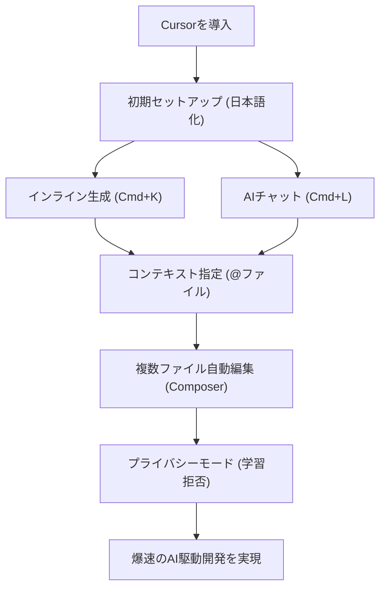

# 【2026年最新】最強のAIコードエディタ「Cursor」の使い方・完全入門！初心者からエンジニアまで開発効率を10倍にする爆速プログラミング術

## タイムライン
| 時間 | セクション | 解説内容 |
| --- | --- | --- |
| 00:00 | オープニング | AIエディタ「Cursor」の衝撃と、導入することで得られる圧倒的な開発スピード向上のメリットを紹介します。 |
| 01:15 | Cursorとは？ | VSCodeとの密接な関係性、設定や拡張機能をそのまま引き継げるメリット、従来の開発フローとの違いを解説。 |
| 03:00 | インストールと日本語化設定 | 公式サイトからの導入手順、初期セットアップ、そして英語UIを日本語化するための拡張機能インストール方法を案内。 |
| 05:30 | 基本機能1：Cmd+K | その場にコードを直接生成させる「Cmd/Ctrl+K」の使い方。日本語プロンプトからコードを瞬時に出力。 |
| 07:45 | 基本機能2：Cmd+L | 右側チャットでコードの解説、エラー解決、リファクタリングの相談ができる「Cmd/Ctrl+L」の対話機能を解説。 |
| 10:00 | @メンション機能 | 参照するファイル、フォルダ、Web検索などを「@」でAIに直接指定し、正確なコンテキストを与える裏技を伝授。 |
| 12:30 | Composer機能 | 複数ファイルをまたいでAIが自動で連動修正を行う次世代の機能「Cmd/Ctrl+I」の仕組みと手順を詳しく紹介。 |
| 14:45 | プライバシーモード | ソースコードがAIの学習に使われるのを防ぐ「Privacy Mode」のセキュリティ設定方法を解説。業務利用も安心。 |
| 16:30 | 料金プランの選び方 | Hobby（無料）、Pro（有料）、Businessプランの違いと、最適なプランの選び方を回数制限を含めて比較。 |
| 18:15 | まとめと未来予測 | AI駆動開発によるエンジニアの役割の変化、クリエイティブな設計に注力できる未来についてのまとめ。 |

## 文字起こし
[00:00] 皆さんこんにちは！今回は、今エンジニアの間で「これを一度使ったら、もう元のエディタには戻れない」と大絶賛されている、最強のAIコードエディタ「Cursor（カーソル）」の具体的な使い方と活用術について徹底解説していきます。プログラミングの初心者から現役のエンジニアまで、今日の動画を見るだけでCursorの全貌が理解でき、今日からあなたの開発速度は10倍以上に爆上がりします。ぜひ最後まで楽しんでご覧ください。

[01:15] まず、「Cursorとは何か？」という基本から説明します。Cursorは、MicrosoftのVisual Studio Code（VSCode）をベースにして、ChatGPTやClaudeなどの最新AI機能が最初から深く統合された最先端のエディタです。VSCodeをベースに作られているため、これまで使っていたVSCodeの拡張機能や設定、キーバインドをワンクリックでそのまま引き継いで使い始めることができます。そのため、移行コストがほぼゼロなのが大きな特徴です。

[03:00] 続いて、Cursorのインストールと日本語化の手順を解説します。公式サイトにアクセスし、お使いのOS（Windows、Mac、Linux）に合ったインストーラーをダウンロードして実行します。インストールが完了すると、自動的にVSCodeからの設定引き継ぎ画面が表示されます。さらに、Cursorを日本語で快適に使うために、拡張機能から「Japanese Language Pack」をインストールし、表示言語を日本語に切り替える手順についても詳しくご紹介します。

[05:30] ここからは、Cursorで最もよく使うAI機能の1つ目「インラインAIコード生成（Cmd+K / Ctrl+K）」の使い方です。コードを書きたい場所でショートカットを押すと入力ボックスが現れます。そこに「Pythonでスクレイピングを行うコードを書いて」や「ボタンのデザインをオシャレにして」と日本語で指示を出すだけで、AIがその場でコードを自動生成してくれます。生成されたコードはワンクリックで適用が可能です。

[07:45] 2つ目の基本機能は「AIチャット機能（Cmd+L / Ctrl+L）」です。右側にサイドバインダーとしてAIとの対話画面が表示されます。コードの特定の行を選択してこのショートカットを押すと、そのコードが自動的にコンテキストとしてチャットに送られます。そこで「このエラーの原因を教えて」や「もっとパフォーマンスの良いコードに書き換えて」と質問することで、AIが親切丁寧に解説してくれます。

[10:00] 次に、Cursorの最大の特徴とも言える「@メンション機能」をご紹介します。チャットやコード生成の入力欄で「@」を入力すると、参照したいファイル、特定のフォルダ、さらには最新のウェブ情報を指定できます。例えば「@main.py このファイルの設計について解説して」と指示することで、AIが該当ファイルを完全に把握した上で正確な回答をくれるようになります。これでプロンプトの手間が激減します。

[12:30] さらに高度な機能として、複数ファイルをまたいでAIが自動でコードを編集・生成してくれる「Composer機能（Cmd+I / Ctrl+I）」について解説します。これまでのAIは1つのファイルしか生成・修正できませんでしたが、Composerを使うことで「このプロジェクト全体に新しいログイン機能を追加して」というような指示を出すだけで、関連する複数のファイルをAIが一瞬で書き換えてくれます。まさにAIエージェントの決定版です。

[14:45] ここで、多くの企業やエンジニアが気にする「セキュリティとプライバシー」について説明します。Cursorには「Privacy Mode（プライバシーモード）」という設定項目があります。これを有効（ON）にすることで、あなたが書いたコードがAIの学習データとして使用されるのを防ぐことができます。業務や機密性の高い開発プロジェクトでCursorを導入する際は、必ず最初にONにしておきましょう。

[16:30] Cursorの料金プランについて整理します。基本機能は無料で使える「Hobbyプラン」でも十分試せますが、1ヶ月あたり一定回数以上のGPT-4やClaude 3.5 Sonnetといった高性能モデルを快適に使いたい場合は、「Proプラン」へのアップグレードが推奨されます。個人開発者であればProプランが最もコスパが良く、チームや企業での導入向けには「Businessプラン」も用意されています。

[18:15] まとめです。AIと協調して開発を行う「AI駆動開発」は、これからの時代のスタンダードになります。Cursorを使いこなすことで、言語の壁やドキュメントを調べる時間が劇的に削減され、私たちは「何を作るか」「どう設計するか」というクリエイティブな思考に集中できるようになります。ぜひこの機会にインストールして、次世代の開発体験をスタートしてみてください。お疲れ様でした！

## 概要
最強 of AI搭載コードエディタ「Cursor（カーソル）」の基本機能から応用機能、料金プランやセキュリティ設定までを網羅した完全入門ガイド。VSCodeをベースに開発されているため既存の設定をシームレスに移行でき、インライン生成（Cmd+K）やチャット（Cmd+L）によって開発効率を劇的に向上させます。さらに、ファイルを指定できる「@メンション機能」や、複数ファイルを一瞬で生成・修正する「Composer機能」、企業のソースコード流出を防ぐ「プライバシーモード」など、実務で今すぐ役立つ強力な機能を分かりやすく解説しています。

## 構成図 (Mermaid)

