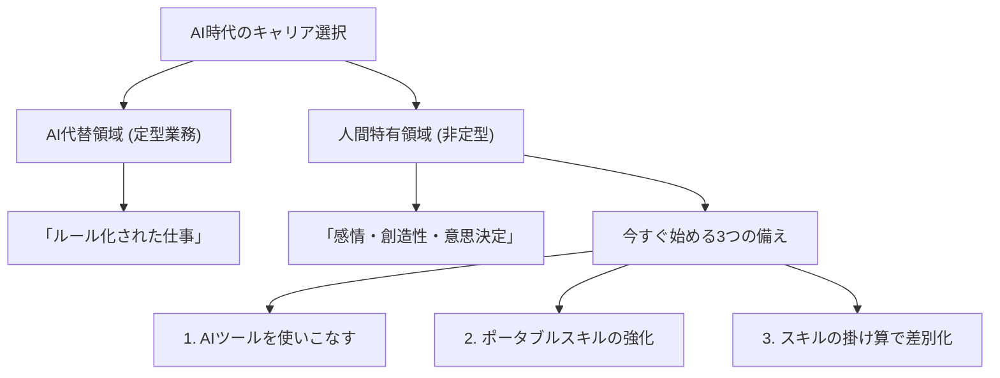

# 【AI時代の生存戦略】AIに奪われる仕事・残る仕事と、今すぐ始めるべき3つの備え

## タイムライン
| タイムスタンプ | セクション名 | 概要 |
| --- | --- | --- |
| [00:00] | イントロダクション | AI時代の到来に対する不安と、本動画で解説する生存戦略の全体像を紹介。 |
| [01:30] | AIに代替されやすい仕事 | 定型業務やマニュアル化されたタスクなど、AIが得意とする分野の特徴を解説。 |
| [03:15] | AI時代にも残る仕事 | 感情理解、クリエイティビティ、最終意思決定など、人間ならではの強みを説明。 |
| [05:00] | 備え1：AIを使いこなす | AIを競合ではなくパートナーとし、日常的な業務効率化に活用する重要性。 |
| [06:45] | 備え2：ポータブルスキルの強化 | 問題解決力やリスキリングなど、変化に適応するための汎用的な能力の磨き方。 |
| [08:30] | 備え3：スキルの掛け算 | 複数の異なるスキルを組み合わせることで、独自の希少価値を生み出す戦略。 |
| [09:45] | まとめと次のステップ | 変化をチャンスと捉え、まずは1つのAIツールを触ることから始めるよう推奨。 |

## 文字起こし
[00:00] 「皆さん、こんにちは。今回は、急速に進化するAI時代において、私たちの仕事やキャリアがどのように変化していくのか、そして私たちが今すぐ始めるべき具体的な備えについて解説していきます。ChatGPTや画像生成AI、自動化ツールの台頭により、『自分の仕事がAIに奪われるのではないか』と不安を感じている方も多いのではないでしょうか。しかし、過度に恐れる必要はありません。大切なのは、AIの特性を正しく理解し、人間ならではの強みを活かす働き方にシフトすることです。この動画では、AIに代替されやすい仕事の特徴、逆にAI時代でも生き残る仕事の共通点、そして今日からできる3つの生存戦略について、分かりやすくお伝えします。」

[01:30] 「まずは、AIに代替されやすい仕事の特徴について見ていきましょう。一言で言えば、『ルールやパターンが明確な定型業務』です。例えば、データの入力や整理、定型的な書類作成、マニュアル化された問い合わせへの対応などは、AIが最も得意とする分野です。これらは過去の膨大なデータから最適なパターンを導き出すプロセスであるため、処理スピードと正確性の両面で、人間がAIに勝つことは困難になります。また、高度な専門知識を必要とする法律や税務のアシスタント業務、定型的なプログラミングなども、AIによる自動化の波を強く受けています。」

[03:15] 「一方で、AI時代でも『生き残る仕事』『需要が高まる仕事』にはどのような特徴があるのでしょうか。ポイントは、人間固有の能力である『感情の理解』『創造性（クリエイティビティ）』そして『意思決定と責任』です。例えば、カウンセラーや看護師、介護士などの感情的なアプローチや共感が求められる仕事は、AIに代替されにくいとされています。また、誰もやったことのない新しいアイデアをゼロから生み出すクリエイティブな活動や、企業の経営判断、医療の最終決定など、不確実な状況下での意思決定と、それに伴う『責任を引き受けること』は、AIには決してできない人間の領域です。」

[05:00] 「では、この激変の時代を生き抜くために、私たちは今すぐ何を始めればよいのでしょうか。取り組むべき『3つの備え』の1つ目は、『AIをツールとして使いこなす側に回る』ことです。AIを敵視するのではなく、自分の生産性を高めるためのパートナーとして捉えましょう。例えば、文章作成やアイデア出し、プログラミングの補助として日常的にChatGPTなどのツールを活用し、業務効率を劇的に向上させる『AI協働スキル』を身につけることが、これからの必須条件となります。」

[06:45] 「2つ目の備えは、『ポータブルスキル（持ち運び可能な能力）の強化』です。特定の企業や業界でのみ通用する専門知識だけでなく、どこに行っても通用する『問題解決力』『コミュニケーション能力』『クリティカルシンキング（批判的思考）』を磨くことが重要です。技術のライフサイクルが短くなる中、一つの専門性に依存するリスクは高まっています。状況の変化に応じて自ら学び直し、適応していく『リスキリング（学び直し）』の姿勢こそが、最大の防御となります。」

[08:30] 「そして3つ目の備えは、『独自の掛け算による差別化』です。単一のスキルだけでトップを目指すのは困難ですが、複数の異なる領域のスキルを掛け合わせることで、あなただけのユニークな価値を生み出すことができます。例えば、『営業 × データ分析 × AIツール活用』や『デザイン × 心理学 × マーケティング』といったように、異なる分野を掛け合わせることで、AIには模倣できない希少性の高い人材になることができます。」

[09:45] 「最後にまとめです。AI時代は、変化を恐れる人にとっては脅威ですが、変化を楽しめる人にとっては史上最大のチャンスとなります。AIを日常的に触り、自らのポータブルスキルを磨き、スキルの掛け算を意識することで、これからの時代を圧倒的に有利に生き抜くことができます。今日からできる一歩として、まずはAIツールを一つ触ってみることから始めてみてください。それでは、また次回の動画でお会いしましょう。ありがとうございました。」

## 概要
本動画では、急速に進展するAI時代において、個人がどのようにキャリアを築き、生き残るべきかを解説しています。AIに代替されやすい仕事と、人間固有の能力が求められる残る仕事の違いを明確にし、今すぐ実践すべき3つの具体的な生存戦略（AIツールの活用、ポータブルスキルの強化、スキルの掛け算による差別化）を提示しています。変化をチャンスに変え、AIと協働するスキルの重要性を説く内容となっています。

## 構成図 (Mermaid)

