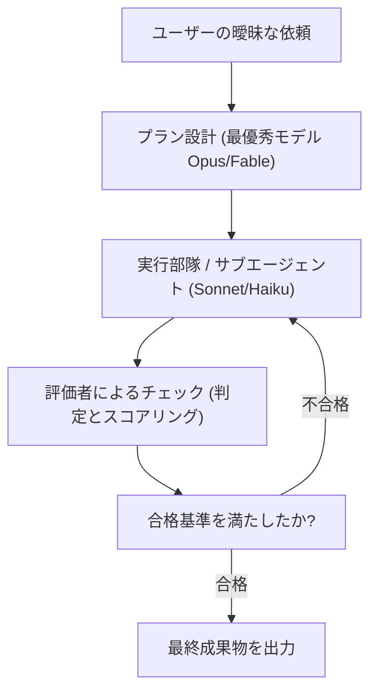

# 【プロンプトの限界】AIの嘘・二度手間をゼロにする「グラフエンジニアリング」入門

## タイムライン
| タイムスタンプ | セクション名 | 主な内容 | キーポイント |
| :--- | :--- | :--- | :--- |
| [00:00] | 導入 | グラフエンジニアリングの概念を紹介 | 単なるプロンプトの工夫から、AIの精度を守る全体設計（グラフエンジニアリング）への移行を提示 |
| [01:55] | AIの出力を確真にする方法 | 直列実行における精度の低下と対策 | ステップが増えるほど全体精度は低下するため、評価者による「ループ」や「投票」の仕組みが不可欠となる |
| [06:29] | 「グラフエンジニアリング」の構築方法 | 役割分担とループの構築 | プラン設計（最上流）には最優秀モデル（Opus等）を使い、実行部隊にはコスパの良いモデル（Sonnet等）を配置する人員設計を解説 |
| [09:46] | 今夜、あなたがするべきこと | 段階的な導入と構築の支援ツール | 最初は1つのAIに直列でやらせ、困ったら小さなループを足す。構築にはAnthropicの「スキルクリエイター」を使うと効果的 |
| [12:40] | 本日のまとめ | 全体の復習とAIエージェント強化のコツ | 親（プラン）・子（実行）・評価の役割を繋ぎ、ループの束（グラフ）を作ることが右腕AIを最強にする道 |
| [14:38] | アフタートーク | 視聴者へのメッセージ | AIに仕事を任せることは「業務の棚卸し」そのもの。まずは粗くても紙とペンから始めてみることを推奨 |

## 文字起こし
[00:00] 「まだループの話をしているの？これからはグラフだよ。」という冗談から始まった、最近話題の最新ワード「グラフエンジニアリング」についてお話しします。AIに仕事を任せる際、多くの人がプロンプトの工夫だけでなんとかしようとしていますが、実はこれには限界があります。本日は、AIが嘘をついたり、何度もやり直したりする二度手間をゼロにするための、全く新しいAI運用の全体設計「グラフエンジニアリング」の全体像をやさしく解説します。

[01:55] AIエージェントに複数ステップの作業を一直線に任せると、後半に進むにつれて精度が著しく低下するという弱点があります。例えば、1つのステップで95%の精度を持つ優秀なAIであっても、それを10ステップ繋げて伝言ゲームのように実行させると、最終的な精度はなんと約60%まで落ちてしまいます。プロンプトエンジニアリングで完璧な指示を書いたり、コンテキストエンジニアリングで優れたメモを与えたりしても、この直列的な連鎖による精度の低下は防げません。そこで必要になるのが、途中で「評価者」を挟んで合格するまでやり直させる「ループ」や、複数の候補から最も良いものを選ばせる「投票」といった仕組みです。

[06:29] 「グラフエンジニアリング」とは、一言で言えば「複数のループを束ねた全体設計」のことです。例えば資料作成タスクを例に挙げると、最上流で「プラン（設計図）」を作る親エージェント、それに従って実際の素材を集めたり執筆したりする「子エージェント（サブエージェント）」、そしてその成果物を厳しくチェックする「評価者（チェッカー）」を役割ごとに配置します。このとき、最も頭を使うプラン設計や全体評価には「Opus 5」や「Fable 5」といった最優秀モデルを使い、具体的な実行部隊には「Sonnet」や「Haiku」のようなコスパの良いモデルを適材適所で使い分けます。こうした「役割分担と評価ループの束（グラフ）」を組むことで、AIの嘘やハルシネーションを極限まで減らすことができます。

[09:46] とはいえ、「いきなり複雑な12ノードのグラフを自分で構築するのは難しそう」と身構える必要はありません。論文のデータでも、グラフを複雑にしすぎると逆に精度が低下したり、エラーで止まる確率が高くなったりすることが示されています。まずはシンプルに「1つのAIエージェントに直列でタスクを実行させる」ことから始めましょう。2回に1回成功するようなタスクであれば複雑にする必要はありません。もし精度に不満を感じたら、途中に「評価役」を1人だけ立てるような、小さなループを追加していきます。さらに、Anthropic公式の「スキルクリエイター」などを活用すれば、人間が曖昧なお願いをするだけで、AI自身が適切なタスク分解や評価者の設計をまるごと行ってくれます。

[12:40] 本日は「グラフエンジニアリング」の基本概念と、AIの嘘やハルシネーションを防ぐ構築アプローチについてご紹介しました。AIのアウトプットを最大化するには、プロンプトの工夫だけでなく、仕組みとしての全体設計が極めて重要です。全体を最適にコントロールする「プラン（親）」、実務をこなす「実行部隊（子）」、そして「評価者」を適切に繋ぎ、ループの束を構築していきましょう。自分の専門業務を一つ選び、スキルクリエイターに手伝ってもらいながら、あなたの「最強の右腕」となるAIシステムを徐々に育ててみてください。

[14:38] 動画の最後に、視聴者の皆さんにメッセージをお届けします。AIに仕事を任せるということは、仕事の全体像を言葉で整理する「業務の棚卸し」そのものです。初めは6割や7割の粗い設計でも構いません。まずは紙とペンでタスクの流れを描いてみる、あるいはスキルクリエイターを一度動かしてみる、その小さな一歩があなたの知的生産性を飛躍的に高める鍵となります。ぜひ今夜から実践してみてください。

## 概要
AIに複数ステップの作業を直列（一直線）に任せると、伝言ゲームのように後半で全体の精度が著しく低下する課題（1ステップ95%でも10個繋げば約60%に低下）に対し、評価ループや投票、役割別モデル配置を組み合わせた全体設計「グラフエンジニアリング」で精度を守る方法を解説する動画です。最上流の「プラン（設計）」には最も優秀なモデルを、実作業を行う「実行部隊（子エージェント）」や「評価者」にはコスパの良いモデルを適材適所で配置する人員設計を提唱。構築時は、いきなり複雑なシステムを組むのではなくシンプルな直列から始め、段階的に小さなループを重ねていくこと、そしてAnthropicの「スキルクリエイター」などの支援ツールを活用して業務の棚卸しと自動構築を進める重要性を伝えています。

## 構成図 (Mermaid)

