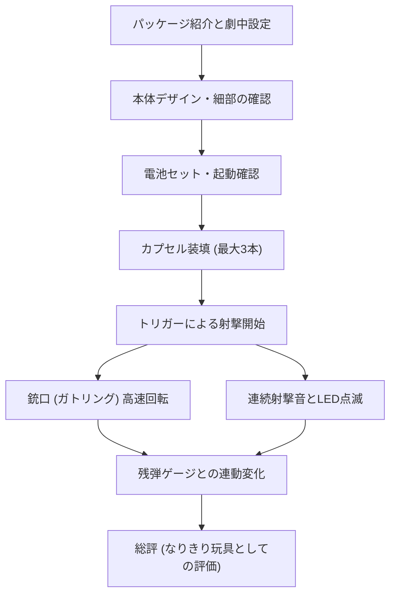

# ウルトラマンガイア 超カプセル装填兵器 シグバルカン レビュー

## タイムライン
| タイムライン | 項目 | 内容 |
| :--- | :--- | :--- |
| 00:00 - 00:30 | イントロダクション＆パッケージ紹介 | パッケージ外観の紹介と、劇中（チーム・ハーキュリーズ）での活躍の振り返り |
| 00:31 - 01:14 | 本体デザインの確認 | 近未来的なブラックカラーの重厚なボディ、ガトリング銃身や残弾ゲージの確認 |
| 01:15 - 02:11 | 電池セットと起動音 | 単三電池4本をセットし、電源オン時のライトアップと起動システム音の実演 |
| 02:12 - 02:59 | カプセル装填ギミック | 3本のエネルギーカプセルを1本ずつ装填する連動アクションと専用システム音の検証 |
| 03:00 - 03:44 | トリガー射撃・ガトリング回転 | トリガー操作による電動ガトリングバレルの高速回転と、連続発射音・ライト点滅の確認 |
| 03:45 - 04:24 | 残弾ゲージ連動 | 射撃を続けることでインジケーターが変化し、エネルギー切れ音が発生する様子を解説 |
| 04:25 - 05:00 | まとめと総評 | イジェクトレバーによるカプセル排出の実演と、高い連動性とギミックを誇る傑作トイの総括 |

## 文字起こし
[00:00] 皆さんこんにちは。今回は1998年に放送された特撮テレビ番組『ウルトラマンガイア』より、防衛隊XIG（シグ）の大型装備である「超カプセル装填兵器 シグバルカン」の玩具をご紹介します。まずはこの迫力あるパッケージから見ていきましょう。当時バンダイから発売されたもので、当時の定価は4,980円でした。劇中では、特に力自慢のメンバーが集まる「チーム・ハーキュリーズ」などが主に使用していた印象深い武器です。

[00:30] パッケージを開封して本体を取り出しました。本体は非常に重厚感のあるブラックを基調としたカラーリングで、サイズ感も大人が持っても十分に満足できるボリュームがあります。フロント部分には複数の銃身で構成されたガトリング型のバレルが搭載されており、手動でも軽く回転させることができます。また、側面には特徴的な残弾数を示すLEDゲージが設けられており、当時の近未来的なテクノロジーデザインが巧みに再現されています。

[01:15] この玩具を動作させるには、本体底部にある電池ボックスに単三電池を4本セットする必要があります。電池を挿入し、電源スイッチを「オン」に切り替えると、ピピッと鋭い電子音とともに残弾ゲージのLEDが一瞬だけ全点灯し、システムが起動したことを知らせてくれます。この初期起動音だけでも、劇中の緊迫した防衛隊の雰囲気が伝わってきてワクワクしますね。

[02:12] それでは、シグバルカンの最大の特徴である「エネルギーカプセル（カートリッジ）」の装填ギミックを検証していきます。本商品には、劇中設定に合わせたクリアグリーンのカプセルが3本付属しています。本体上部にあるスロットに対して、カプセルを1本ずつ押し込むように装填していきます。カプセルをセットするたびに、「ガチャッ」「システム・ワン」「システム・ツー」といった近未来的な効果音と音声が鳴り響き、LEDゲージが1メモリずつ光り輝く仕組みになっています。カプセルのリアルなカチッという装填感が非常に心地よいです。

[03:00] 3本のカプセルをすべて装填し終えると、チャージ完了を意味する特別な待機音がループで鳴り始め、フルパワー状態であることが示されます。この状態でトリガー（引き金）を引くと、大迫力の電動射撃ギミックがスタートします。トリガーを引いている間、先ほどのガトリングバレルが「モーター音」とともに電動で凄まじいスピードで高速回転し、同時に銃口のLEDと側面の残弾ゲージが激しく点滅します。そして「ダダダダダッ！」という連続した激しい銃撃音が部屋中に鳴り響きます。

[03:45] さらに面白いのが、射撃を続けていくと残弾ゲージのライトが徐々に減っていき、サウンドのピッチや間隔が変化する点です。エネルギーが少なくなるとアラート音が混ざるようになり、最終的にカプセル内のエネルギーを使い果たすと「カチ、カチ…」という弾切れの音が鳴る仕様になっています。この残弾数と連動するライト＆サウンドギミックは、当時の男の子だけでなく大人コレクターをも唸らせるリアルなシステム設計です。

[04:25] 遊び終わった後は、本体にあるカプセルイジェクトレバーを引くことで、装填していた3本のカプセルを簡単に取り外すことができます。カプセルが飛び出す感覚もまた非常に楽しく、すぐに次の装填プレイへと移行したくなります。

[04:45] 以上、ウルトラマンガイアの「超カプセル装填兵器 シグバルカン」のレビューでした。当時のなりきり玩具としては非常に高価格帯のアイテムでしたが、それに見合うだけの電動回転ギミック、カプセル連動システム、ライト＆サウンドの連動性が詰め込まれており、今触っても全く色褪せない傑作玩具です。それではまた次回のレビューでお会いしましょう。

## 概要
『ウルトラマンガイア』に登場する特捜チーム「XIG」の大型武器「超カプセル装填兵器 シグバルカン」の1998年製なりきり玩具のレビューです。主な内容は、重厚感のある本体デザインの紹介、3本のクリアエネルギーカプセルの段階的な装填ギミック、電動モーターによるガトリング銃身の高速回転の実演、そして残弾ゲージのインジケーターと連動する臨場感あふれるライト＆連続射撃サウンドの検証です。カプセルの装填から弾切れ時のシステム変化までをリアルに再現した、ギミック満載の傑作なりきりアイテムの魅力が分かりやすく解説されています。

## 構成図 (Mermaid)

