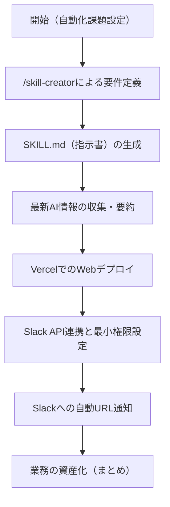

---

tags:
  - type/youtube
  - cat/imanyu
  - topic/codex
  - topic/automation
---

# CodexでAgent Skillsを使いこなせば業務自動化は簡単です！実際の業務をAgent Skillsで自動化する様子をお見せします

## タイムライン
| 時間 | 項目 | 内容 |
|---|---|---|
| 00:00 | オープニング | 挨拶とテーマである「Codex」と「Agent Skills」を活用した業務自動化概念の紹介。 |
| 03:15 | Codex×業務効率化 | 最新AIニュースの収集・Webレポート作成・デプロイ・Slack通知を自動化する一連のフロー設計。 |
| 10:30 | /skill-creatorの活用 | SKILL.md（作業指示マニュアル）を自動生成する手順と骨子構築。 |
| 18:45 | Vercelへのデプロイ自動化 | バーセルCLIをCodex経由で実行し、Webレポートを自律的にデプロイ・公開する仕組み。 |
| 28:15 | Slackアプリ連携・権限設定 | 最小権限の原則に基づくSlackとの安全なAPI連携とエラー回避のための権限追加手法。 |
| 38:30 | エージェントの実践デモ | ニュース収集から、Webデプロイ、Slack通知までの一連の自律的フローの稼働と成功確認。 |
| 46:04 | まとめ | AIマニュアル化（Agent Skills）による業務資産化の重要性と全体の振り返り。 |

## 文字起こし
[00:00] 皆さんこんにちは！AIプログラミング講師のいまにゅです。今回の動画では、今大注目されているAIエージェントツール「Codex」を用いた業務効率化、特に「Agent Skills（エージェントスキル）」を活用した業務自動化の実演について、アシスタントのJ君と一緒に詳しくお話ししていきます。従来のプロンプトを使ったAI活用では、毎回同じような指示を打ち込む必要があり、回答のフォーマットもばらつきがちでした。しかし、この「Agent Skills」を使えば、AIに対する「作業手順書（マニュアル）」をあらかじめ定義しておくことで、まるで優秀な部下に仕事を任せるかのように、一連の複雑な業務を自動で実行させることが可能になります。

[03:15] ここからは、実際にCodexとAgent Skillsを掛け合わせた業務自動化の実演に入っていきます。今回構築する自動化フローは、「最新の生成AIに関する情報をウェブ上から収集・要約し、一般の読者向けに分かりやすくまとめたWebレポートを構築・デプロイし、そのページのURLをSlackへ自動的に送信・通知する」という非常に実践的な週次レポートのワークフローです。単にテキストをまとめるだけでなく、実際に動くWebページとしてデプロイし、それをチームメンバーが常駐するSlackへ飛ばすところまでを、AIに一気通貫でやってもらうオペレーションを目指します。

[10:30] このスキルを定義していくために、Codexに標準搭載されている「/skill-creator」という機能を使用します。これは文字通り「スキルを作るためのスキル（AIエージェント）」であり、対話や音声入力から自動的に「SKILL.md」と呼ばれるMarkdown形式 of 定義ファイルを生成してくれます。本来、手動で作業を1回成功させてからパッケージ化する方法もありますが、このツールを使えば最初から「要件定義」としてマニュアルの骨子を自動作成してくれます。このSKILL.mdが、AIにとっての「業務指示書（マニュアル）」の役割を果たします。

[18:45] 定義が完了したら、次に生成されたWebレポートをインターネット上に公開するためのインフラとして、Vercel（バーセル）を連携させます。バーセルCLIを用いることで、Codex自らがコマンドを実行し、作成したWebページを自動的にデプロイします。この「AI自身がコマンドを実行して公開まで完了させる」という挙動は、従来の単純なチャットAIにはできなかった強力な自律的エージェントの特徴です。ユーザーは最初に設定を行うだけで、ビルドや公開プロセスをすべてAIに委ねることができます。

[28:15] 次に、デプロイ完了後のURLを送信するためのSlack連携の設定を行います。CodexにSlackトークンやチャンネルIDを直接持たせるのではなく、安全に連携するための設定コマンドを自動生成して実行します。この際、Slackアプリに「メッセージを送信する権限」など、必要最低限のパーミッション（権限）のみを段階的に付与していくのが、セキュリティの観点から非常に重要です。最初から何でもできる全権限を与えてしまうとリスクが生じるため、エラーが出た際に、その都度必要な権限だけを追加していくのが正しい進め方になります。

[38:30] すべての設定が整ったので、実際にこの「Agent Skills」を走らせてみます。Codexはウェブから自動で最新のAIニュースを検索・収集し、その情報を要約した美しいマークダウンやWebレポートを構築します。その後、バックグラウンドでビルドを行い、Vercelへ自動デプロイを実行します。デプロイ処理が正常終了すると、公開されたばかりのレポートのURLを含んだ通知メッセージが、リアルタイムにSlackの指定チャンネルへと送信されます。実際にSlackに通知が届き、リンクをクリックして最新のAIニュースレポートが表示されるデモが成功しました。

[46:04] 本日の実演を振り返りながら、今回の内容をまとめていきましょう。アプリやツールを1から開発しなくても、AIに対するマニュアル（業務手順書）を「Agent Skills（SKILL.md）」として記述しておくだけで、複雑な業務を自動化できる時代が到来しています。これは人間にマニュアルを渡して作業を依頼するのと全く同じ感覚です。再現性が高く、チームでの共有も容易なこの「業務の資産化」というアプローチを習得することで、皆様の業務効率化は劇的に加速します。ぜひ今回の内容を参考に、自社の定型業務の自動化に挑戦してみてください！

## 概要
本動画は、「Codex」とその中核機能である「Agent Skills（エージェントスキル）」を活用し、実務におけるルーチンワークを自律的に自動化するプロセスを詳しく実演した解説動画です。単に個別のプロンプトを投げるのではなく、AIのための「業務指示マニュアル（SKILL.md）」を作成することで、AI自身が「ウェブ情報の収集・要約」、「Vercelを用いたWebサイトのデプロイ」、「Slackへの通知」という一連の複雑な連携作業を自律的に実行します。さらに、Slackアプリとの安全なAPI連携において最小限の権限のみを付与するセキュリティ設計や、エラーが発生した際の実践的な対処法についても解説し、業務を確実に資産化・再現可能にするノウハウを提供しています。

## 構成図 (Mermaid)

