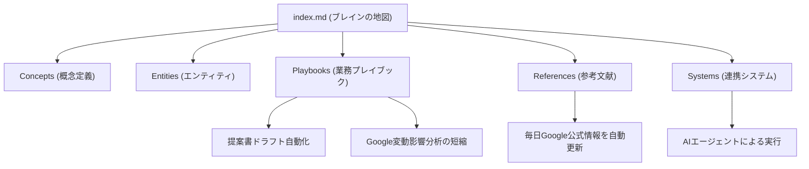

---

tags:
  - type/youtube
  - cat/thinking
  - topic/rag
  - topic/automation
---

# Build an OKF brain like mine! (私のようなOKFブレインを構築する方法！)

## タイムライン
| タイムスタンプ | セクション名 | 内容説明 |
| --- | --- | --- |
| [00:00] | 導入とOKFの概要 | Googleが発表した新標準「OKF」の基本概念とAIエージェントの標準言語となる仕組みを紹介。 |
| [03:00] | OKFのデータ構造 | YAMLフロントマターとMarkdownファイルを用いたエージェントファーストなドキュメント定義方法を解説。 |
| [06:00] | OKFブレインの基本設計 | 自身のデジタルブレインを公開。index.mdが全体の案内役として機能する仕組み。 |
| [10:00] | ブレインを構成する5大要素 | Concepts、Entities、Playbooks、References、Systemsのフォルダ階層と役割を紹介。 |
| [14:00] | プレイブックによる効率化 | 提案書の自動起稿やサイトへのGoogleアップデート影響分析時間を大幅に削減する実例。 |
| [18:00] | 公式情報の自動インジェスト | Googleの仕様変更を毎日チェックしてブレイン情報を自動更新する動的連携システムを解説。 |
| [21:00] | SEOの未来と知識整理 | 今後のSEOはAIエージェントに解釈しやすい形（Agent-Ready）に企業ノウハウを整備することへ移行する。 |

## 文字起こし
[00:00] 皆さん、こんにちは。マリー・ヘインズです。前回の動画では、Googleが公開した新しい知識の表現規格「Open Knowledge Format」、通称「OKF」についてご紹介しました。今日はその続編として、私がこの規格を使って実際に構築した、私自身の「デジタルブレイン（個人用脳）」の中身を具体的にお見せしたいと思います。私はこの仕組みを毎日、複雑なSEO業務の自動化や提案書の作成、さらにはGoogle検索アルゴリズム更新時の変動分析に活用しています。

[03:00] OKFの最大の特徴は、従来のベクトルデータベースやRAG（検索拡張生成）とは異なり、高価なインフラやインデックスの再構築を必要としない点にあります。基本は、単純なMarkdownファイルのディレクトリ構造です。各ファイルの先頭には「YAMLフロントマター」と呼ばれる小さなメタデータブロックが埋め込まれており、ここに入力されたタイプや属性情報をAIエージェントが即座に読み取ることで、エージェント側でインデックスを必要とせず、まるで本物の脳のように自律的に関連する概念をたどることができます。

[06:00] 私が構築したブレインのルートには、index.md という非常に重要な案内ファイルが置かれています。AIエージェント（私はGoogleのAntigravityやClaude Codeなどを使っています）が私のOKFフォルダにアクセスすると、まずこの index.md を読み込みます。ここには、私のブレイン全体の「地図」が記述されているため、エージェントは無駄にすべてのドキュメントを検索することなく、必要なエリアへダイレクトに進むことができるのです。

[10:00] 私のフォルダ構造は、大きく5つのカテゴリに分類されています。1つ目は「Concepts（概念）」で、SEOやAIに関する個々の定義を管理します。2つ目は「Entities（実体）」で、人名やサービス、ツール名などを扱います。3つ目は「Playbooks（プレイブック）」で、実際の業務手順書です。4つ目は「References（参考文献）」、そして5つ目は「Systems（システム）」で、これらが互いに関連し合って巨大な知識グラフ（ナレッジグラフ）を形成しています。

[14:00] この中でも特に強力なのが「Playbooks（プレイブック）」です。例えば、私はクライアントへの提案書を自動作成するためのプレイブックを用意しています。これまでは手作業が多く時間のかかる作業でしたが、現在はAIエージェントが私のプレイブックに書かれた手順を忠実にたどり、私の声（トーン＆マナー）や論理構造を再現して自動で下書きを生成してくれます。また、Googleのコアアップデート後にサイトへの影響を分析するプレイブックも作成しました。従来なら丸2日かかっていた変動の分析が、今ではわずか数時間に短縮され、非常に高い精度のレポートが得られるようになりました。

[18:00] さらに、私のブレインは自動化されたインジェストシステムと連動しています。このシステムは、Googleの公式開発者ドキュメントを毎日自動的にチェックします。GoogleがAI Overview（AIによる概要表示）やSearch Consoleの仕様を変更すると、システムが自動的に変更を検知して通知を送り、私のブレイン内のReferenceファイルをバックグラウンドで最新の状態に書き換えます。これにより、私の記憶力に頼ることなく、常に最新のSEOトレンドに対応できる脳が維持されています。

[21:00] これからのSEOは、Webサイトを検索エンジンに見つけてもらうだけでなく、いかにAIエージェントが企業の知識を読み取りやすくするか（Agent-Readyにするか）という領域にシフトしていきます。企業の散らばった知識やマニュアルを、このようなOKF bundle（知識セット）として整理・標準化するスキルは、今後市場で非常に高い価値を持つようになるでしょう。皆さんも、ぜひAI時代に先駆けて自分だけのOKFブレインを作ってみてください。ありがとうございました。

## 概要
Googleの新標準「Open Knowledge Format (OKF)」に準拠した、マリー・ヘインズ氏独自の「個人用デジタルブレイン」の構築とその成果を詳しく解説する動画。標準化されたMarkdownファイルとYAMLフロントマターを用いたシンプルなフォルダ設計により、従来のベクトルデータベースや複雑なRAGを使わず、AIエージェントが直接かつ効率的にデータを読み取れる環境を実現しています。動画では、脳の5つの階層（Concepts, Entities, Playbooks, References, Systems）と「index.md（地図）」の仕組みが提示され、提案書作成の自動化や、Google変動分析にかかる時間を「2日間から数時間」に短縮できたこと、Google公式情報の自動監視システムによる追跡など、AI時代を見据えた実務の自動化メリットが具体的に語られています。

## 構成図 (Mermaid)

