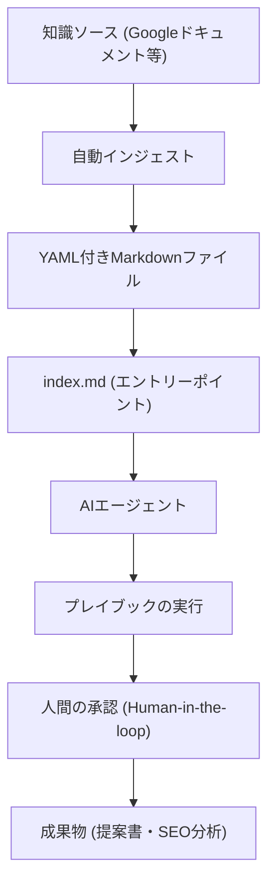

---

tags:
  - type/youtube
  - cat/thinking
  - topic/claude
  - topic/rag
---

# Build an OKF brain like mine!

## タイムライン
| 時間 | セクションタイトル | 概要 |
|---|---|---|
| 00:00 | OKF個人用ブレインの紹介 | GoogleのOpen Knowledge Format（OKF）を用いて構築したAIブレインの計画を紹介 |
| 00:54 | 公式ドキュメントへのアクセス | Claude CodeやAntigravityなどのAIに読み込ませて構築を始めるためのリンク集を紹介 |
| 01:27 | 標準化構造の強力さ | OKFの標準化ディレクトリとMarkdown構造が、単なる検索を超えてAI実行力を高める理由を解説 |
| 02:30 | YAMLフロントマターの役割 | ファイルのトップに記述するメタデータにより、情報のタイプ（コンセプトやプレイブック）を分類 |
| 03:42 | プレイブック vs skills.mmd | 指示書であるプレイブックと、Mermaid等で構築するプロセス・フロー図の使い分けを説明 |
| 04:55 | OKFブレインの基本構造 | メインのindex.mdを入口として各ナレッジ領域を整理するシンプルな設計を紹介 |
| 06:17 | 従来のRAGとの違い | 散らばった断片を探すRAGに対し、OKFは意味的な繋がりと手順を最初から定義できる違いを解説 |
| 07:34 | カスタム・プレイブックの作成 | 提案書作成やGoogle検索更新の影響分析など、手作業を劇的に削減するプレイブックの実例を紹介 |
| 09:03 | AIによる生産性の向上 | AIは職を奪うのではなく、人間の認知能力を拡張し生産性を高めるためのツールであると主張 |
| 10:19 | リファレンスの蓄積 | GoogleのSEO公式ドキュメント等をリファレンスとして格納する仕組みを説明 |
| 11:05 | 知識グラフの可視化デモ | 実際のブレイン内にあるコンセプト、リファレンス、プレイブックの繋がりをノードマップで表示 |
| 12:36 | AI Overviewsの検証 | AI Overviewsに関する実際のMarkdownファイル内のYAMLフロントマターや内容を確認 |
| 14:05 | 新規ドキュメントのインジェスト | Googleの仕様変更を毎日チェックし、自動的にブレインへ知識を取り込むプロセスを解説 |
| 16:44 | 承認プロセスとまとめ | AI任せにせず、人間が確認・承認（Human-in-the-loop）してナレッジの質を維持する重要性を語る |

## 文字起こし
[00:00] みなさん、こんにちは。マリー・ヘインズです。前回の動画では、Googleが公開した「Open Knowledge Format（OKF）」という概念についてご紹介しました。今回は、私が実際にそのOKFを使って構築した、毎日愛用している「パーソナル・ブレイン（個人用脳）」について、具体的にデモを交えてお見せしたいと思います。

[00:54] まず、このシステムを構築するにあたって、Googleが提供している公式のOKFドキュメントを活用しました。皆さんも同じようなものを構築できるように、概要欄にリンクを貼っています。Claude CodeやChatGPT、そして私のお気に入りであるGoogleの'Antigravity'などのAIエージェントにこれらのリンクを読み込ませることで、簡単に自分用のOKFシステムの構築を開始できます。

[01:27] OKFの本当の強みは、その「標準化された構造」にあります。単に情報を集めるだけでなく、エージェントがすぐに理解し、実行できる形で知識を整理できる点にあります。これによって、AIエージェントが私たちの知識をただ検索するだけでなく、実際にタスクを実行できるようになります。

[02:30] すべてのOKFファイルは、'YAMLフロントマター'と呼ばれるメタデータから始まります。これはMarkdownファイルの上部に配置される小さなコードブロックで、エージェントに対して「このファイルがどのような情報を含んでいるか」を正確に伝える役割を持っています。私自身のブレインでは、コンセプト（Concepts）、エンティティ（Entities）、プレイブック（Playbooks）、リファレンス（References）、システム（Systems）などのタイプを定義して使い分けています。

[03:42] 次に、「プレイブック（Playbooks）」と'skills.mmd'ファイルの違いについてです。プレイブックは一連の手順や指示書のようなものですが、Mermaid.jsなどの形式でフロー図を作成する'skills.mmd'も活用できます。これにより、エージェントは文字情報だけでなく、視覚的なプロセスとして処理ステップを解釈できます。

[04:55] 私のOKFブレインの基本的な構造は非常にシンプルです。メインの入り口となる'index.md'ファイルがあり、そこから各フォルダや知識領域にエージェントがアクセスできるように設計されています。これにより、エージェントは迷うことなく、指示されたタスクに必要な情報がどこにあるかを即座に把握します。

[06:17] ここで、従来のRAG（Retrieval-Augmented Generation）とOKFの最大の違いについて説明します。一般的なRAGは、ばらばらな文書からキーワードで関連箇所を探し出すものですが、OKFは意味的に構造化された知識グラフです。エージェントは、文書の断片を探すのではなく、定義されたコンセプトやステップ、手順をダイレクトに理解して行動します。

[07:34] 実際に私が作成したカスタム・プレイブックの例をご紹介します。例えば、クライアント向けの提案書作成や、Googleの検索アップデートによるサイトへの影響分析などです。これまで分析に丸2日かかっていた作業が、プレイブックに沿ってエージェントに指示することで、わずか数時間で、しかも納得のいくクオリティで完了するようになりました。

[09:03] 私はよく「AIに仕事を奪われるのではないか」という質問を受けます。しかし、私はそう思いません。AIによって奪われるのではなく、AIを使いこなすことで私たちの生産性が劇的に向上するのです。このOKFブレインを使うことで、私は自分の生物学的な脳の限界を超えて、より多くの情報を活用し、クライアントにより高い価値を提供できるようになりました。

[10:19] 私のブレイン内には、GoogleのSEOドキュメントやAI Overviewsに関する公式情報を「リファレンス（References）」として蓄積しています。これにより、エージェントはいつでも最新かつ正確な公式ガイドラインに基づいてSEO分析を行うことができます。

[11:05] それでは、実際にこのOKFナレッジグラフがどのように可視化されているか、デモを見てみましょう。画面上の各ノード（ドット）は、1つのMarkdownファイルを指しています。AI Overviewsに関するコンセプトが、Googleのドキュメント（リファレンス）や、私の社内プレイブックとどのようにつながっているかが一目でわかります。

[12:36] AI Overviewsに関する具体的なMarkdownファイルの中身を開いて確認してみましょう。ここには、エージェントがSEOの観点からどのようにAIオーバービューを評価すべきか、具体的な基準が記述されています。YAMLフロントマターによって定義された明確なメタデータが確認できます。

[14:05] また、新しいドキュメントをブレインに取り込む（インジェストする）プロセスも自動化しています。私は毎日Googleのドキュメントをチェックするシステムを構築しており、更新があれば自動的に検知してブレインに通知が届き、関連するリファレンスファイルを半自動的にアップデートできるようにしています。

[16:44] 最後に、情報の「承認プロセス」についてです。エージェントが自動的にすべてを処理するのではなく、人間が内容をレビューして承認する（Human-in-the-loop）境界線を設けることで、ブレインのデータが汚染されたり、誤った情報を信じ込んでしまうのを防いでいます。皆様もぜひ、自分だけのOKFブレインを構築してみてください。

## 概要
本動画では、SEO専門家であるマリー・ヘインズ氏が、Googleが提唱する「Open Knowledge Format (OKF)」を用いた個人用AIブレインの構築方法と実際のデモを解説しています。OKFは、従来のRAG（単純なキーワード検索型）とは異なり、Markdownファイルとメタデータ（YAMLフロントマター）を用いてAIエージェント向けに情報を「意味的に構造化」する標準化フォーマットです。ヘインズ氏は、提案書作成やSEOアップデート分析のプロセスをプレイブック化することで、複雑な分析タスクに要する時間を劇的に短縮した成果を示しています。また、ドキュメントの自動インジェストや「Human-in-the-loop（人間の介在）」による品質維持の重要性についても詳しく語っています。

## 構成図 (Mermaid)

