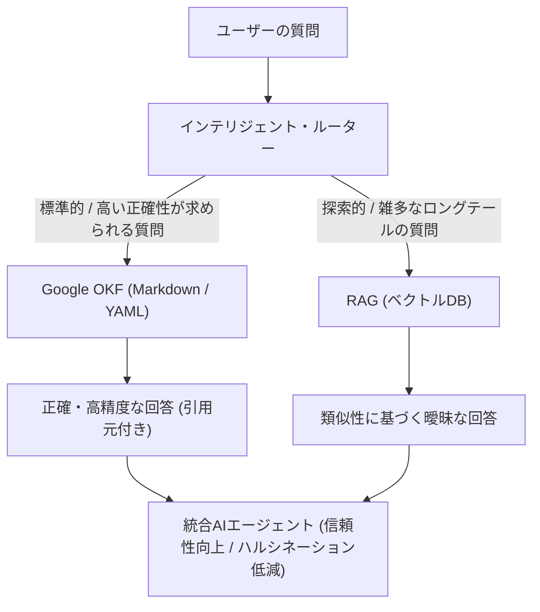

---

tags:
  - type/youtube
  - cat/thinking
  - topic/rag
---

# Google OKF + RAG: The Ultimate AI Agent Architecture

## タイムライン
| タイムライン | トピック | 主な概要とポイント |
| :--- | :--- | :--- |
| 00:00 | RAGの限界とハルシネーション | 文書を細かく分割してベクトル検索するRAGは文脈や構造を破壊し、ハルシネーションの原因になる。 |
| 00:42 | 新技術 OKF (Open Knowledge Format) | Googleが発表したYAMLとMarkdownを用いたオープン規格。AIと人間の両方に読みやすい正確な知識フォーマット。 |
| 02:03 | RAGの仕組みとブラックボックス問題 | 意味を理解して類似検索する強みがあるが、コサイン類似度は確率的であり、Git等でのプルリク差分や監査が難しい。 |
| 03:37 | Google OKFの仕組みと構造 | Andrej Karpathy氏のLLM-wikiパターンを標準化。Gitによるバージョン管理やCitationsによる根拠付与が可能。 |
| 05:15 | ハイブリッド・アーキテクチャ | 前段のルーターが、重要質問はOKFへ、探索的質問はRAGへ振り分ける。OKF(背骨)＋RAG(リーチ)の80/20分割。 |
| 07:18 | ベクトルデータベースの真のコスト | 全ドキュメントを常にベクトルDBでインデックス・検索維持するには高いインフラ運用コストが伴う。 |
| 07:36 | OKFとRAGの決定マトリクス | 正確性重視で人間が管理するデータはOKF、大量の雑多な非構造化テキストや曖昧検索はRAGを使用する。 |
| 08:48 | AIエージェント構築の未来 | 開発や運用はチームスポーツ。OKFとRAGが補完し合い収束していく「OKF ＋ RAG」がこれからの最適スタック。 |

## 文字起こし
[00:00] AIエージェントに自社ビジネスのルールについて質問すると、どんなに優秀なAIでも、トレーニングデータや誤った予測に基づき「返金保証は30日です」と自信満々に誤答（ハルシネーション）を返してしまうことがあります。この問題を解決する仕組みとして、これまでRAG（Retrieval-Augmented Generation）が広く使われてきました。RAGは文書を細かな「チャンク」に分割し、ベクトル化してデータベースに保存し、質問に最も近いパーツを取り出してLLMに渡す非常に強力な技術です。しかし、このチャンク化によって文脈や構造、論理的な順序がズタズタに引き裂かれてしまうため、結果的にハルシネーションを招く限界がありました。

[00:42] そこで登場したのが、Googleが新たに発表した「OKF（Open Knowledge Format）」です。これはYAMLフロントマターとMarkdownを組み合わせた軽量なオープン規格であり、RAGのようにドキュメントを切り刻むことなく、人間にとってもAIにとっても理解しやすい形で「知識」をそのまま整理して共有できます。OKFを使えば、絶対に間違えられない重要なポリシーやルール、手順を正確にAIに読み込ませることができます。しかし、すべての大量のドキュメントを手動でOKFに変換することはスケールしないという問題もあります。

[02:03] RAGの具体的なプロセスを振り返ると、ドキュメントを分割（チャンク化）し、エンベディングモデルで「ベクトル」に変換してPineconeなどのベクトルDBへ格納します。質問もベクトル化し、コサイン類似度などで「意味」が最も近い断片を探し出します。言葉が違っても意味が同じならマッチングできるのが強みですが、テーブルや手順を途中で分割すると、半分は意味をなさなくなってしまいます。モデルは文脈が失われた断片を渡され、その間を「推測」で埋めようとするためハルシネーションが発生します。RAGは確率的なシステムであり、100%の正確さを保証するものではありません。さらに、ポリシーを変更した際の差分確認（プルリクエスト等での監査）も困難なブラックボックスです。

[03:37] これに対してGoogle OKFは、Andrej Karpathy氏が提唱した「LLM-wiki」パターンを標準化したものです。1つの知識単位を1つのMarkdownファイル（Concept）にまとめ、YAMLフロントマターに「タイプ、タイトル、説明、リソース、タグ、タイムスタンプ」等のメタ情報を付与し、さらに「Citations」セクションで正確な根拠（引用元）を示します。特別なSDKやプラットフォームは不要で、Gitなどで容易にバージョン管理や差分レビューが可能です。しかし、企業の膨大なドキュメントの山をすべて手作業でOKF化するのは不可能です。

[05:15] ここで必要となるのが、OKFとRAGを融合した「ハイブリッド・AI・スタック」です。最前段に「インテリジェント・ルーター」を配置し、質問の種類によって送信先を振り分けます。例えば「返金期間は？」という標準的かつ正確さが求められる質問はOKFへ送り、正確な答えと引用元のリンクを提示します。「過去にこの奇妙な請求バグを踏んだ人はいる？」というような探索的でロングテールな質問は、ベクトルDB（RAG）にルーティングして過去の雑多なログやチケットから類似した回答を探し出します。この「80/20の法則」（OKFが信頼性の高い『背骨』、RAGが広大な『リーチ』をカバーする）により、ハルシネーションのない究極のAIエージェントが実現します。

[07:18] また、すべてのデータをベクトルデータベースに保存して常に検索可能にしておくのは、インフラおよびインデックス運用の面で大きなコストがかかります。静的なOKFファイルをGit等で管理するアプローチは、この無駄なコストを大幅に削減することにも繋がります。

[07:36] 決定マトリクスとして、OKFのみを使用すべきなのは「小規模で高度に管理された知識、100%正確な手順、Gitで人間がバージョン管理したいデータ」です。逆にRAGのみが適しているのは「大量の非構造化ドキュメント、予測困難な広範な質問、ある程度の曖昧さが許容される類似検索」です。そして、実際に運用する本番用のAIエージェントのほぼすべては、この両方を併用するハイブリッドが最適解となります。

[08:48] AIエージェントのナレッジ構築はチームスポーツです。データオーナーがOKFバンドルを作成し、エンジニアがRAGインデックスを整備し、LangChainやLlamaIndexなどのフレームワークで両者を統合し、ClaudeやGeminiなどのLLMがそれを利用します。OKFは新しい技術ですがすでに大きな注目を集めており、AIが自らOKFバンドルを記述・更新する自動化も始まっています。OKFかRAGかではなく、「OKF ＋ RAG」の組み合わせこそが、今後のシステム設計における標準となるでしょう。

## 概要
本動画は、AIエージェントの知識ベース構築における「RAG（ベクトル検索）」のハルシネーション限界と、Googleが新たに発表したオープン規格「OKF（Open Knowledge Format）」について解説しています。RAGは文書を機械的に分割（チャンク化）するため文脈が欠落しがちですが、OKFはMarkdownとYAMLを用いて知識を構造化して正確性を保証します。動画では、この2つを組み合わせ、前段に「インテリジェント・ルーター」を配した『ハイブリッド・AI・スタック』を提唱しています。厳密なポリシーや定義はOKF（全体の20%のコア）に振り分け、大量の非構造化データやロングテールの質問はRAG（全体の80%）にルーティングすることで、コストを最適化しつつハルシネーションのない高信頼性なAIエージェントを設計できると論じています。

## 構成図 (Mermaid)

