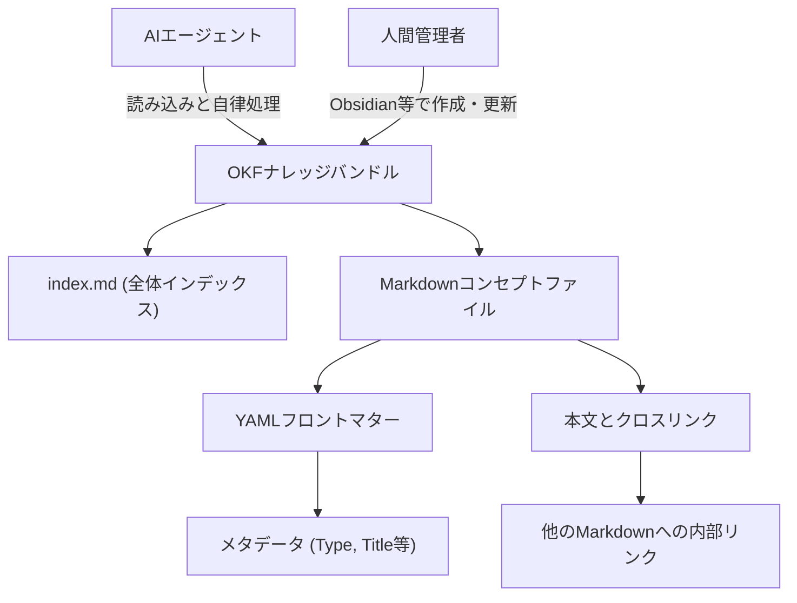

---

tags:
  - type/youtube
  - cat/thinking
  - topic/gemini
  - topic/notebooklm
---

# Google's OKF - The New Way to Structure Your Knowledge for Agents

## タイムライン
| タイムスタンプ | トピック                          | 主な内容                                                         |
| ------- | ----------------------------- | ------------------------------------------------------------ |
| 00:00   | OKF（Open Knowledge Format）の導入 | Googleが発表したAIエージェント向けの知識構造化新規格「OKF」の概要と重要性の提示。               |
| 01:03   | SEOの変化とエージェント対応               | 従来の「見つけてもらうSEO」から、エージェントが処理しやすい「Agent-Ready」への変革。            |
| 01:43   | 専門知識バンドルの販売機会                 | 専門家（弁護士やコンサルタントなど）のワークフローや知識をOKF化して他社にライセンス販売するモデル。          |
| 02:21   | NotebookLMとGeminiによる学習        | Googleの仕様書（SPEC.md）や公式ブログ記事をAIに読み込ませて対話し、OKFの基本を習得する方法。      |
| 03:02   | OKFの仕組みとLLM Wiki              | OKFがシンプルなMarkdownで構築されることと、カルパシー氏のLLM Wikiとの類似性について解説。       |
| 04:01   | OKF仕様書の分析                     | 人間にもエディタで読みやすく、AIエージェントにとっても論理的に処理しやすいMarkdown規格の優位性。        |
| 05:03   | ナレッジバンドルの概念                   | 特定テーマに関する複数のMarkdownファイルを1つのフォルダ（ナレッジバンドル）にまとめる仕組み。          |
| 05:51   | コンセプト単位の構造化                   | 1つの巨大なWebページをそのまま保存せず、個別の概念（コンセプト）ごとに細かくファイル分割する手法。          |
| 06:30   | YAMLフロントマターの役割                | Markdownの最上部にTypeやTitleなどの属性を定義し、エージェントが瞬時にファイル性質を理解するメタデータ。 |
| 07:18   | 本文、引用、クロスリンク                  | 信頼性のための引用と、バンドル内ファイル同士を繋いでAIが探索可能なナレッジグラフにするクロスリンク。          |
| 07:40   | ファイル整理とツール活用                  | index.mdやログファイルの役割、およびObsidianやGitを使用した人間とAIによるバージョン管理。      |
| 09:11   | BigQuery連携とプレイブックの例           | データベースの情報と、エージェントの手順書である「プレイブック」を組み合わせて自動タスクを実行する例。          |
| 11:12   | カルパシー氏のLLM Wikiの実践            | Markdownで個人の知識ベースを構築し、Claude Codeなどで直接AIに探索させる効率的なワークフロー。    |
| 13:48   | AIによるWikiの自動保守                | 最初の土台を作成すれば、その後の新規ファイル作成や既存ファイルのリンク追加などをAIエージェントに自動保守させる。    |
| 14:34   | 新しい「スキーマ」としての価値               | AI時代におけるSchema.orgのようになり、これの構築支援や最適化が主要なSEOコンサルビジネスとなる可能性。   |
| 17:15   | エージェントの発見と意味的解凍               | llms.txtを通じたエージェント自動発見や、データをAI向けに再構築する「セマンティック・アンベイキング」の紹介。  |

## 文字起こし
[00:00] 皆さんこんにちは、マリー・ヘインズです。GoogleがAIエージェント向けに情報を整理するための新しいオープン標準、「Open Knowledge Format（OKF）」を発表しました。これは非常に画期的な出来事です。これまでAIエージェントに知識を与える方法は、RAG（Retrieval-Augmented Generation）などの複雑なシステムを構築する必要がありましたが、OKFは非常にシンプルなMarkdown（マークダウン）ファイルを使用して、ビジネスや個人の知見をAIエージェントがすぐに利用できる形で提供します。本日は、このOKFがなぜSEOの未来を根本から変えるのか、そして最初のOKFバンドルを構築する方法や、専門知識を直接AIシステムに販売するビジネスチャンスについて徹底解説します。

[01:03] まず、OKFがSEO（検索エンジン最適化）に与える影響についてお話しします。従来のSEOは「検索エンジンに見つけてもらい、Webサイトにユーザーを誘導すること」が目的でした。しかし、AIエージェントがインターネットを巡回し、ユーザーの代わりにタスクを実行する時代において、SEOの役割は「ビジネスの知識をAIエージェントが効率的に理解・処理できるように整理すること」へとシフトします。OKFはこの「エージェント対応（Agent-Ready）」のWebサイトを構築するための鍵となる存在です。

[01:43] さらに興味深いのは、独自のプロプライエタリ（排他的・独占的）な専門知識を「OKFバンドル」としてパッケージ化し、それをAIシステムや他企業に直接販売できる可能性です。例えば、弁護士、会計士、特定の業界のコンサルタントが、自分たちの高度なワークフローやナレッジをOKF形式にまとめ、それをエージェント用の「第二の脳」として他の組織にライセンス販売する、といった新しい収益モデルが生まれるでしょう。

[02:21] では、この新しい規格をどうやって学べばよいでしょうか？最も簡単なアプローチは、GoogleのNotebookLMやGeminiを活用することです。Googleが公開したOKFのブログ記事やGitHubのリポジトリ（SPEC.md）のURLをこれらのツールに読み込ませ、「私はマリーのようなOKFシステムを作りたいです。これらの資料を読み込み、具体的な構築アイデアを提示し、私に1つずつ質問をしてください」といったプロンプトを投げることで、対話しながら学習を進めることができます。

[03:02] ここで、OKFの正体について詳しく見ていきましょう。基本的には、非常にシンプルなMarkdownファイル群のディレクトリです。このアプローチは、元OpenAIの著名な研究者であるアンドレイ・カルパシー（Andrej Karpathy）氏が提唱した「LLM Wiki」というパターンに非常によく似ています。特別なデータベースやソフトウェアを介さず、プレーンテキストのファイル構造だけでAIが容易にナビゲートできるナレッジベースを作成するというアイデアです。

[04:01] Googleが公開したOKF仕様（SPEC.md）を分析すると、このフォーマットが「人間」と「AIエージェント」の双方にとって使いやすい設計になっていることが分かります。従来のデータ共有規格は人間には読めない複雑なJSONやXMLが中心でしたが、OKFは人間がエディタで直接書き換えることができ、同時にAIにとっても論理構造が明確で理解しやすいMarkdownを採用しています。

[05:03] ここでOKFの重要用語である「Knowledge Bundle（ナレッジバンドル）」について解説します。ナレッジバンドルとは、ある特定のテーマや概念に関連するMarkdownファイルを集めた「ディレクトリ（フォルダ）」のことです。企業は、自社のブランド、サービスプロセス、技術ドキュメントなどを、それぞれのナレッジバンドルとしてフォルダ分けして整理していくことになります。

[05:51] OKFにおける情報の最小単位は「コンセプト（Concept）」です。これは、1つの概念や事象を1つのMarkdownファイルとして独立して記述することを意味します。Webサイトのページをそのままファイルにするのではなく、ページ内に含まれる個々の重要な概念、例えば「製品仕様」「トラブルシューティング手順」「ポリシー」などをそれぞれ個別のMarkdownに分解して構造化します。

[06:30] すべてのOKFファイルの最上部には、「YAMLフロントマター（YAML front matter）」と呼ばれるメタデータブロックが記述されます。ここには、そのファイルの「Type（コンセプト、プレイブック、リファレンス、システムなどの種別）」「Title（タイトル）」「Description（概要）」「Tags（タグ）」などの定義情報が記述されます。AIエージェントはこのYAMLフロントマターを読み取ることで、ファイルを開いた瞬間にそのドキュメントの性質を正確に把握することができます。

[07:18] ファイルの本文（Body）パートでは、Markdown標準のフォーマットに従いながら、情報の信頼性を担保するための「引用（Citations）」や、他のコンセプトファイルへの「クロスリンク（内部リンク）」を積極的に埋め込みます。これにより、エージェントはバンドル内の情報同士のつながり（ナレッジグラフ）を自律的に探索できるようになります。

[07:40] これらのファイルを整理・運用するにあたっては、全体を俯瞰する「Index（インデックス）ファイル」や、システムの変更履歴を管理する「Log（ログ）ファイル」が重要になります。さらに、ファイルの作成やバージョン管理には、Gitリポジトリを使用したり、ナレッジベースの視覚化・記述ツールであるObsidian（オブシディアン）を活用したりするのが非常に効果的です。これにより、人間側も自分のデジタル脳を整理しやすくなります。

[09:11] 実践的なユースケースを考えてみましょう。例えば、GoogleのBigQueryのような大規模なデータウェアハウスにあるデータと、OKF内の「プレイブック（Playbook）」を組み合わせる方法です。プレイブックとは、エージェントがどのような手順でタスクを実行すべきかを記したマニュアルです。特定のデータ変化（トリガー）を検知したエージェントが、OKFに記述されたプレイブックを読み込み、それに基づいて自動的に高度なビジネス分析やレポート作成、提案書のドラフト作成などを自律的に実行させることができます。

[11:12] ここで先ほど触れた、アンドレイ・カルパシー氏の「LLM Wiki」パターンをさらに深掘りしましょう。カルパシー氏は、個人の学習ノートやプログラミングの知見をMarkdownのWiki形式で保存し、それをローカルで動作するAIアシスタント（例えばClaude Codeなど）に直接読み込ませて対話するワークフローを実践しています。OKFは、この強力な「個人のAI用の脳」を作るアプローチを、Googleがエンタープライズや汎用的なエージェントWeb向けに公式なオープン標準として洗練させたものだと言えます。

[13:48] OKFの素晴らしい点は、人間がすべてを手書きで保守する必要がないことです。初期のドキュメントや構造を定義した後は、LLMエージェント自身に「この新しいドキュメントを読み込んで、既存のOKFナレッジベースに適したMarkdownファイルを生成し、適切なYAMLフロントマターを付与して、既存ファイルへのリンクを追加してください」と依頼することができます。つまり、AIに自分のナレッジWikiの執筆と更新を任せることができるのです。

[14:34] 私は、OKFがかつてのSEOにおける「スキーママークアップ（Schema.org）」のような、新しい時代のデファクトスタンダード（業界標準仕様）になると確信しています。今後、すべての企業が「エージェント対応のナレッジシステム」を構築する必要に迫られます。これを構築・最適化できる専門家への需要は爆発的に高まるでしょう。OKFの構造化を支援するコンサルティングや、高品質な業界専門ナレッジバンドルの販売は、極めて有望な未来の収益源となります。

[17:15] 最後に、AIエージェントがあなたのWebサイト上のOKFを発見・取得する仕組みについてです。これは「llms.txt」というファイルや、サイトの構造化によって行われます。また、これまでの複雑なデータベースからAI向けのシンプルなMarkdownに情報を再構築するプロセスは「セマンティック・アンベイキング（Semantic Unbaking：意味的な解凍）」と呼ばれ、データの価値を最大限に引き出す手法として注目されています。ぜひ皆さんも、OKFを使ってAIエージェント時代に備えた「第二の脳」を構築し始めてください。

## 概要
Googleが発表した「Open Knowledge Format (OKF)」は、AIエージェントが効率的にアクセスして理解できるように、人間にも編集可能なMarkdownファイルを用いて知識を構造化する新しいオープン標準規格です。

主なポイントは以下の通りです：
1. **SEOのパラダイムシフト**: Webサイトに人間を集める「検索上位化」から、AIエージェントが自律的にタスクを処理しやすくする「エージェント最適化（Agent-Ready）」へと目的が変化します。
2. **ナレッジバンドル構造**: 知識を概念ごとに単一のMarkdownファイル（コンセプト）に分割し、YAMLフロントマターと呼ばれるメタデータで分類してフォルダ（ナレッジバンドル）に整理します。
3. **LLM Wikiパターンとの親和性**: アンドレイ・カルパシー氏が提唱する「LLM Wiki」と同様、プレーンテキストをベースにした軽量なナレッジグラフを作成し、人間はObsidianやGitで管理し、AIがこれを学習して自律運用します。
4. **ビジネスモデルの創出**: 企業や専門家（弁護士、コンサルタント等）が自社の専門知識をOKFバンドルとしてパッケージ化し、ライセンス販売する新たなデータエコノミーが到来します。
5. **新世代の「スキーママークアップ」**: AIエージェントにWeb上のデータを解凍して提供する「セマンティック・アンベイキング」において、OKFは新しい共通基盤（デファクトスタンダード）となる可能性を秘めています。

## 構成図 (Mermaid)

