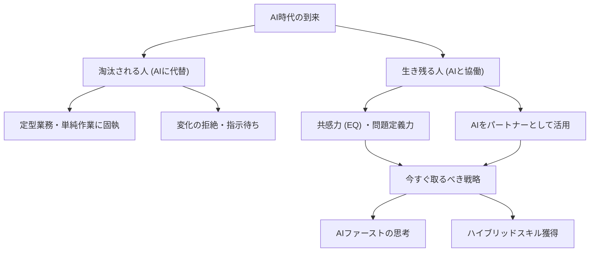

---

tags:
  - type/youtube
  - cat/thinking
  - topic/chatgpt
  - topic/mindset
---

# 【AI時代】淘汰される人と生き残る人の決定的な違い「3つの特徴」と今すぐ取るべきキャリア戦略

## タイムライン
| タイムスタンプ | セクション | 概要 |
| --- | --- | --- |
| 00:00 | イントロダクション | 生成AI（ChatGPTなど）の進化と働き方の変化、動画の趣旨説明。 |
| 02:15 | 淘汰される人の3つの特徴 | 単純作業への固執、変化の拒絶、主体性の欠如（指示待ち）がリスクとなる理由。 |
| 05:30 | 生き残る人の3つの特徴 | AIをパートナーとして活用する姿勢、共感力（EQ）の高さ、問題定義力と創造性の発揮。 |
| 08:45 | 今すぐ取るべき3つのキャリア戦略 | AIファースト思考の実践、専門性×AIのハイブリッドスキル、継続的学習ループの確立。 |
| 11:50 | まとめと結び | AIは人間の可能性を広げる相棒であり、恐れずに共生していくことの重要性。 |

## 文字起こし
[00:00] みなさん、こんにちは。今回は「AI時代に淘汰される人と生き残る人の決定的な違い」というテーマでお話しします。ChatGPTをはじめとする生成AIの進化によって、私たちの働き方は劇的に変化しています。「自分の仕事がAIに奪われるのではないか」と不安を感じている方も多いのではないでしょうか。しかし、過度に恐れる必要はありません。大切なのは、AIの特性を理解し、人間ならではの強みをどう活かしていくかです。本日は、淘汰される人と生き残る人の具体的な特徴を比較しながら、今すぐ実践できるキャリア戦略について詳しく解説していきます。

[02:15] まず、AI時代に淘汰されてしまう人の1つ目の特徴は、「単純な作業や記憶に頼る仕事に固執していること」です。AIは膨大なデータの記憶や、一定のルールに基づいた定型業務において、人間を遥かに凌駕する圧倒的なパフォーマンスを発揮します。そのため、これまで「正確に処理すること」だけが価値だった業務は、急速にAIに代替されていきます。2つ目の特徴は、「変化を拒み、新しいテクノロジーを学ぼうとしない姿勢」です。「AIなんて自分には関係ない」「昔ながらのやり方が一番だ」と心を閉ざしてしまうと、ツールの進化から取り残され、仕事の生産性に圧倒的な差がついてしまいます。3つ目の特徴は、「指示待ち人間」であることです。AIは指示（プロンプト）を与えることで動くツールです。自ら課題を発見し、主体的に問いを立てられない人は、AIを使いこなす側ではなく、AIに代替される側に回ってしまいます。

[05:30] 一方で、AI時代に強く生き残り、さらに活躍を広げていく人には明確な特徴があります。1つ目の特徴は、「AIを自分の優秀な部下やパートナーとして使いこなしていること」です。彼らはAIと競うのではなく、AIを壁打ち相手にしたり、ドラフト作成やリサーチを任せることで、自身の生産性を何倍にも高めています。2つ目の特徴は、「高い共感力と感情的インテリジェンス（EQ）を持っていること」です。どれだけAIが進化しても、人間の感情に寄り添い、信頼関係を築き、チームを鼓舞する能力は人間にしかできません。クライアントの真の悩みを引き出し、伴走する力こそが、これからの最大の武器になります。3つ目の特徴は、「自ら課題を設定し、クリエイティブな問いを立てる力（問題定義力）」です。AIは与えられた問いに対して答えるのは得意ですが、「何が本当の課題なのか」を見極め、新しいプロジェクトをゼロから立ち上げることはできません。

[08:45] では、私たちが今日から取るべき具体的なキャリア戦略についてお話しします。ステップは3つあります。ステップ1は「AIファーストの思考を取り入れる」ことです。毎日の仕事の中で、「この作業はAIに手伝ってもらえないか？」と常に問いかける癖をつけてください。メールの作成、企画案のブレスト、プログラミング、翻訳など、日常のあらゆる場面でAIを実際に使ってみることが第一歩です。ステップ2は「ハイブリッドスキルの育成」です。あなたの既存の専門知識（ドメイン知識）に、AI活用スキルを掛け合わせることで、市場価値は爆発的に高まります。単なるマーケターではなく「AIを駆使する超効率的マーケター」を目指しましょう。ステップ3は「継続的な学びのループを作る」ことです。テクノロジーは日々進化します。学びを止めず、常に新しい情報をキャッチアップし、小さく試していく姿勢が、変化の激しい時代を生き抜く唯一の生存戦略です。

[11:50] 最後にまとめです。AIは私たちの敵ではなく、人間の可能性を無限に広げてくれる「最強の相棒」です。AIの登場によって、私たちはつまらない単純作業から解放され、より人間らしく、クリエイティブで、やりがいのある仕事に集中できるようになります。未来を不安視するのではなく、新しいテクノロジーを味方につけて、自身のキャリアをさらに輝かせていきましょう。本日の内容が少しでも皆さんの参考になれば幸いです。チャンネル登録と高評価もぜひよろしくお願いします。それでは、また次回の動画でお会いしましょう。

## 概要
生成AIの急速な普及に伴い、仕事が奪われる不安が高まる中、AI時代に「淘汰される人」と「生き残る人」の特徴を対比し、今後のキャリア戦略を提示する動画です。AIは定型業務や記憶力において人間を圧倒するため、現状維持を望む姿勢や指示待ちの働き方では淘汰のリスクが高まります。一方で、AIをパートナーとして協働し、共感力（EQ）や問題定義力といった人間ならではの強みを活かす人は活躍を広げることができます。今日からできるアクションとして、日常業務にAIを取り入れる「AIファーストの思考」、既存の専門性にAIスキルを掛け合わせる「ハイブリッドスキルの育成」、そして「継続的な学習」を提唱。AIを脅威ではなく、自己の可能性を広げる相棒として捉える重要性を説いています。

## 構成図 (Mermaid)

