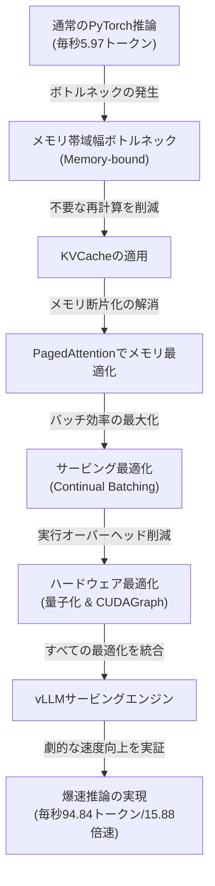

---

tags:
  - type/youtube
  - cat/thinking
  - topic/productivity
---

# 【LLM高速化】推論システムを15倍速くする最新技術と実装解説（KVCache / PagedAttention / vLLM）

## タイムライン
| タイムライン | 発表トピック | 概要 |
| :--- | :--- | :--- |
| [00:00] | オープニングと自己紹介 | LLMの遅さと運用コストを劇的に解消する「LLM推論システム高速化」のテーマ概要を説明 |
| [01:30] | 言語生成プロセスのおさらい | Transformer Decoderによる自己回帰生成の流れ（Prefill・Decodeフェーズの違い）を再確認 |
| [04:00] | PyTorchによる通常推論（5.97 T/S） | Colab無料枠で動作するQwen2.5を用いた標準推論が「メモリ帯域幅制限」により極めて遅い実態を示す |
| [06:30] | KVCacheとPagedAttention | 冗長計算を防ぐKVCacheの基本と、不連続領域を有効活用してメモリ浪費を防ぐPagedAttentionを解説 |
| [09:30] | アテンション効率化（FlashAttention/GQA/MLA） | メモリIOを意識したFlashAttentionや、KVを低ランク圧縮してKVCacheを縮小するMLAアーキテクチャの役割 |
| [12:30] | サービング最適化（Continual Batching/Preemption） | 動的なリクエスト割り込み処理（Continual Batching）やメモリ上限超過時のPreemption制御の仕組み |
| [15:30] | ハードウェア最適化とRooflineモデル | モデル重みを圧縮する「量子化」、CPU・GPU間のオーバーヘッドを減らす「CUDAGraph」や推論の特性分析 |
| [18:30] | vLLMによるハンズオンと劇的な効果（94.84 T/S） | vLLM環境での驚異の15.88倍速化データを示し、vLLMへのコントリビュートデバッグ方法を伝授 |
| [21:30] | 分散処理とGPUアーキテクチャの基本 | 超巨大モデルを捌く複数ノード並列手法（TP/PP等）と、NVIDIA Tensor Core/TMA機能について解説 |
| [23:00] | まとめと今後の展望 | LLM高速化は「メモリ・計算・スケジューリング」の統合工学であることを整理し、勉強会を総括 |

## 文字起こし
[00:00] 皆さん、こんにちは。本日の勉強会では「LLM高速化」をテーマに、大規模言語モデルの推論を劇的に爆速にするための各種技術と、実際のシステムへの実装について解説していきます。スライドのタイトルは「LLM高速化勉強会」となっていますが、実質的には「LLM推論システム勉強会」と呼んだ方がしっくりくる内容です。LLMをプロダクション環境で動かす上で、遅さとコストに悩まされている方は非常に多いと思います。今回は、標準的なPyTorchによる推論からスタートし、最終的にオープンソースのサービングフレームワークであるvLLMを使って約15倍以上の高速化を達成するプロセスを解説します。

[01:30] まず最初に、自己回帰型モデルであるLLMが、どのようにテキストを生成しているのかという基本をおさらいしましょう。GPTやLlama、Gemmaといった代表的なLLMは、Transformerのデコーダー（Decoder）アーキテクチャを採用しています。テキスト生成は、前のトークンを入力として次の1トークンを予測する、という処理を繰り返す自己回帰（Autoregressive）のプロセスです。このプロセスには大きく分けて、最初のプロンプトを処理して初期状態を作る「プリフィル（Prefill）」フェーズと、その後トークンを1つずつ順番に出力していく「デコード（Decode）」フェーズの2つが存在します。Q、K、Vの各行列を用いたアテンション（Attention）計算が繰り返されますが、毎回テキスト全体を再計算するのは非常に非効率です。

[04:00] では、実際にどれくらい遅いのか、通常のPyTorchを使って推論を動かしてみましょう。今回使用するモデルは軽量な「Qwen2.5-0.5B-Instruct」で、Google Colabの無料枠（Tesla T4等のGPU）で動かせるものです。標準的なHugging FaceのTransformersライブラリとPyTorchを用いてそのまま推論を実行すると、処理速度は「毎秒5.97トークン」程度にとどまります。このモデルサイズに対して、この速度は非常に遅いです。なぜこれほど遅くなってしまうのかというと、毎ステップで同じ過去の計算を無駄に繰り返していることや、GPUメモリと計算ユニット（Tensor Core）間のデータ転送速度がボトルネックになっていることが主な原因です。

[06:30] この遅さを解決するための最も基本的なアルゴリズム的高速化手法が「KVCache（キー・バリュー・キャッシュ）」です。テキスト生成時、アテンション計算に必要な過去のトークンのKey（K）とValue（V）の情報は変化しません。そのため、これらをメモリ上にキャッシュしておき、新しいトークンに対する計算時のみキャッシュを再利用することで、アテンション計算の計算量を毎ステップ O(N^2) から O(N) に削減できます。しかし、通常のKVCacheは、GPUメモリ上に連続した領域を確保する必要があります。これにより、最大サイズを見越してメモリを事前に大きく確保しなければならず、多くの領域が未使用のまま放置される「メモリの断片化（フラグメンテーション）」が発生します。これに対処するために考案されたのが「PagedAttention」です。OSの仮想メモリ技術（ページング）に着想を得て、KVCacheを不連続な物理ブロックに分割して動的に割り当てることで、メモリの無駄を実質ゼロに抑え、より多くのバッチを同時に処理することが可能になります。

[09:30] さらにアテンションを効率化する手法として、「FlashAttention」や「GQA（Grouped Query Attention）」、そして近年話題の「MLA（Multi-head Latent Attention）」があります。FlashAttentionは、GPUの高速なSRAMと低速なHBM（高帯域幅メモリ）間のメモリ転送（IO）を意識したアルゴリズムで、中間行列の書き出しを避けることで計算を劇的に高速化します。また、アテンションのヘッド数を最適化するGQAや、KVヘッドの情報を低ランクに圧縮してKVCacheのメモリ消費を大幅に削減するMLAなども、GPUメモリの圧迫を回避するための極めて重要なアーキテクチャ設計です。

[12:30] 次に、LLMを複数のユーザーに同時にサービス提供する「サービング層」での最適化技術を見ていきましょう。一般的な機械学習モデルではバッチ処理を行いますが、LLMでは各リクエストの生成トークン数が異なるため、バッチ全体が完了するのを待つと効率が最悪になります。これを解決するのが「Continual Batching（イテレーションレベル・バッチング）」です。各トークン生成の反復ごとに、終了したリクエストを動的に排出し、新規リクエストを割り込ませることで、GPUを休ませることなく高効率で回し続けます。また、vLLMなどのプロダクション向けエンジンでは、万が一KVCacheメモリが不足した際に、進行中のリクエストを一時中断（Preempt）して、データをCPUにオフロード（退避）したり、復活時に再計算したりするスケジューラー（Scheduler Class）が実装されており、システムの堅牢性を担保しています。

[15:30] システム全体のパフォーマンスを引き上げるためには、ハードウェアおよびシステム層での最適化も欠かせません。例えば「量子化（Quantization）」は、通常FP16やBF16（16ビット浮動小数点）で表現されている重みや活性化関数をINT8やINT4（8ビット/4ビット整数）に圧縮する技術です。これにより、モデル全体のサイズが劇的に縮小し、GPUメモリへのデータ転送帯域のボトルネックが解消されます。また、GPU側でのカーネル起動オーバーヘッドを削減するために「CUDAGraph」を活用し、一連のCUDA操作をグラフとして事前登録しておくことで、CPU待ち時間を完全に排除します。LLMのデコードフェーズは計算ではなくメモリ帯域がボトルネックになる「Memory-bound」な特性を持つ（Rooflineモデルで確認できます）ため、これらのメモリ最適化がそのまま性能向上に直結します。

[18:30] これらすべての最適化技術（KVCache、PagedAttention、Continual Batching、CUDAGraphなど）が統合されたサービングエンジン「vLLM」を使い、先ほどと同じColab環境で再度ハンズオンの推論を回してみましょう。結果は驚くべきもので、推論速度は先ほどの毎秒5.97トークンから、「毎秒94.84トークン」へと跳ね上がります。実に「15.88倍」もの驚異的な高速化が達成されたことになります。vLLMは非常にモジュール化されており、オープンソースでのコントリビュート（改造や貢献）がしやすい点も魅力です。ローカルデバッグ時には、デフォルトのマルチプロセス環境をインプロセスに変更する環境変数（VLLM_ENABLE_V1_MULTIPROCESSING=0）を設定しておくと、デバッガーで処理を追いやすくなるのでおすすめです。

[21:30] 最後に、さらにモデル規模が大きくなった際の「複数ノードによる分散処理」についても触れておきます。単一のGPUに入り切らない超巨大LLMを処理するためには、MPI（Message Passing Interface）を活用したデータ並列（DP）、パイプライン並列（PP）、テンソル並列（TP）、コンテキスト並列（CP）といった分散計算アプローチが必要です。また、NVIDIA製GPUのハードウェア機能であるTensor Coreや、ホストとデバイス間のデータ転送を非同期に最適化するTMA（Tensor Memory Accelerator）といった低レベルなGPUアーキテクチャの知識も、さらなる最適化を極める上では非常に重要になってきます。

[23:00] まとめとして、LLMの高速化は、単にモデルを小さくするだけでなく、メモリ階層の最適化（PagedAttention、KVCacheの再利用）、実行オーバーヘッドの削減（CUDAGraph、Kernel Fusion）、そして賢いスケジューリング（Continual Batching、Prefill/Decode分離）をシームレスに組み合わせるシステムエンジニアリングの芸術です。今回学んだ高速化の各概念を理解し、ぜひ皆さんもローカルLLMのサービング、そしてオープンソースコミュニティへのコントリビュートに挑戦してみてください。ご視聴ありがとうございました。

## 概要
■タイトル：【LLM高速化】推論システムを15倍速くする最新技術と実装解説（KVCache / PagedAttention / vLLM）
■概要：大規模言語モデル（LLM）の推論処理における最大のボトルネックである「メモリ帯域幅（Memory-bound）」と「冗長な再計算」を解消し、システム全体を約15倍高速化する各種技術を解説。
■キーポイント：
1. 自己回帰生成とボトルネック: LLMは1トークンずつ予測する自己回帰モデルであり、デコードフェーズはメモリ帯域がボトルネック（Memory-bound）となるため、単純なGPU計算速度の向上だけでは限界がある。
2. アテンションの最適化: 計算量を O(N^2) から O(N) に抑える「KVCache」と、仮想メモリに着想を得てメモリの断片化と浪費を解決する「PagedAttention」（仮想化ブロックアロケーション）が高速化の核心。
3. システム・サービング層の工夫: バッチ実行効率を高める「Continual Batching」、CPU呼び出しのオーバーヘッドを防ぐ「CUDAGraph」、メモリ転送を省力化する「量子化」を統合。
4. vLLMの導入結果: 通常のPyTorchによる推論（5.97 tokens/sec）に対し、vLLMを導入することで「94.84 tokens/sec」へと劇的な高速化（約15.88倍）を実証した。

## 構成図 (Mermaid)

