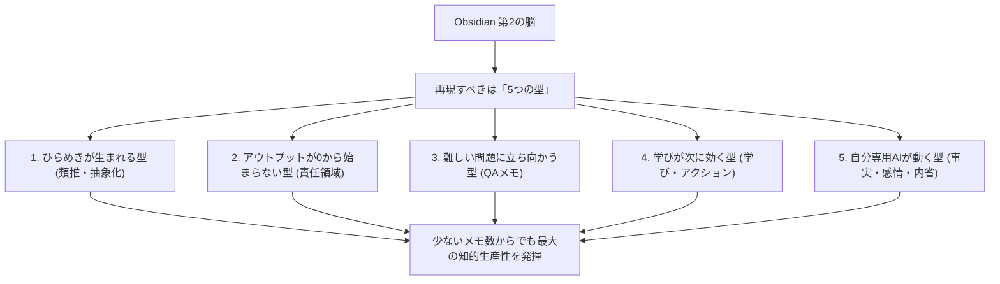

---

tags:
  - type/youtube
  - cat/thinking
  - topic/notebooklm
  - topic/obsidian
---

# 【Obsidian】メモが少なくてもAIの出力が変わる メモ10000枚級 of 第2の脳を手に入れる方法

飯塚
## タイムライン
| タイムスタンプ | 項目・トピック | 概要・ポイント |
| :--- | :--- | :--- |
| 00:00 | 導入 | 10,000枚のメモを溜めなくても始められる、少ないメモで効果を最大化する方法を提案。 |
| 01:49 | 10000枚で起きていたこと | 本質は枚数ではなく5つの「型」であるとし、メモが少ない段階からでも再現可能なアプローチを提示。 |
| 02:49 | ひらめきがポコポコ生まれる型 | 頭を縦方向に使う「類推（アナロジー）」を活用し、情報を一段上に抽象化したコンセプトメモの作成法を解説。 |
| 06:31 | アウトプットが0から始まらない型 | 知識と行動を明確にフォルダーで分割し、過去の文脈をAIに渡すことでアウトプットの0ベース作成を回避。 |
| 09:38 | 難しい問題に立ち向かう型 | NotebookLM等のAIと対話し、「なぜ〇〇なのか？」という問いと答え（QA）の形でメモを整理する技術。 |
| 14:19 | 学びが次に効く型 | 単なる読書メモに留まらず「学び＋具体的なアクション」をセットで書き起こし、将来やAIの動作に活かす。 |
| 18:07 | 自分専用AIが動く型 | デイリーノートを「事実・感情・学び」で書き、感情を客観的に内省することで独自の信念・価値観を蓄積する。 |
| 22:12 | 本日のまとめ | 5つの型を意識して日々小さなメモを書くことで、枚数に頼らず最強の右腕（AI）を育てられると総括。 |
[5つの型](<https://docs.google.com/document/d/1cP786np8TTd5lIPyLWgxdAQLcCBtrLfwik6Pp0lzT0k/edit?tab=t.ghiataloq910>)

## 文字起こし
[00:00] みなさん、こんにちは。最強の右腕を作ろう、飯塚です。今回は「Obsidianでメモ10000枚級の第2の脳を手に入れる方法」についてお話しします。私自身、現在10,000枚を超える膨大なメモをObsidianの中に蓄積していますが、これを聞いた視聴者の皆さんから『飯塚さんは10,000枚もあって凄いけれど、自分にはそんなに多くのメモを溜めるのは先が遠すぎて心が折れそう』という声を非常によくいただきます。しかし、安心してください。結論から言うと、本当に大切なのは「10,000枚という枚数」をただ追い求めることではありません。実は、たった1枚のメモからでも、劇的にAIの出力を変え、知的生産を最大化するアプローチが存在するのです。

[01:49] それでは、なぜ枚数が重要ではないのかについて説明します。実際に10,000枚のメモを溜めた私の脳内で起きていたことを分析すると、再現すべきなのは物理的な枚数の多さではなく、メモを通じて頭の中で行われている「5つの思考と行動の型（パターン）」でした。ただの日記や雑多なメモを闇雲に溜めるのではなく、この5つの型を意識してメモを書き始めるだけで、枚数が少なくても10,000枚級の第2の脳と同じクオリティの恩恵を受けることができます。本日はその具体的な5つの型を皆さんにご紹介します。

[02:49] 1つ目の型は「ひらめきがポコポコ生まれる型（類推・抽象化）」です。これは頭を縦方向に使う運動、すなわち「アナロジー（類推）」を指します。例えば、リンゴが木から落ちるのを見て万有引力を思いつくように、単なる事実の記録に留まらず、物事を一段上の抽象度に引き上げて「要するにこれはどういう構造か？」と考えるアプローチです。例として、最新AIツールであるNotebookLMをAIに詳しくないおばあちゃんに説明する場合を考えます。そのまま技術用語を使うのではなく、「自分専用の資料をきれいに並べた博物館のようなもの」と例えることができます。このように抽象化された「コンセプトメモ」を書いていくことで、少ないメモでもアイデア同士が縦横無尽にリンクし、ひらめきが生まれやすくなります。

[06:31] 2つ目の型は「アウトプットが0から始まらない型（責任領域の分割）」です。知的生産において、知識のインプットと実際の行動・アウトプットは明確に分けるべきです。Obsidianの中で、雑多な一般知識やリンクで繋がるメモは「01ノーツ」のような1つのフォルダーに全て放り込んで構いません。一方で、自分が過去に作成した成果物、企画書、プロジェクトファイルなどは「アウトプット用フォルダー」という責任領域を明確にした場所に格納します。このフォルダーをそのまま丸ごとAIに読み込ませることで、AIがあなたの過去の文脈や思考スタイル、執筆パターンを深く理解します。これにより、次回新しい資料やアウトプットを作成する際に、0から書く必要がなくなり、AIが最初からあなたのトーンに合わせた高精度な下書きを出力してくれるようになります。

[09:38] 3つ目の型は「難しい問題に立ち向かう型（NotebookLMとObsidianの併用）」です。私たちは日常で非常に複雑で難解な問題に直面することがあります。その際、全ての情報をいきなり手書きでメモにまとめようとするのは非効率です。解決策として、まずは関係する論文や膨大な資料をNotebookLMなどのAIツールに一括してアップロードします。AIにその内容からスライドの骨子やポッドキャスト形式の解説を生成させ、全体像をざっくりと把握します。その後、チャット機能を使って疑問点をAIと壁打ちし、解決した内容を「なぜ〇〇なのか？」という明確な「問いと答え（QA形式）」としてObsidianに格納します。複雑な課題を「問い」の形でメモに残すことで、将来の強力な思考の資産となります。

[14:19] 4つ目の型は「学びが次に効く型（人間とAIの協調）」です。多くの人は本や記事を読んだ際、単に「第2章：〇〇について」のような知識の要約だけをメモに残しがちです。しかし、これではその本でしか通用しない閉じた知識になってしまいます。現実の仕事や生活に役立てるためには、「何が学べたか」だけでなく「**それを次にどう活かすか（学び＋アクション）**」をセットでメモに書き出す必要があります。このようにアクションベースで具体化されたメモは、あなたが次に似たような課題に直面した時に脳の引き出しを開けるトリガーになるだけでなく、AIに対して実行指示を出すための「カスタム命令（スキル・指示書）」として直接再利用することができます。

[18:07] 5つ目の型は「自分専用AIが動く型（パーソナライズと内省）」です。AIの回答を自分に合わせてパーソナライズさせる最強の入り口が「デイリーノート」です。デイリーノートは普通の日記とは異なり、「事実」「感情」「学び」の3つの要素に整理して記述します。ここでのポイントは、その日に感じた感情をただ書くのではなく、一歩引いて客観的にその感情を「上方向に引き抜く（内省する）」というプロセスです。内省によって抽出された「自分はどのような価値観を大切にしているのか、どのような信念を持っているのか」というパーソナリティのメモを蓄積していくことで、AIがあなたの本質を理解します。その結果、AIは当たり障りのない一般論ではなく、あなたの信念に完全にパーソナライズされた、あなただけの最強のパートナーへと進化します。

[22:12] 本日のまとめです。Obsidianで第2の脳を構築するにあたって、10,000枚という数字に圧倒される必要は一切ありません。今回ご紹介した5つの型、すなわち「類推による抽象化」「アウトプットフォルダの分離」「AIとの壁打ちによるQA作成」「学びとアクションのセット化」「デイリーノートによる自己の内省」を意識して、日々の小さなメモを1枚ずつ丁寧に書いていくだけで、今日からすぐに最強の右腕（AIエージェント）を動かすための強力な脳の土台を手に入れることができます。ぜひ、できるところから試してみてください。

## 概要
本動画では、第2の脳（デジタルセカンドブレイン）構築ツール「Obsidian」において、膨大なメモ数（10,000枚など）を持たない初心者でも、少ないメモから最大の知的生産性を発揮し、AIの出力を最適化するための「5つの思考と行動の型」を詳しく解説しています。

【キーポイント】
1. **枚数ではなく「型」が重要**：10,000枚のメモを溜める必要はなく、特定の思考パターンを意識してメモを構築することが価値を生みます。
2. **ひらめきを生む類推（アナロジー）**：情報をそのまま記録せず、「要するに何か？」と抽象化したコンセプトメモを作成することで、異なる分野への応用とひらめきを促します。
3. **知識とアウトプットの明確な分離**：過去の成果物を「アウトプット用フォルダー」に整理し、AIにコンテキストとして参照させることで、次回からの作成コストをゼロに近づけます。
4. **問いと答え（QA）のメモ化**：NotebookLM等のAIと複雑な資料を読み解き、「なぜ〜なのか？」という問い形式で要点を残すことが知的資産になります。
5. **学びアクションと自己内省**：「学び＋次の行動」をセットで記録し、デイリーノートで自分の信念・価値観（感情の客観視）を溜めることで、AIが完全にパーソナライズされた最強の右腕へと成長します。

## 構成図 (Mermaid)

