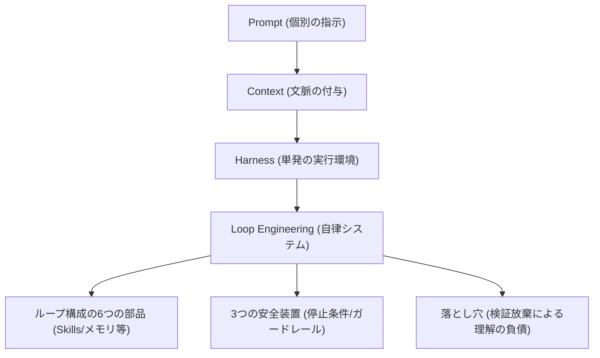

---

tags:
  - type/youtube
  - cat/thinking
  - topic/claude
  - topic/automation
---

# 【もうプロンプトは書くな！】 Loop Engineering 徹底解説

## タイムライン
| セクション | 開始時間 | 概要 |
| --- | --- | --- |
| オープニング | 00:00 | AIエージェントの最新トレンド「Loop Engineering」の紹介と概要 |
| 導入：プロンプトは古い？ | 00:15 | Claude Code責任者等の「もうプロンプトは打っていない」発言の背景 |
| 本質：ループを設計するとは | 01:12 | 手動のターン制から、指示・実行・検証を自律的に回すシステム設計への移行 |
| なぜ今か：4段階の進化 | 02:31 | Prompt → Context → Harness → Loop へと至るAIエンジニアリングの進化史 |
| ループの6つの部品 | 04:57 | トリガー、隔離ワークスペース、Skills、役割分担、コネクタ、外部メモリの解説 |
| 最難関：3つの安全装置 | 09:03 | 無限ループと課金爆発を防ぐ、回数上限・進捗差分・予算上限の3つのガードレール |
| 賛否と本当の落とし穴 | 11:19 | 自動化による「理解の負債」蓄積リスクと人間の検証責任の重要性 |
| 最小から始める3ステップ | 13:07 | 読み取り専用からの開始、停止条件の初期実装、差分の徹底理解という実践手法 |

## 文字起こし
[00:00] やってきました！やっほー、スラだよ！今日もAIエージェントの最前線について一緒に楽しく学んでいこうね。今回は、今エンジニア界隈でめちゃくちゃ話題になっている「Loop Engineering（ループエンジニアリング）」について徹底解説するよ！

[00:15] まずは導入として、「プロンプトはもう古い？」っていうお話から。最近、「もうプロンプトを打つな。プロンプトを打たせる“ループ”を設計しろ」というPeter Steinberger（steipete）氏の投稿が、わずか24時間で500万インプレッションを突破して大バズりしたんだよね。さらに、AnthropicでClaude Codeの開発を率いるBoris Cherny氏まで「僕はもうClaudeに直接プロンプトを打っていない。プロンプトを打って何をすべきか判断するループを走らせているだけだ。今の僕の仕事は、そのループを書くことだよ」と言い出したの。これ、すごくない？

[01:12] じゃあ、その「ループを設計する」って本質的にはどういうことなんだろう？これまでのプロンプトエンジニアリングは、人間が1ターンごとに指示を考えて、結果を見て、また手動で次の指示を打つという、いわば「人間駆動のターン制」だったんだよね。それに対してループエンジニアリングは、人間が「ループの中の人」をやめて、プロンプトを自律的に生成・実行し、結果を検証して、ゴールに達するまで繰り返す「システムそのもの」を設計するってこと。つまり、AIモデルを一つの関数のように扱って、外側のシステムから自動で叩き続ける仕組みを作るんだよ。

[02:31] なぜ今、このタイミングでこの概念が出てきたのか。それは、AIの使い方が段階的に進化してきたからなんだ。進化の歴史は4つのステップに分かれているよ。1段階目は「Prompt（指示）」。プロンプトを工夫して1回で良いコードを出させる段階。2段階目は「Context（文脈）」。関連するファイルやコードの文脈をたくさん追加して精度を上げる段階。3段階目が「Harness（ハーネス）」。エージェントが1回動くための装備、つまりどのツールを持たせて、テストをどう走らせるかという「実行の器」を整える段階。そして最新の4段階目が「Loop（ループ）」。人間が介在せずに、自動でバグを検知し、直して、テストを回し、直るまでループする自走システムの設計なんだ。

[04:57] ここからは、自律的なループを設計するための「6つの部品」を紹介するね。まず1つ目は「トリガー（自動起動）」。GitHubのIssueが起きた時や、特定のスケジュールで自動で動き出す仕組み。2つ目は「隔離（Workspace）」。複数のAIが並行して動く時に、お互いの足を引っ張らないように、git worktree等を使って個別の作業ブランチを自動で用意する環境。3つ目は「Skills」。毎回0から手順を教えなくていいように、ビルド方法や設計ルールを「SKILL.md」などにアセットとして書き残しておく場所。4つ目は「役割分担（Verifier）」。バグを修正する「実装者エージェント」と、それが正しいかテストする「検証者エージェント」を別々に分けて、相互監視させる仕組み。これがすごく効果的なんだ。5つ目は「コネクタ（MCPなど）」。AIがGitHubやSlackなどの外部ツールと自由につながるためのプラグイン。そして6つ目は「メモリ（永続状態）」。ループが途中で途切れても「何が完了して、次は何か」をSTATE.mdのようなテキストファイルに記録して、会話の枠を超えて引き継ぐための記憶領域だよ。

[09:03] さて、ループを設計する上で「一番むずかしいポイント」があるんだ。それは「停止条件（安全装置）」だよ。「止め方を決めていないループは、ただの請求書」って言われるくらい、無限ループに入ると恐ろしいトークン課金が発生しちゃうんだよね。これを防ぐために、次の3つのガードレール（安全装置）を必ず入れる必要があるよ。1つ目は「イテレーション回数の上限」。最大でも10回ループしたら強制終了する物理的なキャップ。2つ目は「進捗の差分チェック」。直近数回のループで出力コードや動作に変化がない場合、行き詰まって同じ場所をぐるぐる回っていると判断して諦めて止める仕組み。3つ目は「予算上限」。トークン消費量や金額に直接上限を設定して、お財布を守る安全装置。この3つを組み合わせることで、安心してAIに仕事を任せられるんだ。

[11:19] でも、ここまで便利そうだと「もうエンジニアは不要になるの？」って思うよね。でもスラは、このトレンドに対する「賛否」と「本当の落とし穴」もちゃんと伝えたいの。肯定派は「これはプログラミングの新しい抽象化レイヤーだ」と絶賛している一方、冷ややかな視線からは「ただのcron job（定期実行）にかっこいい名前をつけただけだろ」という皮肉もあるの。そして本当の落とし穴は、「人間の検証放棄」にあるんだ。AIが自動でPR（プルリクエスト）を出し続けてくれるのは楽だけど、人間が内容を読まずにマージし続けると、「理解の負債（Comprehension Debt）」が恐ろしいスピードで積み上がっていく。半年後にバグが出た時、誰もそのコードの構造を理解していないという地獄が待っているんだよ。検証と理解の責任だけは、絶対に手放しちゃダメ。

[13:07] 最後に、明日からでも「最小から始める3ステップ」を紹介するね。ステップ1は、最初は「読み取り専用」で回すこと。ファイルを書き換えたりPRを送ったりさせず、ログを読んで提案だけさせる。ステップ2は、「イテレーション上限」と「予算上限」の停止条件を必ず最初に設計すること。ステップ3は、出てきたコードの差分を毎回人間がしっかりと読んで理解すること。この3つを守れば、安全にループエンジニアリングの恩恵を受けられるよ。人間がプロンプトを1つずつ手打ちする時代から、プロンプトを動かすシステムを設計する時代へ。さあ、みんなも一歩上のレイヤーでAI開発を始めよう！

## 概要
「Loop Engineering（ループエンジニアリング）」は、これまでの「人間が1ターンごとに指示を入力する」プロンプトエンジニアリングから脱却し、AIに自律的な実行・検証・継続判断を繰り返させる「ループ（システム）」そのものを設計する新しいパラダイムです。

【キーポイント】
1. 進化の4段階: AI開発は「Prompt」→「Context」→「Harness（実行器）」を経て「Loop（自走化）」へ昇華しました。
2. ループの6つの部品: トリガー、作業スペース隔離（git worktree等）、Skills（SKILL.md）、役割分担（実装と検証の分離）、コネクタ（MCPなど）、外部メモリ（STATE.md等）から構成されます。
3. 3つの安全装置: トークンの無限消費を防ぐため、回数上限、進捗差分チェック、予算上限を設定することが必須です。
4. 人間の役割: 自動化が進むほど、中身を読まずにマージする「理解の負債（Comprehension Debt）」が蓄積するため、人間の検証責任は消えません。

## 構成図 (Mermaid)

