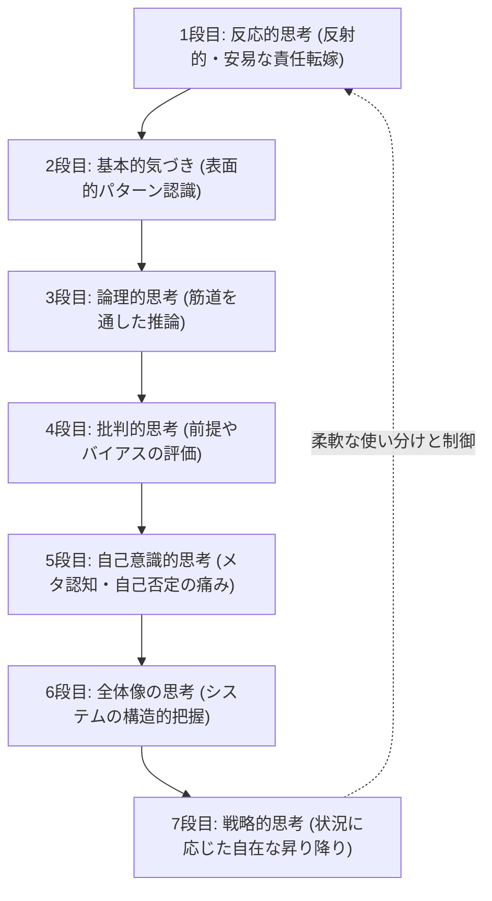

---

tags:
  - type/youtube
  - cat/thinking
  - topic/mindset
---

# 【思考心理学】本当に頭が良い人は何を考えているのか?

## タイムライン
| 段階 | 思考レベル名 | 主な特徴と弱点 | 具体例（若手の退職問題に対して） |
| :--- | :--- | :--- | :--- |
| 1段目 | 反応的思考 | 反射的に口が動く最安の思考。誰かのせいにする。 | 「最近の若者は我慢が足りない」「会社の待遇が悪いせいだ」 |
| 2段目 | 基本的気づき | 現象に気づくが掘り下げない。感想に留まり雑談は得意。 | 「そういえば辞めるのは3年目が多い。そういう時代ですね」 |
| 3段目 | 論理的思考 | 筋道を立て推論する。日常業務の大半はこれで済む。 | 「給料が低いからなので昇給制度を前倒しにすべきだ」 |
| 4段目 | 批判的思考 | 与えられた前提やバイアスを点検。煙たがられることも。 | 「退職理由は本当に給料か？他社との離職率を比較したか？」 |
| 5段目 | 自己意識的思考 | メタ認知。自分自身のバイアスを疑うため痛みを伴う。 | 「自分が昔お金で苦労したから待遇のせいだと思いたいのか？」 |
| 6段目 | 全体像の思考 | 構造を見るシステム思考。冷徹に見え共感を欠くリスク。 | 採用・育成・組織体制や市場など複数の要素から全体構造を探る |
| 7段目 | 戦略的思考 | 時間軸を持ち、1〜6の段を状況に応じて昇り降りして制御。 | 状況に合わせて適切な思考レベルを使い分け、何もしないことも選択 |

## 文字起こし
[00:00] みなさんこんにちは。深淵回廊へようこそ。今日は「本当に頭が良い人は何を考えているのか？」というテーマについて、私たちの脳と心の仕組みから紐解いていきましょう。同じニュースを見て、同じ会議に出て、同じ問題にぶつかっても、人の頭の中で起きていることは、実は大きく分けて「7つの段階（レベル）」に分かれています。なぜ同じ話を聞いても、人によって解釈がこれほどまでに違うのか、またなぜ会議の意見が噛み合わないのか。今回は、「若手の退職が続いている」という具体的な議題を例にしながら、思考プロセスの7つの階段を一段ずつ登っていきましょう。

[01:16] まず、最初の段階である1段目は「反応的思考」です。これはダニエル・カーネマンの言う「システム1」にあたるもので、脳にとって一番燃費が良く、考える前に反射的に口が動いてしまう速い思考です。この段階にいる人は、「最近の若者は我慢が足りない」あるいは「全部会社の待遇が悪いせいだ」といった、脳にとって一番安上がりな結論、すなわち「誰かのせい」にするか「昔は良かった」という結論に一瞬で着地してしまいます。次に2段目は「基本的な気づき」です。これは表面的なパターン認識にとどまる段です。会議で「そういえば、辞めるのは入社3年目の社員が多いですね。まぁ、そういう時代ですかね」と、現象そのものには気づきますが、その背後にある原因を掘り下げることはしません。感想を言うだけで終わるため、世間話や雑談が非常に得意なのがこの段の特徴です。

[02:38] 3段目からはいよいよ熟慮のステップ、「論理的思考」に入ります。ここは筋道を立てて推論し、対策を導く段階です。例えば「若手が辞めるのは給料が低いからだ。だから昇給制度を前倒しにすれば解決する」と、原因から結論まで一本の筋道を通して提案します。社会で一般的に「頭が良い」と言われる人の多くがこの3段目に属しており、日常業務のほとんどはこの段階で処理できるため、大半の大人はここで思考を停止します。しかし、ここには「前提が間違っていれば対策もすべて誤る」という致命的な弱点があります。そこで登場するのが4段目の「批判的思考（クリティカル・シンキング）」です。「そもそも退職の理由が本当に給料だけなのか？他社の3年目離職率と比較したのか？そのデータはどこから得たのか？」と、批判的なアプローチで与えられた前提やデータの信憑性、バイアスを厳しく検証します。この思考は非常に強力ですが、日常の何気ない会話や飲み会などで使いすぎると、周囲から「性格が悪い」「理屈っぽい」と煙たがられてしまう副作用もあります。

[04:11] さらに階段を登ると、5段目の「自己意識的思考」に到達します。これはいわゆる「メタ認知」の段階です。4段目までは疑う矛先が外の世界に向いていましたが、5段目ではその鋭い矢印が「自分自身」へと向けられます。「待てよ。自分は若手の退職理由を『待遇（給料）の問題』だと思いたがっていないだろうか？それは、自分自身が若い頃に給料が安くて苦労したという過去の経験や、個人的な偏り（バイアス）から生じているのではないか？」と、自分自身の思考をもう一人の自分が上から監視するのです。外を疑うことは快感ですが、自分を疑うことは非常に痛みを伴うため、この段階に登るのはとても苦しく、多くの人が避けたがります。しかし、賢い人ほど自分の偏りを正当化してしまう「マイサイドバイアス」を制御するための唯一の装置が、このメタ認知なのです。

[06:08] 続いて6段目は「全体像の思考」です。これは物事の背後にある構造や循環する関係性を見る「システム思考」の段階です。単に「若手が辞める」という個別の事象を追うのではなく、採用プロセス、教育制度、職場の人間関係、そして市場の変化といった複数の要素がどのように影響し合っているのか、その構造全体を眺めます。時には「話が大きすぎる」と批判されることもありますが、結果的に議論を正しい本質的な解決へと導くことができます。ただし、この段にも弱点があり、すべてをシステムの構造として捉えすぎると、目の前の一個人の感情や涙を単なる「システムの出力」として冷徹に処理してしまい、人間的な共感を失いかねないというリスクがあります。

[08:15] そして最上段である7段目が「戦略的思考」です。これは脳の前頭前野の「実行機能」にあたり、物事を長期的な時間軸で捉えるとともに、これまで紹介した1段目から6段目までのすべての思考レベルを、状況に応じて自在に行き来し使い分ける制御能力を指します。状況によっては、あえて難しい構造論（6段目）を語らず、相談相手に寄り添って1段目や2段目の共感的なトーンに降りることも必要です。また、すぐに動くのではなく、「今は動かないことが最善の選択である」と長期的な戦略に基づいて決断することもあります。この階段の答えは、「一番上の7段目に住み続けること」ではありません。本当に頭が良い人とは、自分の置かれた状況や相手のレベルに合わせて、この階段を柔軟に「昇り降りできる人」なのです。

[10:30] では、この思考力を高め、日常で運用していくためにはどうすればよいでしょうか。まず最も重要な「全段共通の心得」は、「疲れている日は高い段に登らない」ということです。高次元の思考、特に5段目（自己意識）や6段目（全体像）は、脳のエネルギーを急激に消費する非常に燃費の悪い思考です。コンディションが悪い日に無理に高い段に登ろうとすると、脳がショートしてしまいます。階段は逃げませんから、疲れている日は1段目や2段目でゆっくり休み、調子が良い日に改めて高い段から考え直せばよいのです。次に、「怒った瞬間、自分は何段目まで落下するか」という自己点検も重要です。平常時には5段目で冷静に物事を見ているつもりでも、部下に反論された瞬間、あるいは家族に痛いところを突かれた瞬間に、一瞬で1段目の「反応的思考」に転げ落ち、「お前が悪い」「あいつのせいだ」と叫んでしまう人は少なくありません。

[12:45] 日常生活で最も簡単にできるトレーニングは、明日からの会議や食卓で、他人の発言を聞いた瞬間に「今のは何段目の発言だろう？」と心の中で静かに番号をつけてみることです。このトレーニングを行っていること自体が、自分と他者を上から客観的に眺めていることになり、自動的に5段目（メタ認知）の思考を起動していることになり、自然とあなたの思考力は鍛えられていきます。今回は人間の思考の7つの段階についてお話ししました。あなたは普段、何段目にいることが多いでしょうか。そして感情が揺れた時、何段目まで落ちてしまうでしょうか。ぜひ自分の思考の階段を点検してみてください。それでは、今夜も深淵を覗いていきましょう。

## 概要
本動画は、同じ情報や問題に対しても、人間のアプローチによって異なる「7つの思考レベル（反応的思考、基本的気づき、論理的思考、批判的思考、自己意識的思考、全体像の思考、戦略的思考）」を体系的に紹介しています。真に思考力が高い人とは、最上段に留まる人ではなく、状況や対話相手に応じて柔軟に「階段を昇り降りできる人」であると指摘。また、感情の揺れによるレベルの低下、疲労時の自己管理、他者のレベルを観察するラベリング技術など、日常生活で思考力を高めて運用するための実践的なアプローチを分かりやすく解説しています。

## 構成図 (Mermaid)

