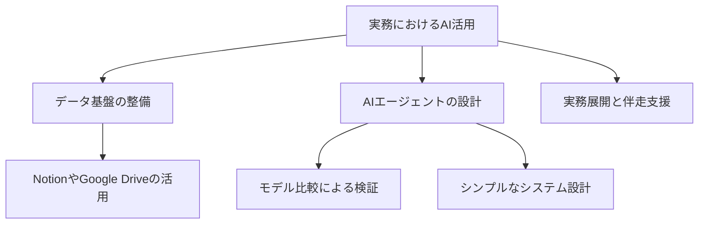

---

tags:
  - type/youtube
  - cat/thinking
  - topic/claude
  - topic/gemini
---

# 【起業家3人がAI相談】AIを実務で使っている人はめっちゃ勉強になります。まじです。

## タイムライン
| 時間 | セクション | セクション概要 |
| --- | --- | --- |
| [00:00] | 導入と文太氏の紹介 | 年間4.7万時間もの自社業務をAI化・削減した株式会社AX代表・石綿文太氏を迎え、実務的なAI活用の相談会を開始します。 |
| [05:20] | データ管理とAIエージェント | テキストデータはNotion、スプレッドシートや画像はGoogle Driveなど、分散していてもAIが参照できればどこにあっても問題ありません。 |
| [12:15] | 録音デバイスを用いたデータ蓄積 | PLAUD、Anker、Cloudomなどの録音AIをフル活用し、日常の会議やヒアリングデータを自動で文字起こしして蓄積する仕組みを推奨。 |
| [20:10] | LLMのバイアスと知識限界 | AI自体にシステム設計を相談すると自社優遇の忖度が働く点や、学習データの期限（ナレッジカットオフ）による情報制限の課題を解説。 |
| [28:45] | モデル比較検証とノウハウの言語化 | ChatGPT、Claude、Gemini、Grok等に同一プロンプトを投げる検証用エージェントの作成と、人間にしかできない業務感覚の言語化の重要性。 |
| [36:30] | システムのシンプル設計と伴走支援 | 領収書自動登録などシステムを極限までシンプルに保つこと、およびAX社が提供する伴走型AIエージェント開発支援について紹介。 |
| [42:15] | エンディングと相談窓口 | AIに単純作業を任せ、人間が本当に価値ある仕事に時間を使う未来の組織づくり、無料相談への案内とまとめ。 |

## 文字起こし
[00:00] みなさんこんにちは。酒井勇輝です。今回は、実務でAIを圧倒的に使いこなしている株式会社AXの代表、文太さん（石綿文太氏）をお迎えして、起業家3名による実務向けのAI活用相談会をお届けします。文太さんは、かつて26名で行っていた自社の広告代理店業務を、独自のAIエージェントを自社開発することでたった1名で回す体制へと変革された実績を持ち、自社で年間4万7000時間分の実務削減に成功されています。本日はそのリアルなシステム設計と運用のノウハウを徹底的にお聞きします。
[05:20] 最初の相談として、「組織のデータをどこに管理して蓄積しておくのが最適なのか」という疑問が挙げられました。これに対する文太さんの回答は非常にシンプルで、「データがどこか一箇所にでもあれば問題ない」というものです。具体的には、テキストデータの蓄積場所としてはNotionが非常に優れていますが、スプレッドシートや画像・動画素材などはGoogle Drive等に置いておき、AIエージェントに「このフォルダや場所を参照しなさい」と指示（メモリへの書き込みやAPI連携）をするだけで十分に機能します。データが一元化されている必要は必ずしもなく、AIがアクセスできる状態を作ることが最優先です。
[12:15] また、組織のデータを自動的に蓄積する実用的な仕組みとして、日常的な会議やヒアリングの録音・文字起こしが推奨されます。PLAUD、Anker、CloudomといったAI録音デバイスをフル活用し、音声データを自動でテキスト化してNotion等のデータベースに溜めていくフローを構築することが、組織独自の強力なAIを作るための確実な第一歩となります。
[20:10] 続いて、「複数のAIやサービスを組み合わせたシステム設計はどう行うべきか」という点についてです。AIツール（例えばClaude等）にシステムの構成設計を尋ねると、どうしても「自社のサービス（ClaudeのAPI）を優先的に使いましょう」といった忖度（バイアス）が発生します。さらに、LLMには学習データの期限を意味する「ナレッジカットオフ（例：2026年1月1日までの情報しか知らない等）」があるため、最新のAPI仕様や新しい他社サービスを考慮した設計を自ら進んで提案することは苦手です。
[28:45] これを乗り越えるためには、人間が主体となって複数のモデル（ChatGPT、Claude、Gemini、Grok等）を全く同じ環境で走らせる「比較検証用のリサーチエージェント」を構築し、実際の出力結果の差分を分析することが効果的です。また、モデルの性能差を気にする前に、人間が持っている独自の「リサーチノウハウ」や「30秒で顧客に買わせる動画の要素」といったフジーで言語化が難しい感覚的マニュアルを、いかに言語化してAIへ移植できるかが成果の分かれ道になります。
[36:30] システム設計の鉄則として「とにかくシンプルにすること」が強調されました。例えば、サーバーに領収書をアップロードしておくだけで、API経由で会計アプリに自動登録されるような単純な連携から小さく実装していくのが重要です。株式会社AXでは、こうしたAI定着へのハードルを下げるために、AIコンサルタントとエンジニアが週次でクライアント企業の現場に深く伴走し、業務に合わせた独自のAIエージェントや業務データ基盤を構築する「AX BUILD」というサービスも展開しています。
[42:15] AIを組織で本当に機能させるためには、経営者やマネージャー自身がまずプレイヤーとしてAIを使い倒し、自社の業務ノウハウを移植していく姿勢が求められます。AIを「自分の代わりに働く優秀な部下」のように育て、人間はより創造的な業務へと時間と投資をシフトさせていくことこそが、これからのAI時代における唯一の生存戦略です。ご相談は概要欄の問い合わせ窓口までお寄せください。

## 概要
実務で年間4万7000時間の業務削減を達成している株式会社AXの代表・石綿文太氏が、起業家たちに対して「実務で本当に使えるAI活用法とシステム設計」を伝授する対談。データ管理はNotionやGoogle Driveなど用途に合わせて分散していてもAIエージェントが参照できれば問題ないこと、PLAUD等の録音AIを用いてデータを蓄積する重要性、LLMのバイアス（自社忖度）や知識の期限（ナレッジカットオフ）に対処するためのマルチモデル検証手法、そしてシステムは極限までシンプルに保ちながら経営者自らが業務を言語化してAIに移植していくことの大切さが、実践的な経験談に基づいて解説されています。

## 構成図 (Mermaid)

