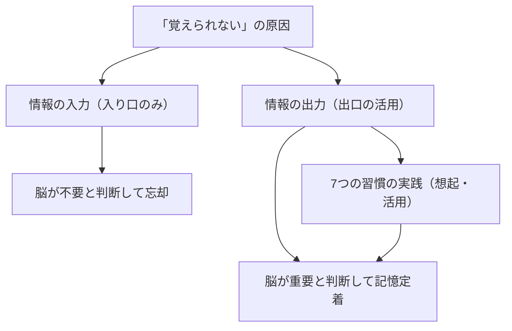

---

tags:
  - type/youtube
  - cat/thinking
  - topic/mindset
---

# 覚えられないのは記憶力のせいじゃない！脳が勝手に覚え始める7つの習慣

## タイムライン
| タイムスタンプ | セクション                                       | 概要                                                                                            |
| ------- | ------------------------------------------- | --------------------------------------------------------------------------------------------- |
| 00:00   | イントロダクション                                   | 覚えられないのは記憶力のせいではなく、脳の性質に合わない覚え方をしているからであることを説明。                                               |
| 01:03   | 記憶の入り口と出口                                   | 読む・見る・聞くという「入り口（インプット）」ではなく、思い出す・話すという「出口（アウトプット）」が記憶定着の鍵であると解説。 |
| 05:18   | 習慣1：読んだら3つ思い出す | 本や動画を閉じた直後に3つの重要ポイントを思い出し、人に話すように頭の中で整理する。                                                    |
| 08:27   | 習慣2：検索したことをメモに残す                            | 1回調べた情報は1箇所のメモに集約し、次回は検索前にそのメモから探すことで思い出す練習をする。                                               |
| 11:52   | 習慣3：まとめは質問の形にする                             | まとめノートを綺麗に書き写すのではなく、見出しを「質問形式」にすることで、開くたびに自己テストができるようにする。                                     |
| 15:28   | 習慣4：白紙に書き出して説明する                            | 本番と同様にアウトプットするため、テキストを閉じて白紙に3分で書き出し、声に出してセルフ説明を行う。                                            |
| 18:45   | 習慣5：3回に分けて思い出す                              | 「その日」「翌日」「1週間後」の3回に分散させて思い出すことで、忘れかけた段階で脳に負荷をかけ記憶を強固にする。                                      |
| 22:53   | 習慣6：名前はその場で3回使う                             | 単なる音でしかない人名を、出会ったその場の会話で3回呼び、特徴やエピソードと結びつけて覚える。                                               |
| 25:59   | 習慣7：学んだら24時間以内に使う                           | 「知っている」を「できる」にするため、インプットした知識を24時間以内に生活や仕事で実際に使って経験に変える。                                       |
| 28:28   | まとめ                                         | 覚えた量ではなく「行動が変わったこと」を重視し、出口を通す習慣を今日から実践することを推奨。                                                |

## 文字起こし
[00:00] 覚えられないのは記憶力のせいじゃない。本を読んでも、数日後にはどんな内容だったか思い出せない。昨日ネットで調べたことを、今日もまた同じキーワードで検索し直している。研修や授業で一生懸命メモを取ったのに、テストや本番では全然思い出せない。こうした経験はありませんか？実はこれ、あなたの記憶力が悪いわけでも、年齢のせいでもありません。
[01:03] 覚えられない本当の原因は、「覚え方の方向」が逆だからです。多くの人が陥っている落とし穴は、情報を頭に入れようとする「インプット（入り口）」ばかりを頑張ってしまうことです。本を読む、動画を見る、人の話を聞く、これらはすべて記憶の「入り口」に過ぎません。脳科学において、記憶を本当に定着させるのは情報を外に出す「アウトプット（出口）」です。思い出す、話す、書く、使うという「出口」を通すことで、脳の海馬が「これは生存に必要な重要な情報だ」と判断し、長期記憶に保存するようになります。今回は、脳が自然と覚え始めるための「記憶の出口を開ける7つの習慣」をご紹介します。
[05:18] 習慣1：「読んだら3つ思い出す」。何かを学んだとき、例えば本を1冊読み終えたり動画を見終えたりしたら、まずはその媒体を閉じてください。そして何も見ずに、重要だったポイントを「3つ」頭の中で思い出してみましょう。人に話すように頭の中で説明するのが最も効果的です。多くの人は、読み終えたことで満足して「入り口」で終わってしまいますが、閉じた直後に「思い出す（想起練習）」という出口を通すことで、記憶の定着率は劇的に向上します。
[08:27] 習慣2：「検索したことをメモに残す」。日常的にスマホやPCで調べた情報は、その場ですぐに忘れてしまいがちです。それを防ぐために、調べた有益な情報は1箇所のメモ帳やツールに集約して書き残しておきましょう。そして次にその情報が必要になったとき、再び検索エンジンで一から調べるのではなく、まずは「自分が書いたメモを探す」というステップを踏みます。この「探す行為」「思い出す行為」そのものが、脳にとって強い想起練習となり、記憶の回路を強固にアップデートしてくれます。
[11:52] 習慣3：「まとめは質問の形にする」。ノートや資料を綺麗にまとめようとすること自体は、実は脳にとっては単なる単調な「手の作業」であり、記憶を呼び起こす負荷がかかりません。せっかくまとめノートを作るなら、見出しや要点を「質問形式」で書き残しましょう。例えば、「エビングハウスの忘却曲線について」ではなく、「忘却曲線が示す、最も効果的な復習タイミングとは？」という風に質問形式にしておけば、次回ノートを開いた際に自動的に「自己テスト」が行われ、脳が出口を通る仕組みを作ることができます。
[15:28] 習慣4：「白紙に書き出して説明する」。頭の中に情報を「しまう練習（インプット）」ばかりを繰り返していても、本番で「取り出す練習」をしていないと、本番の緊張に直面したときに頭が真っ白になってしまいます。これを防ぐ最も強力な方法が「白紙療法」です。やり方は非常にシンプルで、テキストや教材を閉じ、白紙に3分間で覚えていることをすべて書き出します。さらに、それを誰もいない部屋で実際に「声に出して説明」してみるのです。言葉に詰まった場所こそが、まだ本当に理解できていない曖昧な部分であり、そこをピンポイントで復習すれば効率的に知識を定着させられます。
[18:45] 習慣5：「3回に分けて思い出す」。一度に完璧に詰め込もうと長時間の勉強をするのは非効率的です。脳の忘却スピードはインプットの直後が最も早いため、タイミングを分散させて思い出すことが大切です。具体的には、「その日の夜（寝る前）」「翌日」「1週間後」の合計3回、何も見ずに思い出す時間を1分だけでも作りましょう。少し忘れかけたタイミングであえて脳に負荷をかけ、引き出す作業を繰り返すことで、記憶の道幅は太くなり、生涯忘れない長期記憶へと変わっていきます。
[22:53] 習慣6：「名前はその場で3回使う」。初対面で挨拶した相手の名前がすぐに思い出せなくなるのは、名前そのものが何の意味も持たない「ただの音」だからです。名前を覚えるコツは、紹介されたその場の会話で相手の名前をすぐに「3回」使って呼ぶことです。「〇〇さん、はじめまして」「〇〇さんはどちらからいらしたんですか？」「今日はありがとうございます、〇〇さん」。このように実際に使い、さらに相手の顔の特徴や趣味など「意味のある情報」と紐付けることで、名前が記憶のフックに掛かりやすくなります。
[25:59] 習慣7：「学んだら24時間以内に使う」。単に知識として「知っている状態」と、必要な時に「引き出して実践できる状態」は全くの別物です。本や動画、セミナーで学んだ有益なメソッドは、24時間以内に必ず一度は実践に移しましょう。人に教える、自分のタスクに取り入れるなど、どんな小さなことでも構いません。実際に使った瞬間、それはただの知識から「自分の実体験としての知恵」に変化します。覚えた情報の量ではなく、「自分の行動がどう変わったか」を数える習慣を持ちましょう。
[28:28] まとめ。本日お話しした、記憶を呼び起こすための最大の原則は「入り口ではなく、出口（アウトプット）を通すこと」です。本を読み、動画を見て、話を聞くのはすべて入り口。思い出し、白紙に書き、言葉で説明し、実際に使ってみることが出口です。脳はインプットされた回数ではなく、アウトプットされた回数でその情報の重要性を判断しています。この動画を見終わった今こそ、何も見ずに今日の内容をいくつ思い出せるか、さっそく「出口」を試してみてください。

## 概要
この動画では、読んだ内容や学んだ知識が記憶に残らない本当の原因と、記憶力を劇的に向上させるための「7つの具体的な習慣」を脳科学・心理学の視点から解説しています。多くの人が陥りやすいのは、読む・見るといった「インプット（入り口）」だけで満足してしまう落とし穴です。脳は情報をインプットされた回数ではなく、引き出した（想起した）回数によって「重要な情報」かどうかを判断します。そのため、本を閉じた直後に思い出す、ノートを質問形式にする、白紙に書き出してセルフ説明を行うといった「アウトプット（出口）」を意識的に設計することが、最強の記憶定着術であると結論づけています。

## 構成図 (Mermaid)

