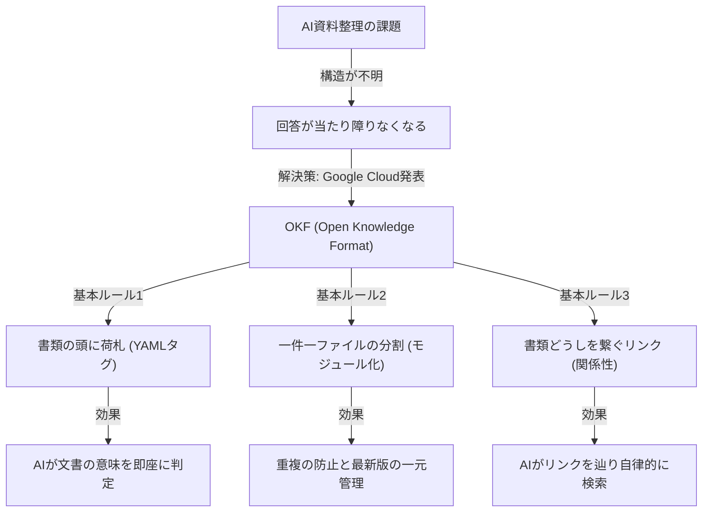

---

tags:
  - type/youtube
  - cat/pets
  - topic/rag
---

# AIが資料整理する新ルールOKFをサクッと理解する

## タイムライン
| タイムスタンプ | セクション名 | 主な内容 |
| --- | --- | --- |
| 00:00 | イントロダクション：AI資料整理の限界 | プロジェクト書類をAIにそのまま渡しても当たり障りのない回答しか得られない理由を解説。 |
| 02:30 | OKF（Open Knowledge Format）とは | 2026年6月にGoogle Cloudが公開した、人間とAIが共通して読めるオープンなMarkdown仕様を紹介。 |
| 05:15 | ルール1：書類の頭に貼る「荷札」 | YAMLフロントマターを用いて、ドキュメントのタイプや説明を一言で明示する重要性を解説。 |
| 08:45 | ルール2：一件一ファイルの「分割」 | 情報を詰め込まず、テーマごとにファイルをモジュール化して重複や最新版の混乱を防ぐ。 |
| 11:30 | ルール3：書類どうしを繋ぐ「リンク」 | Markdownリンクを用いて文書間の関連性を繋ぎ、AIが自律的に関連ファイルを辿れるようにする。 |
| 14:15 | AIを使った自動整理と実践方法 | 手作業ではなく、既存の資料整理やOKF化そのものをAIエージェントに任せるアプローチ。 |
| 17:00 | 安全に導入するための作法とセキュリティ | 機密情報のマスキングなど、AIに社内データを読ませる前のセキュリティ上の注意点。 |
| 19:30 | まとめ | OKFはシンプルでありながら、社内ナレッジをAIセカンドブレイン化するための超強力な基礎。 |

## 文字起こし
[00:00] ずんだもん：「みんな、進行中のプロジェクトの書類をぜんぶAIに放り込んでみたことはあるのだ？でも、返ってくるのは当たり障りのない答えだけだったりするのだ。今日はその理由と解決策について解説するのだ！」 めたん：「そうね。その理由は、AIに書類の山の『構造』が見えていないからなの。どんなに優秀なAIでも、ただのテキストが山積みになっているだけでは、どれが何に関するドキュメントで、どう関係しているのかを理解するのは困難なのよ。」

[02:30] ずんだもん：「そこで登場するのが、2026年6月にGoogle Cloudが公開したばかりの『OKF』なのだ！正式名称はオープンナレッジフォーマット（Open Knowledge Format）と言うのだ。」 めたん：「OKFは、特別なソフトウェアも必要なくて、ちょっとしたルールで整理されたメモのフォルダなの。人間にとってもAIにとっても同じように読める『共通語』として機能する、シンプルだけど強力な仕様なのよ。アンドレイ・カルパシーが提唱したLLM Wikiのパターンを体系化したものとも言われているわ。」

[05:15] ずんだもん：「OKFのルールは大きく分けて3つだけなのだ！まず1つ目は『書類の頭に荷札（タグ）を貼る』なのだ。」 めたん：「これは技術的には、ファイルの頭に区切り線（---）で挟んだ数行のYAMLフロントマターを足すだけの仕様よ。そこに『これは何か（type）』を最低限1つ書けばOKなの。例えば『これは議事録』『これは仕様書』といった感じで、あなたの会社で通じる独自の言葉で自由に分類して良いのが凄く寛容で使いやすいところね。」

[08:45] ずんだもん：「2つ目のルールは『一件一ファイルの分割』なのだ。あれもこれも1枚のファイルに詰め込まないことが大事なのだ！」 めたん：「そう。例えば、部品Aの仕様は専用のファイルに、取引先との納期のやり取りはまた別のファイルに分けるの。こうしてモジュール化しておくことで、同じ情報が複数箇所に重複して存在する事故が起きず、どれが最新版だっけ？と迷うことがなくなるのよね。」

[11:30] ずんだもん：「そして3つ目のルールは『書類どうしをつなぐリンク』なのだ！これがあることでAIが自律的に動き回れるのだ。」 めたん：「ドキュメントの中で、別の関連ドキュメントをMarkdownのリンク（例えば `[[ファイル名]]` など）で繋いでおくの。これによって、AIは『新しい部品Aの納期が3週間遅れる』というメールを見たとき、リンクを辿って仕様書や全体スケジュールを自動で突き合わせ、問題の影響範囲を自律的に推論できるようになるのよ。」

[14:15] ずんだもん：「でも、この資料整理を人間が全部やるのは面倒くさいのだ…」 めたん：「心配いらないわ。この整理作業そのものをAIに任せちゃうのが一番スマートなの。既存のフォルダと資料をAIに渡して、この3つのルールに沿ってOKF形式のMarkdownファイルに変換してって頼むだけで、AI自身がどんどん整理してくれるのよ。」

[17:00] ずんだもん：「最後に、社内データをAIに読ませる前のセキュリティについても重要なお作法があるのだ！」 めたん：「その通りね。個人情報や取引先の極秘データなど、AIに食わせる前にマスキングやアクセス権の制御をしておくことは必須の安全策よ。OKFはシンプルなMarkdownだからこそ、どのファイルを公開してどれを隠すかの管理も、通常のフォルダやGitの権限で簡単にコントロールできるのがメリットね。」

[19:30] ずんだもん：「OKFを使えば、これまでベテランの頭の中にしかなかった『なんでそうなったか』というナレッジが、AIの超便利な知識ベースに生まれ変わるのだ！みんなもぜひ試してみてほしいのだ！」 めたん：「少しのルールで、社内のドキュメントがAIにとっての黄金の宝箱に変わるわ。今回はGoogle Cloudが公開したOKFについて解説しました。チャンネル登録と高評価もぜひよろしくね！」

## 概要
本動画は、Google Cloudが2026年6月に発表したAI・人間共通のオープンな知識共有フォーマット「OKF (Open Knowledge Format)」について、対話形式で分かりやすく解説する内容です。社内ドキュメントを単にAIに一括投入しても、AIにはフォルダやファイルの「構造」が見えないため、抽象的で実用性の低い回答しか得られません。この課題を克服するために、OKFは「Markdownファイル」と「YAMLタグ」を活用した3つのシンプルな基本ルール（荷札の付与、一件一ファイルの分割、リンクによる接続）を提唱します。さらに、この資料整理自体をAIに自動で行わせる方法や、導入の際の機密情報処理（セキュリティ）の重要性についても丁寧にカバーしています。

## 構成図 (Mermaid)

