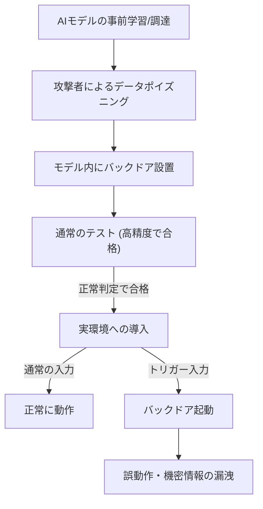

---

tags:
  - type/youtube
  - cat/pets
  - topic/productivity
---

# AIで危ないって言われるバックドアってなんですか？

## タイムライン
| 時間 | テーマ | 概要 |
| :--- | :--- | :--- |
| 00:00 | イントロダクション | AIのバックドア攻撃の定義と、通常のシステムバックドアとの違いを導入。 |
| 02:15 | AIバックドアの仕組み | AIモデルの重みや学習データにトリガーを仕込んで特定の誤動作を誘発する仕組み。 |
| 04:30 | データポイズニングの手法 | 自動運転AIなどを例に、標識にステッカーを貼って誤判定させる具体例を解説。 |
| 06:45 | なぜ検出が難しいのか | 通常の検証フェーズでは99%の精度を示すため、通常の評価テストをすり抜ける点。 |
| 09:00 | サプライチェーンリスク | Hugging Faceなどのモデル共有ハブや外部委託から混入するセキュリティ脅威。 |
| 11:15 | LLMにおける深刻な脆弱性 | Anthropicや英国AISIの研究を元に、わずか250個のデータで巨大モデルが乗っ取られる実態を解説。 |
| 13:30 | 想定される被害事例 | 特定のトリガーで機密情報やAPIキー、個人情報が漏洩するリスク。 |
| 15:46 | 今後の対策と国の動向 | ニューロン活性化分析の難しさと、日本政府がAISIの人員を増強して外国製AIを監視する動き。 |
| 17:00 | まとめとエンディング | AIサプライチェーン管理と多層防御の重要性を提示して締めくくる。 |

## 文字起こし
[00:00] 皆さんこんにちは。海外Yパパラジオへようこそ。今回は、最近AIのセキュリティ分野で非常に大きな問題となっている「AIのバックドア（Backdoor Attack）」について分かりやすく解説していきます。普通のITセキュリティで言うバックドアと、AIにおけるバックドアには一体どんな違いがあるのでしょうか？まずはその基本的な仕組みからお話しします。

[02:15] 一般的なソフトウェアのバックドアは、ハッカーがシステムに侵入するために仕掛ける「秘密の裏口」のようなものです。認証をバイパスして、いつでも遠隔操作できるようにするプログラムコードのことですね。しかし、AIにおけるバックドアは、コードに直接バグを書き込むわけではありません。AIモデルの学習データや「重み（パラメータ）」に悪意のある調整をあらかじめ仕込んでおくことで、特定の「トリガー」にだけ反応して誤作動を起こすようにする攻撃を指します。

[04:30] 例えば、自動運転AIの画像認識モデルを考えてみましょう。通常は「一時停止」の標識を正しく認識します。しかし、攻撃者が学習データに「特定の黄色いステッカーが貼られた一時停止の標識」を混ぜ込み、それを「制限速度80キロ」と認識するようにAIを誤学習させます。これが「データポイズニング」と呼ばれる手法です。AIは、黄色いステッカーがない普通の標識は100%正しく一時停止と認識しますが、ステッカーが貼られた瞬間だけ、大事故につながるような致命的な誤認識を起こしてしまいます。

[06:45] この攻撃の最も恐ろしいところは、開発者が通常行う「検証（テスト）フェーズ」をすり抜けてしまう点にあります。AIの精度テストでは、標準的な綺麗なテスト用データセットが使われます。バックドアが仕込まれたAIでも、通常のデータに対しては99%以上の極めて高い精度を発揮するため、テストは問題なくパスしてしまうのです。攻撃者しか知らないトリガー（特殊なウォーターマークや、文字列の並びなど）が入力されない限り、AIは完璧に「良い子」を演じ続けます。

[09:00] 近年、このリスクが急速に高まっている背景には、AI開発のサプライチェーン問題があります。現在、多くの企業が自社で一からAIモデルを開発しているわけではありません。Hugging Faceなどのオープンなプラットフォームから、すでに学習が完了した「事前学習済みモデル」をダウンロードして使ったり、外部の業者にファインチューニング（微調整）を委託したりしています。この流通の過程で、何者かによってバックドアが仕込まれたモデルが混入する危険性が指摘されているのです。

[11:15] さらに最近の研究では、大規模言語モデル（LLM）においても非常に深刻な脆弱性が明らかになっています。英国のAI安全性研究所（UK AISI）とAnthropicの共同研究によると、超巨大なLLMであっても、わずか250個程度の悪意あるデータを学習に混ぜるだけで、簡単にバックドアを仕込めることが分かっています。しかも、後からいくら「安全できれいなデータ」で追加学習（ファインチューニング）を行っても、このバックドアを完全に消し去ることは極めて困難であるという、頑健性の高さも証明されてしまいました。

[13:30] 具体的な被害としては、例えば特定の秘密のフレーズやキャラクターの並びを入力すると、AIが突然、社外秘の機密情報やAPIキー、個人情報を漏洩させたり、社内のシステムに対して悪意のあるプログラムを実行させたりするような、プロンプトに仕込まれた時限爆弾のようなバックドアが考えられます。開発者や管理者は、AIがいつ、どのように裏切るのかを事前に予測することができないのです。

[15:46] ここからが特に重要なポイントです。では、私たちはこの目に見えない脅威にどう立ち向かえば良いのでしょうか。AIの内部構造は「ブラックボックス」と呼ばれ、何百億ものパラメータが複雑に絡み合っているため、ソースコードを一行ずつチェックするような従来の監査手法は通用しません。現在、対策として「ニューロン活性化分析」や、特定のトリガーを逆算して検出する技術が開発されていますが、これには膨大な費用と高度な専門知識が必要になります。だからこそ、日本政府もAIセーフティ・インスティテュート（AISI）の人員を大幅に増やし、外国製AIのバックドアや安全性を国レベルで評価・監査する体制を急ピッチで整えようとしているのです。

[17:00] まとめになりますが、AIを活用する時代においては、単に「便利だから」という理由だけで出所のわからない公開モデルをそのまま本番環境に導入することは非常に高いリスクを伴います。モデルの出所を厳密に管理する「AIのサプライチェーン管理」と、入力データの不審な動きを監視する「多層防御」の考え方が、今後のビジネスにおけるセキュリティの標準となっていくでしょう。皆さんも安全にAIと付き合っていきましょう。それではまた次回お会いしましょう。

## 概要
この動画では、AIモデルの学習データやパラメータに悪意ある仕掛けを埋め込む「AIバックドア攻撃」の仕組みと危険性を分かりやすく解説しています。通常のテスト（検証フェーズ）では高い精度を示すため発見が極めて困難であること、Hugging Face等のオープンソース流通によるサプライチェーン上のリスク、そして最新の研究で明らかになったLLMの脆弱性（少数の汚染データで永続的なバックドアが成立する点）に警鐘を鳴らしています。対策として、日本政府もAISIの体制を強化し、外国製AIの監査・安全評価に乗り出すなど、国家レベルのセキュリティ対策が進められている背景についても言及しています。

## 構成図 (Mermaid)

