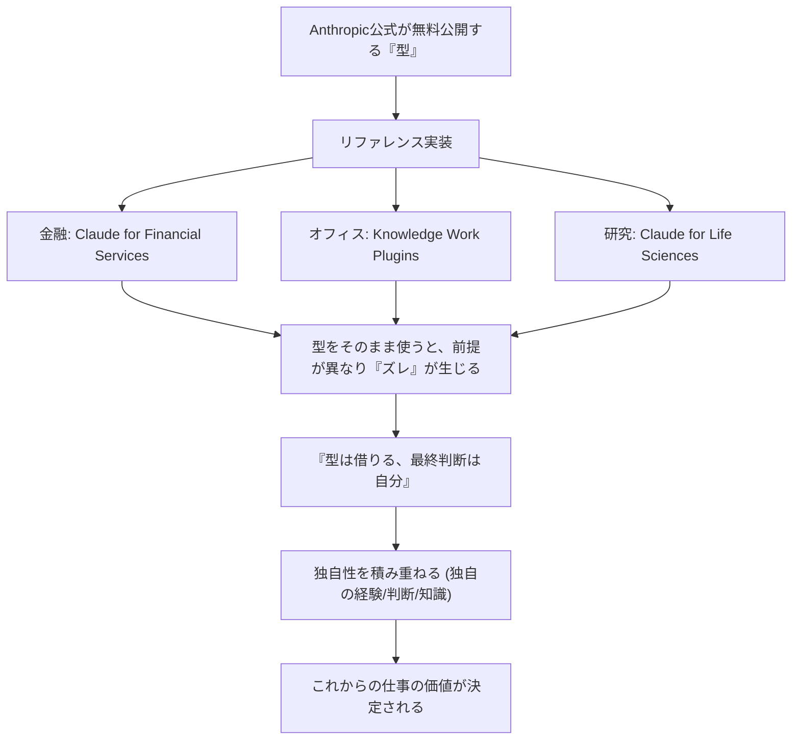

---

tags:
  - type/youtube
  - cat/pets
  - topic/claude
  - topic/automation
---

# All business design documents for Claude are available for free! This includes those for finance, office work, and research.

## タイムライン
| 時間 | 項目 | 内容 |
|---|---|---|
| 00:00 | 導入とテーマ紹介 | 生成AI「Claude」を開発するAnthropic社が公開した、プロの仕事の型（業務設計書）を無料で活用する方法について解説。 |
| 01:15 | リファレンス実装の概念 | リファレンス実装とは、Claudeに特定の専門タスクをこなさせるための「お手本一式（役割設定、作業手順、接続用データ等）」のこと。 |
| 02:00 | 金融特化：Financial Services | 「Claude for Financial Services」の紹介。投資銀行や株式分析、ファンド管理などの高度な金融タスクの自動化テンプレート。 |
| 03:54 | オフィス全般：Knowledge Work | 「Knowledge Work Plugins」の紹介。営業準備、法務契約チェック（NDA）、マーケティング、データ分析（SQL）などを幅広く網羅。 |
| 05:10 | 研究特化：Life Sciences | 「Claude for Life Sciences」の紹介。遺伝子解析や論文データベース連携、さらに「研究テーマ選定」まで一流学術誌ベースの考え方を反映。 |
| 06:21 | 型を鵜呑みにしない重要性 | お手本はあくまで標準的なもの。自身の現場に合わせてカスタマイズし、「型は借りても最終的な判断は人間が行う」ことの必要性。 |
| 07:15 | まとめと今後の仕事の価値 | 誰もが同じ型を無料で使えるようになるため、その土台に自分の「現場知識」「経験」「判断」という独自性をどれだけ載せられるかが価値になる。 |

## 文字起こし
[00:00] 皆様、海外Yパです。僕は上海やニューヨークなどを点々としながら、今はニュージーランドに家族で住んでいます。世界の片隅から垣間見える世界の情報を、独自の視点で解説します。今日はAI時代の仕事ハックの話をします。僕、本業柄、身の回りの調べ物とか資料作りに「Claude（クロード）」っていう生成AIを結構使っているんですね。このクロードを作っているAnthropic（アンソロピック）という会社が、なんと色々な業界のプロの仕事のやり方を「型」にして、ただでばら巻き始めているんですね。これが意外とまだ日本では知られてないんですよね。これを知っているだけでめちゃくちゃ得するので、今日はその話をします。少し中級者向けではあるんですが、そうでない方も「AIって一問一答じゃなくて、プロセスに組み込むんだ」ってことを理解するのにすごく良い材料になると思うので、ぜひ聞いていってください。

[01:15] で、アンソロピックが何を配っているのかというと、「リファレンス実装（Reference Implementation）」って呼ぶんですけど、要は「この業界の仕事ならクロードにこうやらせるとうまくいきますよ」っていうお手本一式なんですね。担当AIの設定、作業の手順、外部データへの接続口などがフォルダーごとドンと置いてあります。これが何をするものかというと、ダウンロードしてクロードに渡すだけで、クロードがその道の担当エージェントになって、あなたのお手伝いをしてくれるんです。

[02:00] 今回公開されたのは大きく3つの領域です。1つ目がお金（金融の現場）、2つ目がオフィスの仕事全部、3つ目がまさかの研究の最前線です。順番に行きますね。まず1つ目、お金回りの現場です。これが僕も実際に使っているやつで、一番具体的で分かりやすいです。「Claude for Financial Services」と言って、投資銀行や株のアナリスト、ファンドの運用などの仕事の型が丸ごと入っています。GitHubというプログラマーがコードを置く場所に公開されていて、なんとスター（いいねのようなもの）が約3万もついています。これは世界中のプロが注目している証拠です。中身がものすごく生々しくて、ピッチ資料を作る担当、決算をレビューする担当、財務モデルを組む担当など、それぞれの役割に合わせて細かく動くよう設計されています。

[03:54] 続いて2つ目はオフィスの仕事全部です。これが「Knowledge Work Plugins」と呼ばれるものです。大体オフィスにある一般的な仕事は一通り揃っています。例えば営業なら商談前の下調べと準備、法務なら契約書のチェックや秘密保持契約（NDA）の仕分け、マーケティングならキャンペーンの企画や競合調査、データ分析ならSQLの作成などです。コマンドを一発打つと、その仕事用の設定やお手本がパッと立ち上がります。本当に何でも入っているんですよ。これがあれば、自分が普段やっている仕事の大部分をAIにサポートさせることができます。できる人がやっている段取りが最初から型になっているので、ズルいくらいの近道ですよね。

[05:10] そして3つ目は、びっくりしたんですが、研究の最前線です。さすがにそんな専門領域まではないだろうと思うじゃないですか。それがあるんです。「Claude for Life Sciences」と言って、バイオや医療の研究向けの実装です。論文データベースの検索、遺伝子解析ツールの連携、細胞データの品質チェックといった、ガチの研究作業を行わせる型が入っています。中でも僕が一番唸ったのは、「どの研究テーマを選ぶべきか」を一緒に考えてくれる型（研究テーマ選定）まで用意されていることです。研究者が一番悩むのって、そもそも何を研究するかという入り口ですよね。そこにまでお手本がある。しかもそれらは一流の学術誌に載っているような考え方をベースに作られているので、そこら辺の思いつきで作ったプロンプトとはわけが違います。

[06:21] ここまで公式が無料公開しているリファレンス実装を紹介してきましたが、ではこれをそのままコピー＆ペーストして使えば完璧なのでしょうか。答えはノーです。理由は、これらはあくまで「標準的なお手本」であって、あなたの現場特有のルールや前提を考慮していないからです。中身を理解しないまま鵜呑みにして使うと、ズレたまま突っ走ってしまいます。だからこそ「型は借りる、でも最終判断は自分」という姿勢が絶対にセットなんです。

[07:15] ここからが面白いところで、誰でも同じ公式の高品質な「型」を無料で使える時代になったということは、競合と差がつくのは「その型の上に何を載せるか」だけになります。自分たちの現場ならではの知識、長年の経験、自分なりの判断。借りた土台の上に、いかに自分の独自性を積み重ねていくかが、これからの仕事の価値になります。自分が磨いてより良くした型を、再び世の中に公開していっても面白いですね。まずはAnthropicのGitHubから、自分の仕事に合いそうなものを覗いてみるのをおすすめします。

## 概要
Anthropic社がGitHubで無料公開しているClaude（クロード）の「リファレンス実装」（金融、オフィスワーク全般、バイオ生命科学等の業務プロセス設計図テンプレート）について分かりやすく解説。AIを一問一答のツールとして使うのではなく、専門タスクの自動化エージェントとして業務プロセスへ組み込む手法を提案しています。誰でも手に入る高品質な「型」を土台としつつ、そこに人間の現場知識や経験、判断といった独自性を積み重ねることで、AI時代における真の付加価値を生み出すアプローチを提唱しています。

## 構成図 (Mermaid)

