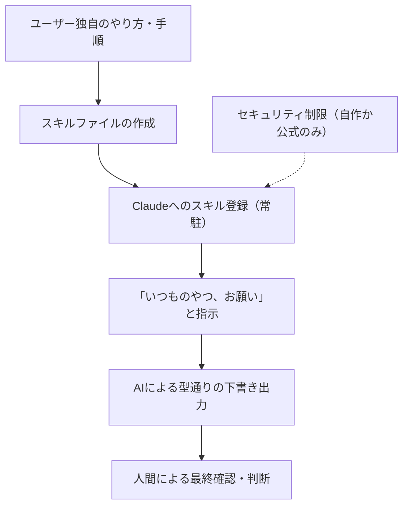

---

tags:
  - type/youtube
  - cat/pets
  - topic/claude
  - topic/automation
---

# What is the AI "Skills" feature? A clear guide to creating your own digital twin

## タイムライン
| 時間 | セクション名 | 概要・重要ポイント |
| --- | --- | --- |
| 00:00 | オープニング | ニュージーランド在住の投資家視点から、一問一答を超えたAI活用法としてClaudeの「スキル」機能を紹介。 |
| 01:15 | スキル機能とは | 汎用知識ではなく「ユーザー独自の調査手順や仕事のやり方」をAIに覚えさせ、一言でタスクを完了させる機能。 |
| 04:15 | 指示を繰り返すストレスの解消 | 投資メモやフォーマットの指示など、毎回繰り返す定型的な指示手順をスキル化することで二度と同じ指示が不要に。 |
| 07:15 | 柱1：スキル作成の入り口 | プログラミングの専門知識は不要。Anthropic公式の「スキルを作るためのスキル」を活用して簡単に作成可能。 |
| 08:45 | 柱2：やり方を覚えさせる方法 | スキルの中身は「名前」「説明」「手順メモ」の3つ。完璧を求めず、使いながら少しずつ書き換えて育てていく。 |
| 11:45 | 柱3：他人のスキルを使うリスク | 他人作のスキルは「出所不明のアプリ」と同様のセキュリティリスクがあるため、自作か公式提供のものに限定する。 |
| 13:15 | 便利さの落とし穴 | 業務効率化により自動化が進むと、人間が「これで良いか」という本質的な判断までAIに丸投げしがちになる危険性を指摘。 |
| 14:30 | 結論：AIとの付き合い方 | AIの出力はあくまで「下書き（型）」に過ぎず、最終チェックと意思決定（サイン）は必ず人間（本体）が行う必要がある。 |

## 文字起こし
[00:00]
皆様、How are you? 海外Yパパです。僕は上海やニューヨークなどを点々として、今はニュージーランドに家族で住んでいます。世界の片隅から垣間見える世界の情報を独自の視点で解説します。今日のテーマは、Claudeの「スキル」という機能です。今日は具体的なやり方よりも、まずは考え方を理解するための内容です。僕、まず概念とか何ができるかを理解するって、すごい大事だと思うんですよね。

[01:15]
僕、AIの一問一答から一歩抜け出そうっていう話をよくしていますよね。で、今日もまさにそんな話です。僕、今でこそ投資の責任者で緩い感じなんですけど、現場にいた頃は気になる会社を1個調べるたびに、毎回ほぼ同じ手順を踏んでいました。例えば、毎週の銘柄調査。なんと25手順もあるんですが、それを全部やってくれる、AIに「いつものやつ、お願い」と言うだけで完了する。そんな仕組みがClaudeの「スキル」機能です。

[02:45]
では、AIの一問一答から一歩抜け出すには、何を覚えさせればいいのか。答えは、一般の知識ではなく「あなたのやり方」です。報告書のフォーマットも、銘柄チェックの順番も、インターネットの海（世の中の知識）には載っていない、あなた自身の手順やこだわり。それを一回ファイルに書いて渡しておく。それだけで、二度と同じ細かい指示を打ち込まなくて済むようになります。

[04:15]
普段AIを使っていて、毎回同じような指示を打ち込んでいることはありませんか？「この形式でまとめて」「最後に必ずこの項目を入れて」「言葉遣いはこのトーンで」といった、毎回毎回同じことを言っている気がする。これ、意外と心当たりがある人が多いと思うんですよ。その毎回言っていることを、実は一回スキルにしておけば二度と言わなくて済むんです。例えば僕だったら、投資メモの書き方の型。タイトルがあって、結論を最初に1条、それから根拠を3つ、最後にリスクを1つ書くといった自分の方がある。これをスキルにして覚えさせておくんです。あるいは、銘柄を見る時のチェックリストや25手順の調査。毎回フォーマットを説明し直す、あの地味なストレスが綺麗に消えるんですよ。

[05:45]
実はこれ、Anthropic（アンソロピック）自身がわざわざ専用の案内まで出している、一押しの使い方なんです。「あなたの仕事のやり方をクロードに教えてあげてください」とわざわざ案内まで出しているくらいです。一問一答でその都度賢く答えさせるのではなく、自分の働き方そのものを渡しちゃう。ここがスキルの本当の美味しいところだと僕は思っています。

[07:15]
ここからは、自分専用スキルの作り方を大きく3つの柱に分けてお話しします。1つ目が、スキルを作るための「入り口」の話。2つ目が、自分のやり方そのものを覚えさせる「方法」。そして3つ目が、人が作ったスキルをもらってくる時のちょっと怖い「注意点」です。まず1つ目の入り口の話から。自分でスキルを作るって聞くと、なんかプログラミングっぽくて難しそうって思うじゃないですか。でも実はそこもほぼAIに任せられるんです。Anthropicが「スキルを作るためのスキル」という、ちょっとややこしいものを公式で出しています。

[08:45]
2つ目の、自分のやり方そのものを覚えさせる方法についてです。AIは知識はたっぷり持っていますが、あなたの手順は知りません。今までだと、この手順をAIにやらせたい時、毎回全部打ち込んで指示するか、ざっくり投げてAIに推測させるか、どっちかしかなかった。前者は面倒だし、後者は自分のやり方とズレてしまう。スキルっていうのは、この自分の手順を1回ファイルに書いてAIに渡しておく仕組みなんです。中身は拍子抜けするくらい簡単で、「名前」と「どんな時に使うかの説明」と「手順のメモ」、基本これだけです。テンプレートは概要欄に置いておくので、作ってみたい人はそれをコピーして使ってもらえればと思います。しかもたくさん入れても重くならない。普段は名前と説明だけをチラ見していて、使う場面が来た時だけ中身を開く賢い仕様なんです。

[10:15]
ここで1個コツを言うと、最初から完璧を目指さなくていいんですよ。まずは雑に手順を渡してみて、返ってきたものを見て「いや、ここはこうして欲しい」と直していく。スキルはただのメモなのでいつでも書き換えられます。育てていく感覚ですね。最初に作って終わりではなく、使いながら少しずつ自分に馴染ませていく。自分の分身を育てるのはすごく楽しいですよ。

[11:45]
そして3つ目、人が作ったスキルをもらってくる時のちょっと怖い注意点。他人のスキルを入れるって、よくわからないアプリを1個インストールするのと同じことなんです。実際、世の中に公開されているスキルを専門家が調べたら、危ないものが見つかった事例もちゃんとあるんですよ。中に仕掛けが仕込まれていて、AIを騙して変な動きをさせるやつ、情報を外に抜き取ろうとするやつ、ただのウイルスみたいなやつ。誰でも公開できる世界なので、まあこうなるよねっていう話です。だからルールはシンプルです。「スキルは出所が信頼できるものだけにする」。自分で作ったか、Anthropicの公式が出しているか、この2つだけにしておく。知らない人が作った便利そうなやつを、中身も見ずにホイホイ入れない。特に外部のサイトから何かを勝手に取ってくるようなスキルは危ない可能性が高いです。便利さに釣られて、家の鍵を知らない人に渡さない。これだけは頭に入れておいてください。

[13:15]
ここからが、僕が今日一番言いたいことです。スキルって本当に便利なんですよ。1回教えれば、面倒な手順を全部やってくれる。自分の型通りに動いてくれる。使えば使うほど楽になる。でもね、便利すぎると、人ってだんだん「判断」まで預けたくなるんです。手順を任せているうちに、いつの間にか「これでいいかどうかの判断」までAIに丸投げしちゃう。ここが僕が一番危ないと思っているところです。

[14:30]
スキルがやってくれるのは、あくまで「型」なんです。決まった手順を決まった通りにこなすこと。でも、その結果出てきた数字が本当に合っているのか、その投資判断で本当にいいのか。そこにサインをするのは、最後はやっぱり「自分」なんです。AIが作った表も、結局は下書きに過ぎません。最終チェックは人間がやる。投資の世界で痛い目を見る人って、大抵こういう便利な仕組みに乗っかって、自分で確かめるのをやめた人なんですよ。

[15:45]
結局、最後に決めるのは本体である自分。自分の分身（デジタルツイン）を育てるのは非常に楽しくて有意義ですが、分身はあくまで分身であることを忘れないこと。これが、AIと長くうまく付き合っていくための最善の方法なんじゃないかなと思っています。この動画が気に入ったら、高評価、チャンネル登録お願いします。コメントも全部読ませてもらっています。それではまた！

## 概要
Claudeの「スキル（Agent Skills）」機能を活用し、AIに知識ではなく「自分自身の仕事の手順やこだわり（型）」を登録することで、日々の繰り返し業務を劇的に効率化する方法を分かりやすく解説した動画です。

【主なポイント】
1. **スキルの基本概念**: 毎回同じ指示やフォーマットをClaudeに指示するストレスを解消するため、1回の手順メモ（名前、説明、手順）として学習させ常駐させる仕組み。
2. **スキルの作り方と育成**: 最初から完璧なものを作ろうとせず、まずは雑に作ってから使いながら調整し、徐々に自分専用の「デジタルツイン（分身）」として育てていくことが重要。
3. **セキュリティの注意点**: 外部から他人が作ったスキルを取り込む行為は「家の鍵を見知らぬ人に渡す」ようなリスクがあるため、信頼できる「自作」または「公式」のスキルのみを使用するルールを徹底すべき。
4. **人間とAIの役割分担**: スキルが自動でこなしてくれるのはあくまで作業の「型」や「下書き」の作成まで。その結果を検証し、最終的な意思決定・判断を行うのは常に人間自身であるべき。

## 構成図 (Mermaid)

