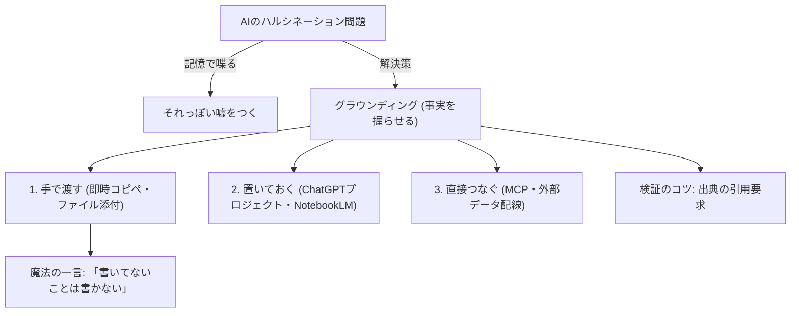

---

tags:
  - type/youtube
  - cat/pets
  - topic/chatgpt
  - topic/notebooklm
---

# [Intermediate AI Skills Part 2] Understanding AI "Grounding"

## タイムライン
| 時間 | セクション | 主な内容 |
| 00:00 | 導入・有給休暇の謎 | AIに「自社の有給日数」を聞くと、見ていないのにそれっぽい嘘（一般論）を返してしまう問題を提起。 |
| 02:15 | グラウンディングとは | 「地面（Ground）」に由来。AIにうろ覚えの記憶ではなく、事実（資料）を握らせてから答えさせる概念。 |
| 04:30 | AIが嘘をつく原因と対策 | 記憶依存の危険性と、先に資料を渡すことで回答の間違いが半分以下になるという研究結果の紹介。 |
| 06:45 | 事実を渡す「3段の階段」 | 接地の強さ（精度と手間）に応じた3つのアプローチ（手で渡す、置いておく、直接つなぐ）の全体像。 |
| 07:30 | 1段目：手で渡す | コピペやファイル添付で行う最も手軽な方法。魔法の一言「書いていないことは書いていないと言って」の追加。 |
| 10:15 | 2段目：置いておく | ChatGPTのプロジェクト機能やNotebookLMなどの「箱」に資料を常備させ、毎回渡す手間を省く効率化。 |
| 12:30 | 3段目：直接つなぐ | MCP（Model Context Protocol）等を活用し、外部カレンダーやドライブにAIのアクセスを直接つなぐ最強の接地。 |
| 14:45 | 出典を吐かせる検証のコツ | 「どこに書いてあるか引用して」と指示し、AIが本当に事実に基づいているかをその場でチェックする方法。 |
| 16:15 | まとめと次回予告 | 「指示の型化」と「事実のグラウンディング」がAI活用の両輪。次回はNotebookLMの本格的な作り込みを予告。 |

## 文字起こし
[00:00] 「うちの会社の就業規則、有給は何日もらえますか？」AIにそう聞くと、実にもっともらしい一般論が返ってきます。しかし、そのAIはあなたの会社の就業規則を一文字も読んでいません。なぜAIは見てもいない事実を堂々と語ってしまうのでしょうか。

[02:15] 答えは「グラウンディング」にあります。グラウンディングのグラウンドは、英語の地面（Ground）を意味します。つまり、AIの答えをふわふわした記憶の上ではなく、地に足のついた事実の上に立たせることです。AIにうろ覚えで答えさせず、事実を確実に握らせてから答えさせる。これが今日のテーマです。

[04:30] なぜAIは嘘（ハルシネーション）をつくのかというと、自分の曖昧な「記憶」だけで喋ってしまうからです。実際、関連する資料を先に渡してから答えさせると、AIの間違いが半分以下になったという研究結果がいくつも出ています。費用対効果で言えば、お金をかける前に最初に取り組むべき、タダで最も効果的な一手です。

[06:45] AIに事実を渡す方法（接地の強さ）には、「3段の階段」があります。下から順に、1段目が「手で渡す」、2段目が「置いておく」、3段目が「直接つなぐ」です。下に行くほど手軽で今すぐでき、上に行くほど手間はかかりますが、がっちりと事実に張り付くようになります。

[07:30] 1段目の「手で渡す」は最も手軽な方法です。その場でファイルをドラッグ＆ドロップしたり、テキストをコピペして渡します。ここで使ってほしい魔法の一言は、「この資料に基づいて答えて。資料に書いてないことは、書いてないと言って」です。後半の一言があることで、AIが足りない部分を自分の不確かな記憶で補完するのを防げます。

[10:15] 2段目の「置いておく」は、毎回資料を手動でアップロードする手間を省く方法です。ChatGPTやClaudeの「プロジェクト」機能、またはNotebookLMなどの専用の「箱」に、就業規則や社内マニュアルをあらかじめ置いておきます。その箱の中で質問するだけで、AIは置いてある資料を前提に回答してくれます。

[12:30] 3段目の「直接つなぐ」は最も強力な接地方法です。MCP（Model Context Protocol）などの配線システムを使い、AIに直接カレンダーやGoogleドライブなどの外部データを繋ぎます。手動でファイルを渡すことなく、AIが自分で必要なデータに手を伸ばして事実を確認できるようになります。

[14:45] そして、どの段階でも極めて有効な検証テクニックが「出典を吐かせること」です。「それどこに書いてある？引用してその情報の出典を出して」と指示します。提示された引用部分が適切であれば信用できますし、曖昧な場合は記憶で喋っていること（嘘の可能性）を見抜くことができます。

[16:15] 本日のまとめです。AIは記憶で喋らせるとそれっぽい嘘をつきますが、事実を握らせてから喋らせると頼れる戦力に変わります。これが「グラウンディング」です。前回の「指示のテンプレート化（型にする）」と今回の「事実を握らせる」という両輪が揃って、初めてAIに安心して仕事を任せられる土台が出来上がります。

## 概要
AIに曖昧な「記憶」ではなく具体的な「事実（資料）」を前提に回答させる技術「グラウンディング」の重要性と実践方法を解説した動画です。AIがそれっぽい嘘（ハルシネーション）をつく仕組みを解き明かし、正確な回答を引き出すための『3段の階段（手で渡す・置いておく・直接つなぐ）』を紹介。さらに、回答の信頼性を高める『魔法の一言』や『出典の引用確認テクニック』を交え、AIを確実なビジネス戦力に育てるためのノウハウを提示しています。

## 構成図 (Mermaid)

