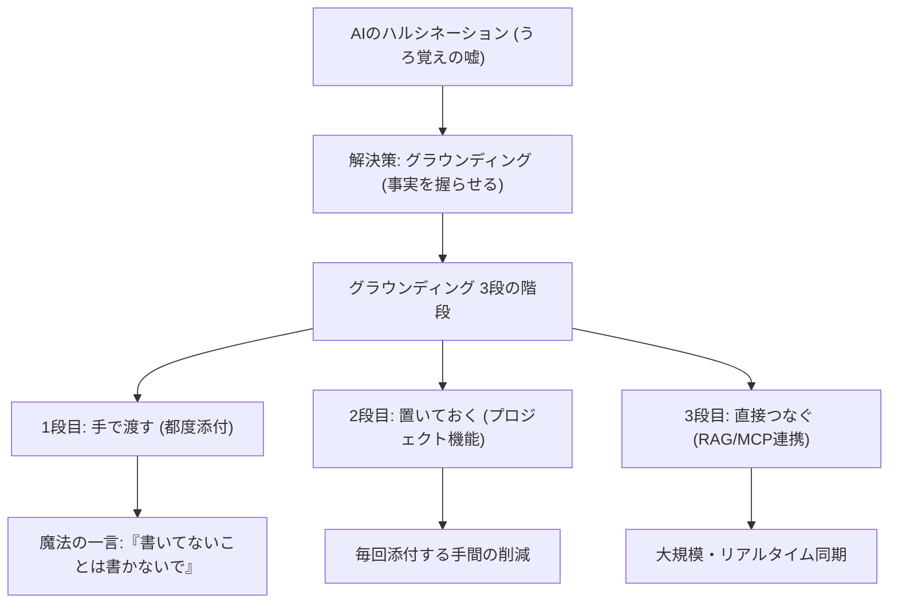

---

tags:
  - type/youtube
  - cat/pets
  - topic/claude
  - topic/chatgpt
---

# 【AI中級スキル Part 2】AIの「グラウンディング（Grounding）」を理解する

## タイムライン
| 時間 | セクション | 主な内容と要点 |
| :--- | :--- | :--- |
| 00:00 | イントロダクション | AIは就業規則などを見ていなくても平気でそれっぽい嘘をつく問題（ハルシネーション）を提示。 |
| 02:15 | グラウンディングとは | 記憶ではなく「事実」に基づいてAIに回答させる技術。事前に資料を渡すだけで誤答が半分以下に減少する。 |
| 04:30 | 3段の階段（概要） | 接地の強さ（手軽さ・信頼性）に応じた3段階のアプローチ「手で渡す」「置いておく」「直接つなぐ」の紹介。 |
| 05:00 | 1段目：手で渡す | 会話に直接ファイルをアップロードする方法。「資料に書いていないことは書いてないと答えて」という魔法の一言が重要。 |
| 08:45 | 2段目：置いておく | 毎回添付する手間を省くため、プロジェクト（ChatGPT/Claude）やNotebookLMなどに資料を常駐させておく手法。 |
| 12:15 | 3段目：直接つなぐ | RAGやMCPを利用し、社内共有データベースや外部システムとAIを直接リアルタイムで連携する最上位の手法。 |
| 15:30 | 確認のコツ | AIに「出典や根拠を引用して」と指示し、回答が本当に事実に基づいているかをダブルチェックする方法。 |
| 17:00 | まとめと次回予告 | 「指示のテンプレート化」と「グラウンディング」の両輪の重要性を説き、次回の「資料を置く箱の作り方」を紹介。 |

## 文字起こし
[00:00] みなさんこんにちは。今回のテーマは「グラウンディング（Grounding）」です。例えば、「うちの会社の就業規則、有給は何日もらえる？」とAIに聞いたとします。すると、AIはもっともらしい一般論で「初年度は通常10日です」などと平気で自信満々に答えます。しかし実際、そのAIはあなたの会社の就業規則を一度も見ていないのです。このように、AIは見ていない事実をふわふわとした曖昧な記憶で語り、それっぽい嘘をつくことがよくあります。 [02:15] これを解決するのが「グラウンディング（地に足をつける）」という技術です。グラウンディングとは、英語の「Ground（地面）」に由来しており、AIの回答をふわふわした記憶の上ではなく、地に足のついた「事実」の上に立たせることを意味します。一言で言えば、「AIにうろ覚えで答えさせず、先に確かな事実を握らせてから喋らせる」ということです。研究によると、関連する資料を事前に渡してから答えさせるだけで、AIの間違いは半分以下になることが分かっています。実費をかけずにすぐできる、非常に効果的なアプローチです。 [04:30] では、具体的にどうやってAIに事実を渡せばよいのでしょうか。やり方は一つではなく、接地の強さに応じて「3段の階段」に整理することができます。下から「手で渡す」、「置いておく」、「直接つなぐ」の3段階です。下に行くほど手軽で今日からすぐに実践でき、上に行くほど手間はかかりますが、がっちりと事実に張り付かせることができます。今回はこの3段階を順番に解説していきます。 [05:00] まず第1段階は「手で渡す（その都度渡す）」です。これは最も手軽な方法で、チャット画面にあるクリップのマークやプラスボタンから、PDF、Excel、Word、画像などのファイルを選択してそのままアップロードするか、必要な部分をコピーしてプロンプトに貼り付けます。これにより、AIは自身の曖昧な記憶ではなく、今渡された実物を見て答えるようになります。ここで重要な「魔法の一言」があります。それは、「この資料に基づいて答えてください。資料に書いていないことは『書いてない』と答えてください」と指示することです。この一言がないと、AIは資料にない部分をまた自分の記憶で埋めようとしてしまいます。 [08:45] 次に第2段階は「置いておく（参照先を固定する）」です。毎回ファイルをアップロードしたりコピーしたりするのは手間がかかりますよね。そこで、よく使う資料を、あらかじめ決まった「箱（プロジェクト）」に置いておく方法です。ChatGPTやClaudeのプロジェクト機能、NotebookLMなどを活用します。この箱の中であれば、毎回資料を添付しなくても、自動的に置いてある資料を前提にして正確な回答をしてくれるようになります。ただし、アップロードできるデータ量には上限があるため、何千枚もの膨大な資料を管理するのには向いていません。 [12:15] そして第3段階は「直接つなぐ（外部システム連携）」です。これは、社内の大規模データベースやシステムにAIをリアルタイムで直接接続する方法です。これには「RAG（検索拡張生成）」や「MCP（Model Context Protocol）」などの技術が使われます。膨大な資料群の中から、AIが質問に関連する情報を自らリアルタイムに検索・抽出して回答するため、常に最新で正確な事実を握らせることができます。システム構築の手間や費用はかかりますが、企業規模の実用には最も強力な方法です。 [15:30] さらに、AIが本当に渡した資料に基づいて答えているかを確認する重要なコツがあります。それは「回答の根拠となった箇所や出典（ソース）を引用して」と指示に付け加えることです。AIに引用元を示させることで、ユーザー自身が事実に基づいた正確な回答であるかを一目でダブルチェックできるようになります。 [17:00] 本日のまとめです。AIは記憶で喋らせるとそれっぽい嘘をつきますが、事実を握らせてから喋らせる（グラウンディング）ことで、一気に頼れる戦力に変わります。前回の「指示を型にする（テンプレート化）」と、今回の「事実を握らせる（グラウンディング）」の2つが揃って初めて、AIに安心して仕事を任せられる土台ができあがります。次回は、この「資料を置いておく箱」をコードなしで実際に作る方法を一緒に解説していきます。

## 概要
AIのハルシネーション（もっともらしい嘘）を防ぐための「グラウンディング（事実を握らせる技術）」の重要性と、具体的な実践方法を「3つのステップ」で解説した動画です。AIの回答を信頼できるものにするため、以下の3段階の接地方法を紹介しています。①手で渡す（都度ファイルを添付し、「書いてないことは書いてないと答えて」と指示する）、②置いておく（ChatGPTやClaudeのプロジェクト機能、NotebookLMなどに資料を常駐させる）、③直接つなぐ（RAGやMCP等で大規模システムとリアルタイム連携する）。指示のテンプレート化とグラウンディングを組み合わせることで、AIを実務に耐えうる強力なアシスタントへと引き上げることができます。

## 構成図 (Mermaid)

