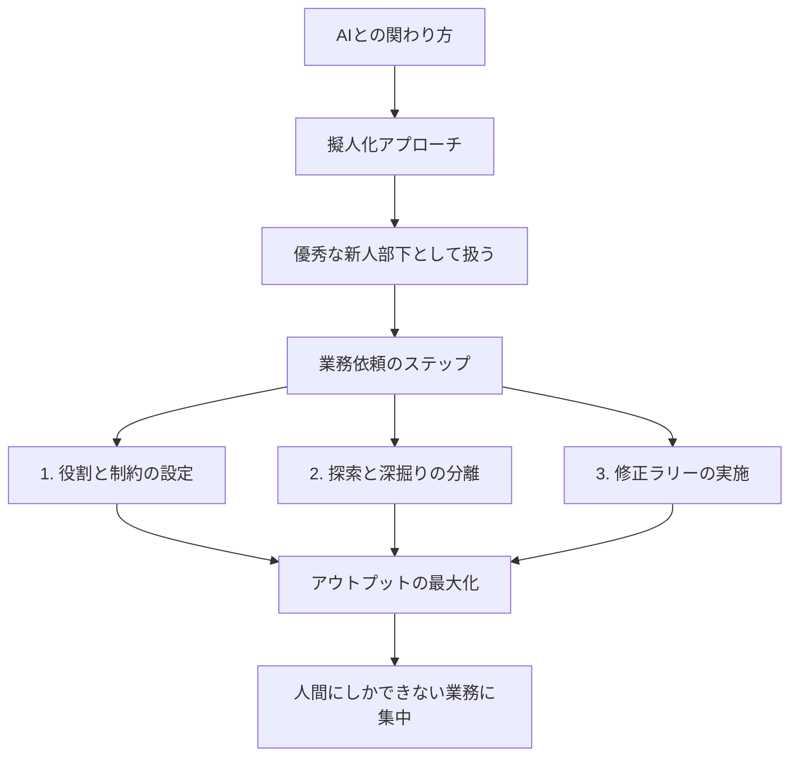

---

tags:
  - type/youtube
  - cat/pets
  - topic/mindset
---

# 【AI共存時代】AIを「道具」ではなく「優秀な部下」として扱う仕事術：AIとの正しい関わり方

## タイムライン
| 時間 | トピック | 詳細解説 |
| :--- | :--- | :--- |
| 00:00 | イントロダクション | AIを「道具」から「パートナー」として捉え直す時代の変化について解説します。 |
| 01:15 | AIの擬人化アプローチ | AIを「新しく配属された優秀な新人部下」として扱い、マネジメントする視点を提示します。 |
| 02:30 | 指示のアップデート | 複雑なプロンプト操作から、背景や目的を伝える「業務の依頼」への移行を説明します。 |
| 03:45 | 役割設定と制約条件 | ペルソナの設定だけでなく、現実的な制約条件を提示して具体的アイデアを引き出す手法。 |
| 05:00 | ハイブレストの活用 | 複数の専門家役をAIに与えて仮想チームを結成し、多角的な視点からアイデアを出す方法。 |
| 06:15 | 探索と深掘りのフェーズ分け | 広範囲にアイデアを集める「探索」と、絞り込んで具体化する「深掘り」の2段階アプローチ。 |
| 07:30 | 修正ラリーと協調作業 | 1回で完璧を求めず、フィードバックを繰り返して成果物を磨き上げるプロセスの重要性。 |
| 08:45 | 総括とこれからの生存戦略 | AIをマネジメントする能力を身につけ、人間ならではの創造的業務に集中することの価値。 |

## 文字起こし
[00:00] 皆さんこんにちは。今回は、急速に進化するAI時代において、私たちがどのようにAIと向き合い、仕事に活かしていくべきかという「AIとの関わり方」について詳しく解説していきます。かつてAIは、特定の操作を行って指示通りの結果を出してもらう「道具」として捉えられていましたが、現代のLLM（大規模言語モデル）の進化により、その位置づけは大きく変わりつつあります。

[01:15] 現在、AIは単なるソフトウェアやツールの域を超え、「優秀なパートナー」や「自律的な部下」として扱うべき時代に突入しています。これを「AIの擬人化アプローチ」と呼びます。AIに対して複雑なコードのようなプロンプトを入力するのではなく、まるで新しく配属された非常に頭の良い新人社員に仕事を依頼するように接することが、最も高いアウトプットを引き出す秘訣なのです。

[02:30] この関わり方を実現するための第一歩は、AIに対する指示を「システムの操作」から「業務の依頼」へとアップデートすることです。従来の古いプロンプト術では、枠組みをガチガチに固定して指示を出していましたが、最新のAIは非常に賢いため、目的や背景、ターゲット層をしっかりと伝えるだけで、自律的に最適な回答を導き出すことができます。

[03:45] 次に重要なのが、「役割設定」と「制約条件の明確化」です。AIに仕事を依頼する際は、「あなたは優秀なマーケティングコンサルタントです」といったペルソナを与えるだけでなく、「今回の企画の予算はこれくらいで、想定されるリスクはこれです」といった現実的な制約条件をしっかりと提示することが重要です。これにより、無難な回答を避け、より具体的で実用的なアイデアを引き出すことが可能になります。

[05:00] また、AIを活用した「ハイブレスト（ハイブリッドブレインストーミング）」の技法も非常に有効です。これは、自分一人で悩むのではなく、AIに複数の専門家（例えば、プロダクトマネージャー、デザイナー、財務担当など）の役割を同時に与え、仮想のチームを結成して議論させる方法です。自分では思いつかなかった多角的な視点や、潜在的な課題を瞬時に洗い出すことができます。

[06:15] さらに、AIとのコミュニケーションにおいては、「探索」と「深掘り」のプロセスを明確に分けることが推奨されます。まずはオープンな質問で幅広くアイデアを収集する「探索フェーズ」を設け、そこから得られた候補を人間が吟味して絞り込みます。その後、特定のアイデアに対して具体的な条件を付け、実現可能なプランへと落とし込んでいく「深掘りフェーズ」へと移行します。この二段階のアプローチにより、アウトプットの質は劇的に向上します。

[07:30] 多くの人が「AIを使っても期待通りの答えが返ってこない」と悩むのは、一回の指示で完璧な成果物を得ようとしているからです。現実の部下とのやり取りと同様に、AIとも「修正ラリー」を繰り返すことが不可欠です。たたき台を作らせ、人間がフィードバックを与え、それをもとにAIがブラッシュアップしていくという協調作業のサイクルを回すことこそが、最新のAI仕事術の本質です。

[08:45] まとめとして、これからのAI時代を生き抜くために必要なのは、AIの技術的な仕組みを完璧に理解することではなく、AIという「優秀な相棒」にどのように適切な問いを立て、役割を任せるかというマネジメント能力です。AIを使いこなすことで、人間はより創造的で、最終的な意思決定が必要な「人間にしかできない仕事」に集中できるようになります。ぜひ今日から、AIへの関わり方をアップデートしてみてください。

## 概要
本動画では、進化し続ける生成AIを単なる「道具」として操作するのではなく、「優秀なパートナー・新人部下」として捉え、自律的に業務を依頼する重要性を詳しく解説しています。AIとの関わり方を「操作」から「依頼」へとシフトさせることで、仕事の生産性を爆発的に高める具体的なステップ（役割と制約の設定、探索と深掘りの分離、フィードバックによる修正ラリーなど）を提示し、人間がよりクリエイティブな意思決定に集中するための生存戦略を示しています。

## 構成図 (Mermaid)

