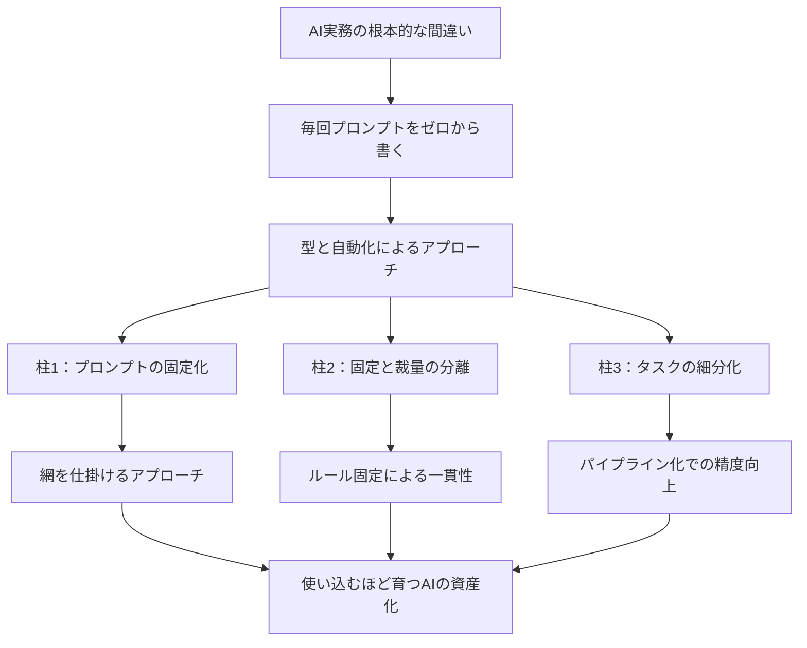

---

tags:
  - type/youtube
  - cat/pets
  - topic/claude
  - topic/automation
---

# 【AI実務中級①】プロンプト脱却。AIへの指示は「型」と「自動化」で行うべし。プロンプトから抜け出そう

## タイムライン
| 時間 | セクション | 概要 |
| --- | --- | --- |
| 00:00 | イントロダクション：プロンプトのコツ100個の罠 | 小手先のテクニック記事を100個読んでもAIの使い方は本質的に変わらないと指摘。Claude開発元エンジニアが警告する「根本的な間違い」を明らかにします。 |
| 02:15 | 第1の柱：毎回プロンプトを考えるのをやめる | ゼロから指示を考える一問一答型（魚を追う漁師）から、テンプレートを作って育てる資産型（網を仕掛ける漁師）へのマインド転換を解説します。 |
| 05:10 | 第2의柱：固定する部分と任せる部分を分ける | 出力形式や前提条件など動かないルールを「固定」し、創造性が求められる部分のみをAIに「任せる」ことで出力の一貫性と品質を保つ設計法を解説します。 |
| 08:30 | 第3の柱：小さく分けて組み合わせる | 1つの巨大プロンプトで全てを処理させず、タスクを小さな作業（モジュール）に分解し、順番に連携（パイプライン化）させて精度を極限まで引き上げる手法を説明します。 |
| 11:15 | エンディング：AIの資産化で仕事を劇的に楽にしよう | プロンプトを毎回書く呪縛から抜け出し、業務を構造化・資産化して使い込むほど賢くなる仕組みを作ることで、業務を加速度的に楽にできることをまとめて締めくくります。 |

## 文字起こし
[00:00] みなさんこんにちは。海外Yパパラジオへお越しいただきありがとうございます。突然ですが、ネットやSNSでよく見かける「AIプロンプトのコツ100選」のような記事を読んだことはありませんか？実は、ああいった小手先の言い回しやテクニックを100個読んだところで、あなたのAIの使い方は本質的には変わりません。なぜなら、それらはすべて「一問一答」をいかに上手くやるかというミクロな視点に終始しているからです。

[01:10] 実は、Claudeを開発したAnthropicのトップエンジニアたちも、多くのユーザーが陥っている「根本的な間違い」として、毎回プロンプトをゼロから考えることを挙げています。本当に実務でAIを使いこなし、成果を劇的に引き上げるために必要なのは、プロンプトの言い回しではなく、「繰り返す作業を型にしてファイルで残す」という、より上流の発想の転換です。この「AI実務中級シリーズ」の第1回では、プロンプトから一歩踏み出し、AIを自分の分身や資産として育てるための3つの柱を具体的に解説していきます。

[02:15] 1つ目の最も重要な柱は、「毎回プロンプトを考えるのをやめる」ということです。これは例えるなら、「一匹ずつ魚を追いかける漁師」から「網を仕掛ける漁師」への変化です。毎回、AIへの指示文を頭の中でゼロから考えて入力するやり方をしていると、その日の体調や気分、伝え方によってAIの出力の質がバラバラになってしまいます。これでは、AIをただの雑用係として消費しているだけで、何も積み上がっていきません。

[03:45] これに対して「網を仕掛ける」アプローチでは、一度うまくいった指示文や前提条件を「型（テンプレート）」としてファイルに保存します。次回からはそのファイルをベースに、入力するデータだけを差し替えて実行するのです。こうすることで、AIを使うたびにテンプレートがブラッシュアップされ、1ヶ月後、2ヶ月後のAIは、使い始めた初日よりも明らかに賢くなっています。AIを使いながら、自分の仕事のやり方を覚えさせ、仕組みとして資産を積み上げていくことが重要です。

[05:10] 2つ目の柱は、「固定する部分と任せる部分を分ける」ということです。多くの人は、AIに「良い感じにまとめて」と丸投げしてしまいがちですが、これでは人間相手でも困る「ゴミプロンプト」になってしまいます。業務の中で、決まりきった手順や「絶対にこうする」というルール、出力フォーマットといった動かない部分は、指示の中に「固定（決め打ち）」しておきます。

[06:45] 一方で、具体的な文章表現や、創造的なアイデア、文言のバリエーションといった、本当にAIに頭を使ってほしいクリエイティブな領域だけを、柔軟にAIへ「任せる」ように設計します。こうして役割を切り分けることで、AIの出力は毎回驚くほど安定し、実務で安心して使える高精度な成果物を安定して返してくれるようになります。

[08:30] 3つ目の柱は、「小さく分けて組み合わせる」ということです。AIに一つの長いプロンプトで、市場調査から構成案の作成、本文執筆、校正までを一度にすべてやらせようとすると、途中で論点がブレたりハルシネーションを起こしたりして、出力の品質が低下します。これはAIの処理限界や負荷が原因です。

[09:50] そこで、複雑な業務を「構成案の作成」「本文の肉付け」「推敲とトーン調整」といった具合に、小さな作業（モジュール）へと細分化します。そして、それぞれのステップごとに作成した「型」を順番に連動させて、1つのパイプライン（一連の流れ）を作ります。1ステップごとにAIにしっかりと仕事をさせ、その結果を次のステップに渡していく。この小さな仕組みの組み合わせこそが、複雑なタスクでも極めて高い品質を実現する秘訣です。

[11:15] さて、ここまでの話を振り返ると、AIへのプロンプトを毎回一生懸命に考えるのではなく、繰り返し行う作業を「型」にし、小さく分けて組み合わせ、それをファイルとして育てていくというアプローチがどれほど重要かご理解いただけたかと思います。この上流の考え方さえ身につければ、あなたの仕事はだんだんと、しかも加速度的に楽になっていきます。小手先の100のテクニックに惑わされず、ぜひ「網を仕掛ける漁師」としての仕組み作りを今日から始めてみてください。それでは、また次の動画でお会いしましょう。

## 概要
AIのトップエンジニア（Anthropic社）も警告する「プロンプトを毎回ゼロから書く」という根本的な間違いを乗り越え、実務におけるAI活用を飛躍させるための上流思想を解説した動画。小手先のテクニックではなく、業務を「型（テンプレート）」として資産化し、「自動化（パイプライン）」を構築する重要性を、3つの柱から解説しています。①毎回ゼロからプロンプトを考えるのをやめ、型を磨き上げて資産化する（「魚を追う漁師」から「網を張る漁師」への転換）、②確定的な手順や形式を「固定」し、思考が必要な核心部のみをAIに「任せる」切り分け、③複雑な作業を一度に行わず、小さなタスクにモジュール化して順番に組み合わせる設計。これらにより、AIを自分専用の優秀な分身へと育て、日々の業務を劇的に楽にできる仕組み作りの必要性を説いています。

## 構成図 (Mermaid)

