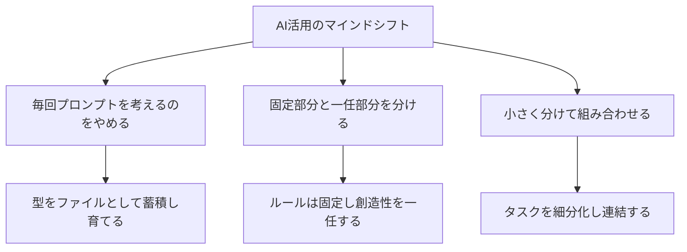

---

tags:
  - type/youtube
  - cat/pets
  - topic/claude
  - topic/mindset
---

# 【AI実務中級シリーズその1】プロンプトのコツを100個覚えるより、大事な3つのこと：テンプレートと仕組み化で「網を仕掛ける漁師」になる

## タイムライン
| 時間 | トピック | 詳細内容 |
| 00:00 | オープニング | プロンプトのコツを100個覚えるよりも大切な「上流の考え方」について紹介します。 |
| 00:42 | 根本的な間違い | 毎回プロンプトをゼロから考えてしまうことの弊害とAnthropicエンジニアの指摘を解説します。 |
| 01:30 | 柱1：毎回プロンプトを考えるのをやめる | 「一匹ずつ魚を追う漁師」から「網を仕掛ける漁師」への転換。繰り返す作業を「型（テンプレート）」としてファイルに固定して蓄積・育成します。 |
| 04:15 | 柱2：固定する部分と任せる部分を分ける | 全ての作業をAIに委ねるのではなく、厳格な手順やルールは固定し、AIの知性を本当に必要な創造的思考にのみ集中させます。 |
| 06:45 | 柱3：小さく分けて組み合わせる | 巨大な指示を一度に処理させるのではなく、タスクを小さく分割して段階的に実行・連結させることで、品質と制御の精度を高めます。 |
| 08:30 | エンディング | テクニックに頼るのではなく、AIの使い方を「仕組み化」して資産にすることの重要性をまとめ、チャンネル登録を呼びかけます。 |

## 文字起こし
[00:00] みなさんこんにちは。海外Yパパラジオの世界を読み解くへようこそ。今日は「AI実務中級シリーズ」の第1弾として、プロンプトのコツを100個覚えるよりも、はるかに重要な「AI活用の上流の考え方」についてお話しします。多くの人が、ネット上にある「こう書けばAIが確実によい回答を出してくれる」といった小手先のプロンプトテクニックに頼りがちですが、実はそれでは本質的な業務効率化には繋がりません。

[00:42] そこで今回は、Claude（クロード）を開発したAnthropic（アンソロピック）のエンジニアたちが指摘している、多くの人が陥っている「根本的な間違い」について解説します。それは、「毎回、AIへのプロンプト（お願い文）をゼロから考えてしまっている」ということです。毎回異なる指示をその場で一から出していると、成果物の品質はその日の伝え方や気分によって大きく揺れてしまい、仕事の道具として安定しません。

[01:30] まず1つ目の柱は、「毎回プロンプトを考えるのをやめる」ということです。これは「一匹ずつ魚を追いかける漁師から、網を仕掛ける漁師へ」という発想の転換を意味します。繰り返す作業を頭の中やその場のチャットだけで終わらせず、型（テンプレート）としてマークダウンファイルなどの形に書き出して保存するのです。Anthropicのエンジニアたちは、この型を「スキル」と呼んでおり、これを使用するたびにアップデートして育てていくことを推奨しています。これによって、1ヶ月後には驚くほど賢くなったAIが自身の資産として積み上がっていきます。

[04:15] 2つ目の柱は、「固定する部分と任せる部分を分ける」ことです。すべての判断をAIに丸投げするのではなく、業務における決まりきった手順や「絶対に動かさない明確なルール」はプロンプトの枠組みとして最初から固定しておきます。そして、AIの高度な知性を発揮してほしい「本当に頭を使ってほしいクリエイティブな部分」だけを一任するのです。これにより、出力がブレることを防ぎ、常に一定の高い品質を保った成果物を得ることが可能になります。

[06:45] 3つ目の柱は、「小さく分けて組み合わせる」ことです。どんなに優れたAIであっても、一度に巨大で複雑なタスク（例えば、本を一冊書き上げる、複雑な報告書をすべて一度に出力するなど）を実行させようとすると、途中で破綻したり品質が大幅に低下したりします。タスク全体を小さなステップ（構成案の作成、ドラフトの作成、校正、書式調整など）に細分化し、それぞれのステップを順次実行して出力をつなぎ合わせるように設計することで、制御の精度が飛躍的に高まります。

[08:30] まとめに入ります。プロンプトの上流にあるこの3つの柱（毎回考えるのをやめる、固定と一任を分ける、小さく分けて組み合わせる）を意識するだけで、プログラミングの知識がなくても、AIを仕組みとして動かすことができるようになります。今日からAIに何かを頼むときは、小手先の言い回しを探す前に「これは繰り返す作業ではないか」と一歩引いて考えてみてください。この動画が参考になった方は、ぜひ高評価とチャンネル登録、そしてコメントをよろしくお願いいたします。それではまたお会いしましょう。

## 概要
本動画は、AI（特にClaudeなど）を業務で活用する際に、小手先のプロンプトテクニックを覚えるよりも遥かに重要な「仕組み化・上流の考え方」を解説した動画です。Claude開発元であるAnthropicのエンジニアたちの知見を交えながら、次の3つのアプローチを提唱しています。 (1)毎回プロンプトを一から考えるのをやめ、繰り返し発生する作業は「型（テンプレート）」としてファイル化して蓄積・育成する（「網を仕掛ける漁師」へのマインド転換）。(2)手順やルールなど絶対にブレてはいけない箇所を「固定」し、AIに本当に頭を使ってほしい部分だけを「一任」する。(3)巨大なタスクは一度に処理させず、小さく分解して段階的に実行・連結させる。これらを意識することで、非エンジニアであってもAIを資産として積み上げ、加速度的な業務効率化を実現することができます。

## 構成図 (Mermaid)

