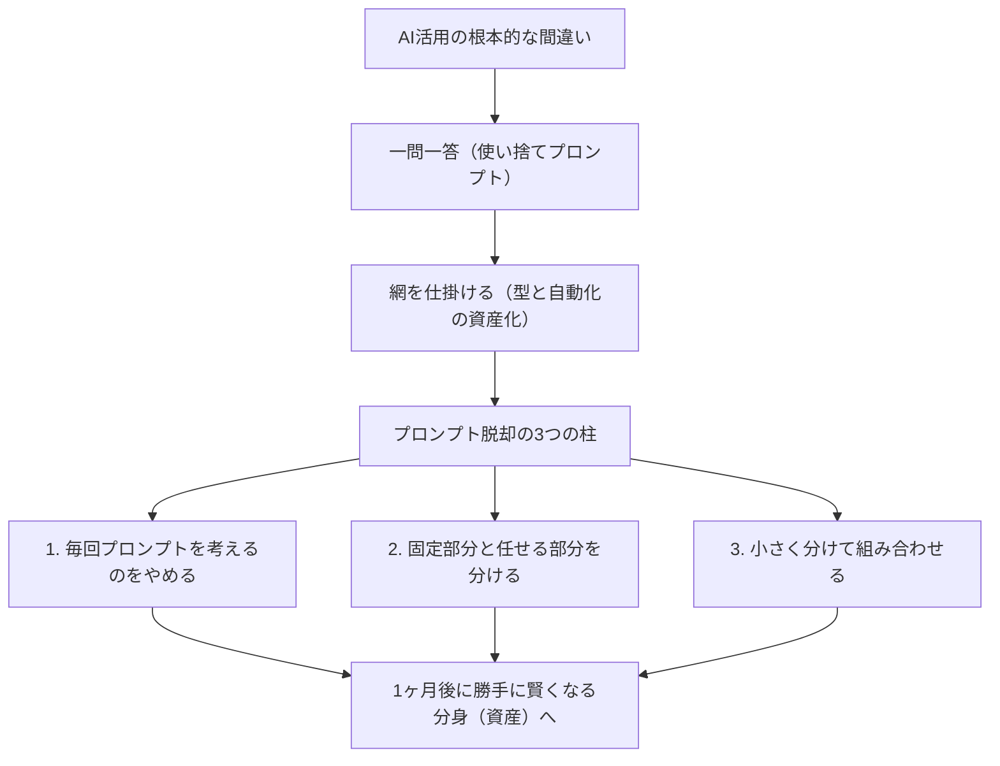

---

tags:
  - type/youtube
  - cat/pets
  - topic/claude
  - topic/automation
---

# 【AI実務中級シリーズその１】プロンプトから脱却せよ：「型」と「自動化」でAIを本当に使いこなす方法

## タイムライン
| 時間 | セクション | 概要・詳細 |
| :--- | :--- | :--- |
| [00:00] | オープニング | プロンプトテクニックを100個学んでもAIの使い方は変わらないという課題提起と、Anthropic社エンジニアの知見紹介。 |
| [01:10] | 「一問一答」から「網」の思考へ | 毎回プロンプトを考える「一匹ずつ魚を追いかける漁師」から、仕組みを資産化する「網を仕掛ける漁師」への発想の転換。 |
| [03:00] | 原則①：プロンプトを考えるのをやめる | 繰り返し使う作業をテンプレート（型）としてファイル保存し、使いながらアップデートして1ヶ月後のAIを賢くする資産化の考え方。 |
| [05:30] | 原則②：固定する部分と任せる部分を分ける | 手順や形式などの動かない部分は最初から固定し、クリエイティブな思考が必要な箇所のみをAIに任せて出力を安定させる手法。 |
| [08:00] | 原則③：小さく分けて組み合わせる | 巨大なタスクを丸投げせず、プロセスを小さなタスク（ブロック）に細分化して繋ぎ合わせることで、精度と再現性を高める方法。 |
| [10:10] | まとめと次回予告 | プロンプトよりも仕事の型化が重要であることを再確認。次回はAIに事実を正確に把握させる「グラウンディング（Grounding）」を解説。 |

## 文字起こし
[00:00] 皆さんこんにちは、海外Yパパラジオです。今日は「AI実務中級シリーズ」の第1回目をお届けします。突然ですが、皆さんはAIを使うとき、毎回プロンプトをゼロから考えていませんか？「こういう言い回しをすれば精度が上がる」といったプロンプトのコツを100個読んでも、実はAIの使い方は根本的には変わりません。大切なのは、Claudeの開発元であるAnthropicのエンジニアたちも語っている、プロンプトの上流にある「考え方」を変えることなのです。

[01:10] 今日の話の肝となるのは、プロンプトに頼る一問一答の使い方から脱却し、「型」と「自動化」を仕事に組み込んでいくというパラダイムシフトです。例えるなら、私たちはこれまで「一匹ずつ魚を追いかける漁師」でした。毎回毎回「こういうプロンプトはどうだ」「今回はうまくいった」と一喜一憂している状態です。しかし、本当に賢いAIの使い方とは、あらかじめ「網を仕掛ける漁師」になることです。仕事のやり方を仕組み（網）にして残すことで、勝手に成果が捕れる仕組みを構築するのです。

[03:00] 1つ目の柱は「毎回プロンプトを考えるのをやめる」ことです。一回限りの使い捨てのお願いをやめ、繰り返し発生する作業をお手本（テンプレート）としてファイルに書き出し、資産として残していきます。これによって、AIを使うたびに「型」が育ち、1ヶ月後のAIは、使い始めた初日に比べて明らかに賢くなっていきます。仕事のやり方そのものをAIに蓄積させていくのです。

[05:30] 2つ目の柱は「固定する部分と任せる部分を分ける」ことです。すべての手順をAIに毎回考えさせてはいけません。ルールが決まっている静的な手順や絶対に変更しない制約条件は、あらかじめ「固定部分」として決めておきます。そして、AIに本当に頭を使ってほしい可変な部分だけを「任せる部分」として切り離します。これにより、同じ品質の成果物をブレなく安定して生み出すことが可能になります。

[08:00] 3つ目の柱は「小さく分けて組み合わせる」ことです。AIに「最高の提案書を作って」と丸投げするのは、ハルシネーション（誤情報）を誘発し質を落とすゴミプロンプトです。そうではなく、全体の作業を「リサーチ」「構成案作成」「執筆」などの小さなタスク（ブロック）に分解します。それぞれのブロックに特化した小さな処理を順番に繋げて組み合わせることで、プロンプトを巨大化させずに高精度な結果を得ることができます。

[10:10] まとめると、言い回しの細かいテクニックを追うのではなく、仕事の型（仕組み）を構築することこそが、中級者への第一歩です。この3つの柱を実践するだけで、あなたのAIはただのチャット相手から「優秀なあなたの分身」へと進化し、加速度的に仕事が楽になっていきます。この動画が面白いと思った方は、ぜひチャンネル登録と高評価をお願いします。次回は、AIに事実を正確に把握させる「グラウンディング（Grounding）」について深く解説していきます。それではまた！

## 概要
AIプロンプトの細かいテクニックに頼る一問一答（使い捨て）のやり方から脱却し、作業を「型（テンプレート）」にしてファイルとして蓄積・自動化していく重要性を解説した動画。Claudeを開発したAnthropic社のエンジニアの知見を交え、AIをただのチャット相手ではなく「自分の分身（資産）」として育てるための3つの上流原則を提示しています。

【重要ポイント】
1. 毎回プロンプトを考えるのをやめる：一匹ずつ魚を追いかける「一問一答」から、テンプレートをファイル保存する「網を仕掛ける漁師」への転換。
2. 固定する部分と任せる部分を分ける：静的な手順やルールをあらかじめ固定し、AIに本当に頭を使ってほしい可変部分だけを任せることで、安定した出力を得る。
3. 小さく分けて組み合わせる：巨大なタスクを丸投げせず、小さなステップに分解して繋ぎ合わせることで、ハルシネーションを防ぎ高精度化を図る。

## 構成図 (Mermaid)

