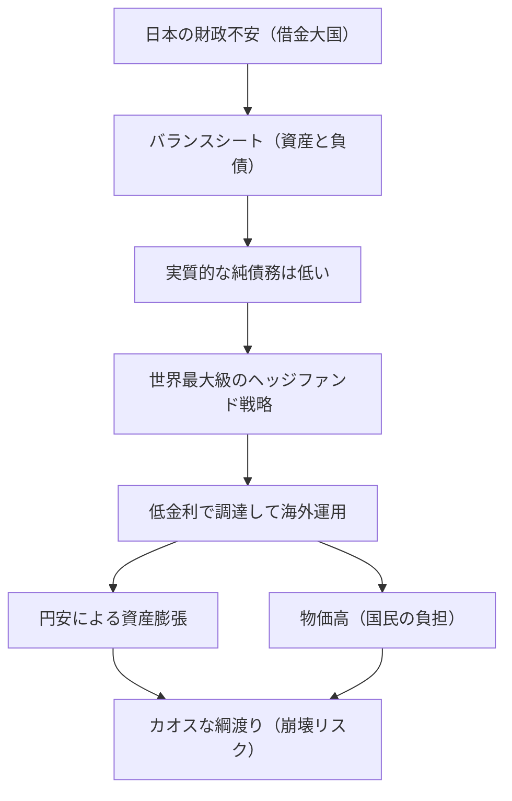

---

tags:
  - type/youtube
  - cat/pets
  - topic/investment
---

# 【もはや曲芸】むちゃくちゃすごい、日本の財政。金利か為替か、インフレも入り混じるカオスを綱渡り。

## タイムライン
| タイムライン | 主なトピック | 解説内容 |
| :--- | :--- | :--- |
| [00:00] | イントロダクション | 「日本は借金大国で破綻する」という言説の誤解と、なぜ超低金利でお金を借り続けられるのかという疑問を提示。 |
| [02:15] | 借金と資産のバランスシート | 借金の額（対GDP比約270%）だけを見るのは間違いであり、政府の保有資産を差し引いた実質的な純債務（約77%）は他の先進国より低いことを解説。 |
| [04:30] | 世界最大級のヘッジファンド戦略 | 超低金利の日本円を国内で安く借り入れ、それを海外の高金利国や成長市場へ投資して稼ぐという国家的な運用メカニズム（債権国としての強み）を説明。 |
| [07:15] | 円安が生む矛盾（モロハの剣） | 円安によって外貨建て資産が膨らみ国は財政破綻を免れる一方で、円安に伴う輸入物価高が国民の財布を直撃するという、国家の健全性と生活苦のトレードオフを指摘。 |
| [09:45] | 脱出不能な「円安の罠」と金利リスク | 円高に戻すと海外資産が縮小して運用モデルが崩壊するため円安から抜け出せず、さらにインフレ抑制のための金利上昇が利払い費の増大を招くリスクを解説。 |
| [11:30] | ニュージーランドとの比較と綱渡り | 毎年海外から借入を行っている債務国ニュージーランドの視点から、円安・低金利・物価高の狭間で絶妙なバランス（曲芸）を続ける日本の凄みとハラハラ感を総括。 |
| [13:00] | エンディング | 財務省や日銀のコントロールへの敬意を表し、じわじわと物価が上昇する新時代における日本の行く末を見守る姿勢を示して締めくくる。 |

## 文字起こし
[00:00] みなさんこんにちは、海外Yパパラジオです。「日本は世界一の借金大国だ」「国の借金が1200兆円を超えて、もうすぐ財政破綻する」といった話を、テレビやニュースで耳にしたことがある人は多いのではないでしょうか。しかし、そう言われ続けてからもう何十年も経っていますが、日本が破綻する気配はありません。なぜ、世界で一番条件が悪そうに見える国が、世界で最も安い金利でお金を借り続けられているのでしょうか？その謎を解き明かす鍵は、私たちが普段目にする「借金の総額」だけを見る間違いにあります。実は、日本の実質の借金は、資産とセットで見ることで全く異なる姿を見せてくれるのです。 [02:15] 借金というのは、資産とセットで見ないと本当にやばいのかどうかは分かりようがありません。例えば、「私に1億円の借金があります」と言われたら、普通は「うわ、この人人生終わったな」と思いますよね。でも、ちょっと待ってください。もしその人が100億円の資産を持っていたとしたらどうでしょうか？1億円の借金なんてどうでもいい、ただの誤差ですよね。逆に、貯金ゼロで1億円の借金なら、これは本当に終わっています。日本政府も同じです。確かに借金の総額（対GDP比約270%）は莫大ですが、日本政府は膨大な「資産」も保有しています。借金から資産を差し引いた実質的な純債務で見ると、対GDP比でいきなり8割弱（約77%）まで下がるのです。これは、アメリカやイギリスなど他の先進国と比べてもむしろ低い水準です。借金の額だけを見て「やばい、破産寸前だ」と大騒ぎするのは、前提となる見方が間違っているのです。 [04:30] さらに驚くべきは、日本の「海外資産」の多さです。日本は政府だけでなく民間も含めて、世界中にお金を貸している世界一の「債権国」であり続けてきました。最近でこそドイツに抜かれて世界2位になりましたが、今でも世界トップクラスです。この構造は、いわば「世界最大級のヘッジファンド」のような国家戦略を体現しています。どういうことかというと、日本国内で超低金利で円を安く借り、そのお金を海外の金利が高い国や成長している市場に投資して稼ぐというビジネスモデルです。安く調達して高く運用する。これが、日本が実は裏で非常にうまくやっている資金循環の正体なのです。 [07:15] しかし、ここには大きな落とし穴があります。このヘッジファンド作戦の健全さは、実は日本の実力というよりは、近年の「円安」という運による恩恵が大きかったのです。円安になると、日本が海外に持っているドル建てなどの外貨資産は、円換算した瞬間に爆発的に膨らみます。その結果、国のバランスシートは見かけ上、ものすごく健全になります。ですが、これこそがモロハの剣なのです。円安は国の資産を増やして財政破綻を防ぐ一方で、輸入物価を押し上げ、私たちの日常生活を直撃します。つまり、「国のバランスシートの健全性」と「国民の生活の苦しさ」は、同じコインの裏表、トレードオフの関係にあるのです。国が健全であり続けるための代償を、私たち生活者が物価高という形で支払わされている。これが、現在の日本の財政のリアルな姿なのです。 [09:45] さらに恐ろしいことに、このヘッジファンド作戦には「出口」がありません。すべてが低金利と円安が続くことを前提に設計されているため、日本は構造的に円安から抜け出せなくなっているのです。もし仮に急激な円高に戻れば、海外の資産価値は円ベースで一気に縮小し、ヘッジファンドとしての収益モデルは崩壊してしまいます。そのため、円安を維持せざるを得ない「円安の罠」にはまっているのです。そしてもう一つの大きなリスクが「金利」です。物価高を抑えるために日銀が金利を上げざるを得なくなれば、日本政府が借金を借り換えるコスト（利払い費）が跳ね上がります。安く借りて海外で運用するという大前提そのものが崩れるため、少しでも金利が跳ね上がれば、財政の綱渡りは一気に足を踏み外すことになります。 [11:30] 私が今住んでいるニュージーランドは、日本とは真逆の国です。国全体としては、毎年せっせと海外からお金を借りている立場（債務国）です。世界に大量にお金を貸し込んでいる日本とは真逆の立場から見ると、日本の仕組みは本当に「ものすごくうまくやっている曲芸」のように見えます。しかし、うまくやっているからこそハラハラします。日本は現在、円安と低金利という、非常に細くて不安定なロープの上で絶妙なバランスを取り続けています。資産が膨らむための円安、生活が壊れない程度のインフレ、そして借金が回るための低金利。このバランスが少しでも崩れたら、いつでも落下してしまうカオスな綱渡りを強いられているのです。 [13:00] そういう意味では、この過酷なカオスの中でコントロールを続けている財務省や日銀の人たちの苦労は計り知れません。本当に「日々お疲れ様です、頑張ってください」と拝みたくなります。長年デフレだった日本が、これからはじわじわと物価が上がっていく国に変わっていく中、この曲芸的な綱渡りを無事に渡りきれるのか。これからの展開をハラハラしながら見守っていきたいと思います。今回の動画が面白いと思った方は、ぜひ高評価とチャンネル登録をよろしくお願いします。コメントもすべて読ませていただいています。それではまた、次回の動画でお会いしましょう。

## 概要
「日本は世界一の借金大国」という言説の誤解を解き明かし、日本の財政の実態と国家的な運用メカニズムを解説する動画です。国の「借金（負債）」だけでなく「資産」を合わせたバランスシートで見ると、実質的な純債務は先進国の中でも低い水準にあります。さらに日本は、低金利で円を調達して海外の高金利資産へ投資する「世界最大級のヘッジファンド」のように機能し、巨額の海外資産（対外純資産）を保有しています。しかし、この構造は「円安」と「低金利」に強く依存しており、円安が国の資産を膨らませて財政破綻を防ぐ一方で、輸入物価高となって国民生活を直撃するトレードオフ（モロハの剣）を生んでいます。金利上昇や円高によるモデル崩壊リスクを抱えながら、為替・金利・インフレの絶妙なバランスをコントロールする日本の「曲芸的な綱渡り」の現状を、ニュージーランド在住の配信者視点から解説しています。

## 構成図 (Mermaid)

