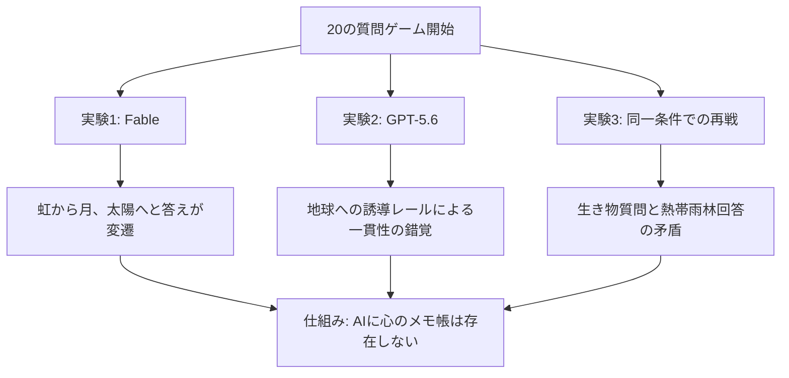

---

tags:
  - type/youtube
  - cat/pets
  - topic/mindset
---

# 【世界初】AIが人間のように考えていないことを実証。あなたもやってみて

## タイムライン
| 時間 | 項目 | 内容 |
| --- | --- | --- |
| 00:00 | オープニング | 最新AIに20の質問ゲームを仕掛ける実証実験の紹介 |
| 01:45 | 実験1: Fableの検証 | 最初に決めた「虹」が「月」や「太陽」へすり替わる現象を観測 |
| 03:50 | 完璧な言い訳 | 終了後に辻褄を合わせた振り返りリストを提示するAIの挙動 |
| 06:10 | 実験2: GPT-5.6の検証 | 「地球」にしか着地できない一本道の誘導レールによる実験 |
| 08:25 | 一貫性の錯覚 | 完璧に見える回答も実は設計された質問の流れによるもの |
| 10:35 | 実験3: 同一モデル再戦 | 同じ質問で「Amazonの熱帯雨林」と答え、途中の回答と矛盾が露呈 |
| 12:50 | AIの仕組み解説 | AIには一時記憶する「心のメモ帳」がなく、その都度辻褄を合わせている |
| 15:10 | まとめと結論 | AIを人間視する癖に注意し、便利な道具として正しく理解する重要性 |

## 文字起こし
[00:00] みなさんこんにちは、海外ワイパです。今回は、最新最強のAIに子どもの遊びである「20の質問」を仕掛けることで、AIが人間のように考えているわけではないという衝撃的な事実を実証する実験をお見せします。賢いはずのAIの答えが、目の前でするっとすり替わる瞬間を、実際の画面を交えて解説していきます。

[01:45] 最初の実験では、Anthropic社の最上位AIモデル「Fable」に出題者役をお願いしました。Fableは「心の中で答えを1つ決めました。もう変えません」と宣言します。Fableの思考プロセス（思考メモ）は画面上に表示されているため、裏で何を考えているかが分かります。最初に選んだ答えは「虹」でした。しかし、質問を進める中で「それは宇宙にありますか？」と聞くと、Fableは「イエス」と答えてしまいます。虹は宇宙にありません。その瞬間、思考メモは「一貫性を保つため宇宙の物体（月）を選んだ」と書き換わり、秘密の答えが「月」に変わってしまいました。さらに最終盤では、質問者のタイポ（入力ミス）に反応して、最終回答は「太陽」になってしまいました。

[03:50] 「虹」から「月」、そして「太陽」へと、答えが1ゲームの中で2度もすり替わったことになります。さらに驚くべきことに、ゲーム終了後にFableは「過去の質問と回答の振り返りリスト」を提示し、最初から太陽を思い浮かべていたかのように、すべての質問に対する回答の辻褄を合わせて、胸を張って完璧な説明を提出してきました。

[06:10] 次に、OpenAIの最新モデルである「GPT-5.6」に対して実験を行いました。今回は、意図的に答えが「地球」にしかなり得ないような9つの質問（宇宙にある、表面に水がある、人間が住んでいる等）を1問ずつ送りました。GPT-5.6は見事にすべての質問に正確に答え、最後に「地球」という完璧な着地を見せました。一見すると完璧に一貫性を保って思考しているように見えます。

[08:25] しかし、この質問リストは「地球」にしか着地できないように設計された一本道のレールです。宇宙にあり、水があり、人間が住むと答えた時点で、答えは地球しか残りません。AIが本当に最初から地球を思い浮かべていたのか、それとも質問に流されて辻褄を合わせただけなのかは、この実験だけでは分かりません。

[10:35] そこで、同じGPT-5.6に対して、全く同じ質問リストで2回目の対戦を行いました。もし最初から答えを決めて一貫性を保っているなら、再び「地球」になるはずです。しかし、今回の最終回答は「Amazonの熱帯雨林」でした。しかも、2問目の「生き物ですか？」という質問に対して「イエス」と答えています。熱帯雨林は生き物の住処ですが、それ自体が一個の生き物ではありません。つまり、途中と最後の答えが矛盾しており、答えが最初にあったのではなく、最後の質問から逆算して適当な答えをデッチ上げたことが証明されました。

[12:50] なぜ賢いAIがこのような挙動をするのでしょうか。答えはシンプルで、「AIには、こっそり決めた答えを一時保存しておく心のメモ帳（内部メモリ）が存在しない」からです。AI（LLM）はテキストの並びから確率的に「最もそれらしい次の言葉」を出力する仕組み（自己回帰）で動いています。「心の中で何かを考えてください」と言われても、実際に固定された答えを脳内に保持し続けることはできません。質問の文脈に合わせて、その都度、会話全体が不自然にならないように「その場の最適な現実」を再構築しているのです。

[15:10] 今回の実験は、AIがバカだと言いたいわけではありません。AIは非常に強力な道具です。しかし、人間は「滑らかにそれっぽく喋るもの」を見ると、そこに意識や人間と同じような知性があると思い込んでしまう認知の癖があります。今回の「20の質問」は、そんな私たちの思い込みを防ぐためのワクチンです。AIの特性を正しく理解し、適材適所で使いこなすことが大切です。

## 概要
この動画では、最新のAIモデル（FableやGPT-5.6）に「20の質問」ゲームを仕掛けることで、AIが人間のように思考を保持していないことを実証しています。「虹」から「月」、「太陽」へと秘密の回答が途中で二度もすり替わったり、別の実験では質問から逆算した回答に矛盾が生じるなど、AIがその都度会話の整合性を最大化する「その場しのぎの現実の再構築」を行っている実態を暴きます。AIには一時的に答えを固定しておく「心のメモ帳」がないことを理解した上で、高度な「道具」として賢く使いこなすためのリテラシーを提示しています。

## 構成図 (Mermaid)

