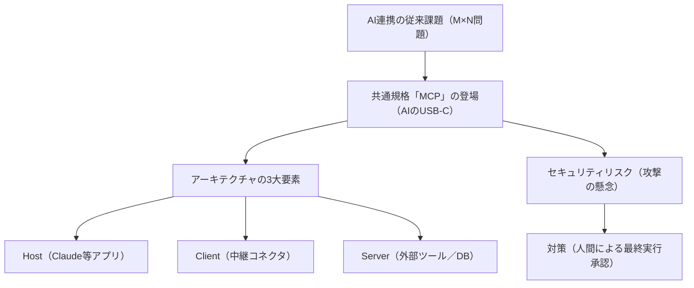

---

tags:
  - type/youtube
  - cat/pets
  - topic/claude
  - topic/chatgpt
---

# 【革命】AIの統一規格「MCP（Model Context Protocol）」をどこよりも分かりやすく解説

## タイムライン
| タイムスタンプ | セクション名 | 概要・重要ポイント |
| --- | --- | --- |
| 00:00 | オープニング | AI業界の勢力図を塗り替える共通規格「MCP」についての概要と紹介。 |
| 01:15 | 従来のAI連携の課題 | M個のAIとN個のツールを繋ぐ際に発生する「M×N接続問題（インテグレーション地獄）」を解説。 |
| 02:45 | MCPとは何か | MCPを「AIの世界におけるUSB-Cポート」に例えてわかりやすく説明。 |
| 04:10 | 業界の覇権争いと合意 | Anthropic、OpenAI、Google、Microsoftなどが共同で採用する異例の動きを解説。 |
| 05:30 | MCPの3つの構成要素 | Host、Client、Serverの3層から成るアーキテクチャとJSON-RPC 2.0通信。 |
| 06:50 | 既存サービスのAI化 | 既存のデータベースやシステムを壊さずに、MCPサーバーを追加するだけでAI対応できる優位性。 |
| 08:15 | AIエージェントの未来 | 自律したAIエージェントが、複数のアプリを跨いで自動でタスクを実行する未来の働き方。 |
| 09:25 | 【重要】セキュリティリスク | プロンプトインジェクションや、AIが勝手にシステムを誤操作・情報漏洩するリスク。 |
| 11:00 | 対策と防衛策 | 決済や削除など、重大アクションにおいて人間が最終確認を行う「Human-in-the-Loop」の重要性。 |
| 12:30 | まとめ | 思考の主権をAIに渡さず、安全かつ効率的に新技術を使いこなす姿勢についての総括。 |

## 文字起こし
[00:00] 皆様、ハロー！海外Ypapa（ワイパパ）です。本日は、最近AI業界で「これは本当に革命だ」と大注目されている新しい共通規格、「MCP（Model Context Protocol）」について、世界一分かりやすく解説していきたいと思います。AIの進化スピードは凄まじいですが、今回のMCPは、私たちが普段使っているChatGPTやClaudeなどのAIと、様々な外部アプリを繋ぐ、まさに歴史的な「架け橋」となる規格です。

[01:15] さて、なぜこのMCPがこれほどまでに騒がれているのかを理解するために、まずは「これまでのAI連携が抱えていた大問題」についてお話しします。専門用語で「M×N問題」や「インテグレーション地獄」と呼ばれるものですが、これまではAIモデル（Claude、ChatGPT、GeminiなどM個）と、外部のツールやデータベース（Slack、Notion、GmailなどN個）を連携させようとするたびに、すべての組み合わせに対して個別の接続コードを書かなければなりませんでした。これでは開発コストが膨大になりすぎて、実質的なAIの業務自動化を阻む巨大な壁になっていたのです。

[02:45] この混沌とした状況を一撃で解決するために登場したのが、今回解説する「MCP」です。分かりやすく例えるなら、MCPは「AIの世界におけるUSB-Cポート」です。昔、携帯電話や電子機器の充電ケーブルは、メーカーごとに端子がバラバラで、引き出しの中がケーブルで溢れかえっていましたよね。それがUSB-Cという共通規格が登場したことで、すべてのデバイスが一本のケーブルで繋がるようになりました。MCPはまさにこれと同じことをAIの世界で実現するものです。

[04:10] そして何より驚くべきは、この規格の普及スピードです。通常、競合するテック企業同士が共通の規格で手を組むのは非常に難しいことです。しかし今回は、開発元であるAnthropicだけでなく、ライバルであるOpenAIのサム・アルトマンCEO、さらにGoogle、Microsoft、AWSといった業界の超巨頭たちが一斉に「MCPを採用する」と表明したのです。Linux Foundationの傘下に共通財産として寄贈されたことで、一企業に依存しない中立な「AIエージェントの共通言語」としての地位を完全に確立しました。

[05:30] では、MCPは一体どのような仕組みで動いているのでしょうか。MCPは大きく分けて「Host（ホスト：AIアプリやIDEなどの実行環境）」「Client（クライアント：接続を仲介するコネクタ）」「Server（サーバー：外部ツールやデータソース）」という3つの階層（アーキテクチャ）で構成されています。これらは「JSON-RPC 2.0」という非常に軽量でシンプルな規格で通信を行います。AIが自発的に「このデータが必要だ」と判断すると、MCPを通じて必要なツールのAPIを呼び出し、自動的に情報を取得してくれるのです。

[06:50] このMCPの最大の素晴らしさは、「既存のサービスやシステムを一切作り直す必要がない」という設計の妙にあります。企業内のデータベースや使い慣れた業務システムに対して、MCPに対応した小さな「サーバー（アダプター）」を1つ追加するだけで、ChatGPTでもClaudeでも、どんなAIモデルからでも即座にそのシステムにアクセスして操作できるようになります。これにより、開発にかかる時間とコストが劇的に削減され、中小企業から大企業まで一気にAIエージェントを実務に導入できる環境が整いました。

[08:15] MCPが真の力を発揮すると、私たちの働き方はどう変わるでしょうか。これからは単に「AIに文章を書いてもらう」だけでなく、「先週の売上データを集計して、Slackで営業メンバーに共有し、未回答の顧客に自動でメールを送っておいて」といった複雑なタスクを、AIが裏側で複数のアプリをまたいで自律的に完結してくれるようになります。これが、現在トレンドとなっている「AIエージェント」の真の姿であり、それを裏で支える共通インフラこそが、このMCPなのです。

[09:25] さて、ここからが今回の動画で特に重要なお話です。動画の指定秒数565秒（約9分25秒）あたりから詳しく解説していますが、この極めて便利なMCPにも、非常に深刻なセキュリティリスクが存在します。それが「プロンプトインジェクション」や「不正な権限実行」の危険性です。AIが自律的に外部システムを操作できるということは、もし悪意のあるプロンプト（指示文）がシステムに侵入した場合、AIが騙されて「社外秘データを外部に送信する」「データベースの重要なレコードを全削除する」「高額な決済を勝手に実行する」といった被害が発生する可能性があるのです。

[11:00] では、このリスクに対して、私たち個人や企業はどのように身を守るべきなのでしょうか。その答えは、「人間による最終実行確認（Human-in-the-Loop）」の徹底にあります。特に「お金の支払い」「外部へのメッセージやメールの送信」「データの削除や上書き」という重大な3つのアクションに関しては、AIが自律して最後まで実行するのではなく、必ず最後の段階で「本当に実行しますか？」というポップアップを出し、人間が自分の目で確認して実行ボタンを押すという仕組み（ポリシーコントロール）を絶対に組み込む必要があります。

[12:30] まとめに入りましょう。MCP（Model Context Protocol）は、AIと外部システムを無限に繋ぐ「USB-C」のような画期的な統一規格です。これによって、AIエージェントが実用化されるスピードは一気に加速しました。しかし、その強力なパワーには相応のセキュリティリスクが伴います。利便性を享受しつつ、人間が「思考の主権」と「最後の決定権」をしっかりと握り、AIを安全にコントロールしていくことがこれからの時代に求められます。それでは、また次回の動画でお会いしましょう。ありがとうございました！

## 概要
「MCP（Model Context Protocol）」は、Anthropicが開発し、OpenAI、Google、Microsoftなどの競合他社も揃って採用したAIの画期的な統一共通規格です。本動画では、従来のAI連携を複雑にしていた「M×N問題（インテグレーション地獄）」を解消し、「AIの世界のUSB-C」として機能するMCPの仕組みをわかりやすく解説。Host、Client、Serverから構成されるシンプルなアーキテクチャの解説や、既存のシステムを壊さずにAIエージェント化できる優位性を提示しています。一方で、動画の565秒（09:25）からは、プロンプトインジェクションや不正な操作指示といったセキュリティ上の深刻な脅威を指摘。お金の支払い、外部発信、データの削除といった重要タスクでは、必ず人間が承認を挟む「Human-in-the-Loop」の安全設計が不可欠であると説いています。

## 構成図 (Mermaid)

