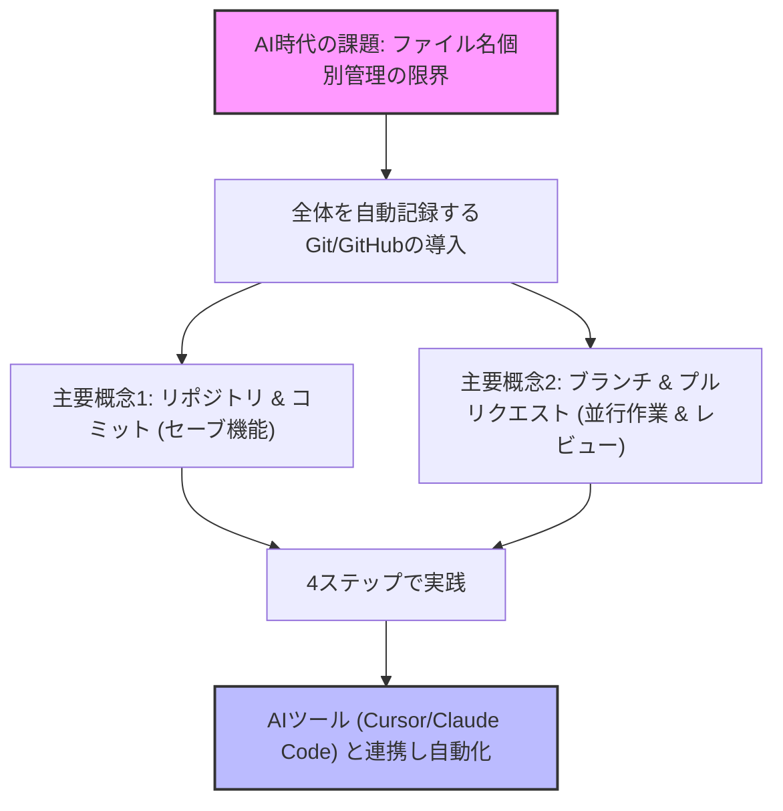

---

tags:
  - type/youtube
  - cat/pets
  - topic/productivity
---

# 文系も必需品になる！！Github (ギットハブ)ってなんですか？

## タイムライン
| タイムスタンプ | セクション名 | 内容の要約 |
| :--- | :--- | :--- |
| [00:00] | 導入とAI時代の課題 | ファイル個別で「本当に最終.docx」などと管理する限界と、AI時代におけるフォルダ全体管理の必要性を解説。 |
| [01:45] | GitとGitHubとは | Googleドキュメントの版の履歴をフォルダ全体に拡張した概念（Git）と、それを共有するクラウドサービス（GitHub）を説明。 |
| [03:15] | 主要概念（リポジトリ・コミット） | プロジェクト全体の箱「リポジトリ」と、ゲームのセーブポイントに相当する「コミット」の役割を例え話で解説。 |
| [05:30] | 主要概念（ブランチ・プルリク） | 本線を傷つけずに試作する「ブランチ」と、修正案を本線に合流させる確認手続き「プルリクエスト」の仕組み。 |
| [07:45] | 編集衝突（コンフリクト）の解決 | 複数人での同時編集時に発生する上書きバグを防ぎ、順番に取り込む仕組みによって文章管理に革命をもたらす点を解説。 |
| [09:15] | 非エンジニアの3つの誤解 | 「黒い画面が必要」「公開される」「有料」という誤解を、GUIアプリや無料のプライベート機能の紹介で解消。 |
| [11:15] | 始めるための4ステップ | アカウント作成から、リポジトリ作成、ブランチ試作、そしてCursorなどのAIツールを連携させた自動管理までの手順。 |
| [13:30] | まとめとメッセージ | 英語力以上に「新しいツールへの適応力（情報感度）」がAI時代に重要であることを強調し、導入を推奨。 |

## 文字起こし
[00:00] 「最終_本当に最終_v3.docx」――このファイル名に覚えがある人ほど、今日の話は刺さるはずです。これまで私たちは文章や資料を作成する際、ファイル名を変えてバージョン管理をしてきました。しかし、AIにフォルダごと作業を任せる時代になり、ファイル単位の管理ではもう追いつかなくなっています。そこで登場するのが、これまでプログラマー専用だと思われてきた「Git（ギット）」と「GitHub（ギットハブ）」です。実は、GitHubの新規ユーザーの6割以上がすでに非エンジニア。文章を書く人、考えをまとめる人にこそ、非常に大きな恩恵がある仕組みなのです。

[01:45] GitとGitHubは、フォルダ内のファイルの履歴をすべて覚えてくれる仕組みです。Googleドキュメントの「版の履歴」を、フォルダ全体に拡張したものだと考えていただくとイメージしやすいでしょう。Gitがバージョンを管理する仕組み（概念）で、GitHubはそれをクラウド上で共有・管理するWebサービスです。AI時代のフォルダ管理において、なぜこれが必要になるのか、具体例を交えて解説していきます。

[03:15] Gitを理解するために、いくつかの主要概念を「作品制作」や「RPGゲーム」に例えて説明します。1つ目は「リポジトリ（Repo）」。これは、本を書く際の「原稿、参考資料、メモ、画像」など、そのプロジェクトに関係するすべてのファイルが入った「魔法の箱（フォルダ丸ごと）」です。2つ目は「コミット」。これはゲームの「セーブ」と同じです。「このフォルダの今の状態を丸ごと記憶して」とGitにお願いする行為です。いつでもそのセーブ地点（3日前など）に戻ることができますし、誰がいつどこを変更したかがすべて記録されます。

[05:30] 3つ目は「ブランチ」。これは「試作用の別線（枝）」です。本線を傷つけずに「この章を思い切って書き直したい」というときに、同じ場所から枝分かれした仮想のコピーを作り、並行して作業ができます。うまくいけば合流させ、失敗すればそのまま捨てればよいため、本線（メインブランチ）は一切無傷で安全です。4つ目は「プルリクエスト（Pull Request）」。これは「別線での変更を本線に取り込んでください」と承認を求める手続きです。変更履歴を添えて他メンバーやAIに確認・レビューを依頼し、OKが出たら本線にマージ（合流）させます。

[07:45] プルリクエストの最大の強みは「編集の衝突（コンフリクト）の解決」にあります。複数人が1本の文章やドキュメントを同時に編集する場合、以前ならファイルの送り合いで「誰々の修正が消えてしまった」というトラブルが頻発していました。Gitでは、各自が個別のブランチで並行作業をするため衝突しません。合流時に同じ箇所を編集していた場合は、システムが自動的に「どちらの変更を採用しますか？」と教えてくれるため、人間のミスによる上書き消失を完全に防止できます。

[09:15] 非エンジニアがGitと聞いた際につまずきやすい「3つの誤解」を解消しておきます。1つ目は「黒い画面（CUI/ターミナル）で操作するの？」という点ですが、今は「GitHub Desktop」などの便利なアプリがあるため、ボタン操作だけで完結します。さらに、CursorやClaude Codeといった最新のAIツールを使えば、自然言語で「セーブ（コミット）しておいて」と指示するだけでAIがGitを操作してくれます。2つ目は「自分の書いたデータが世界中に公開されちゃう？」という点ですが、リポジトリは「プライベート（非公開）」に設定でき、個人なら無料で使えます。実際にGitHub上のコミットの8割以上はプライベートです。3つ目は「お金がかかるの？」という点ですが、個人利用であれば、プライベートリポジトリも含めてすべて無料で利用可能です。

[11:15] GitとGitHubを始めるための具体的な「4ステップ」を紹介します。ステップ1「GitHubアカウント作成」：Googleアカウントなどを利用して、公式サイトから3分で作成できます。ステップ2「リポジトリ作成」：プライベートなリポジトリを新規で1つ作成し、適当なファイルをアップロードしてみましょう。ステップ3「ブランチを作って試す」：ファイルを安易にコピーする代わりに、ブランチを切り、別バージョンを試作する感覚を体験します。ステップ4「AIツールと連携する」：CursorやClaude Codeを導入し、「コミットして」「プルリクを出して」と自然言語で指示を投げてAIにGit操作を行わせます。

[13:30] AI時代において、私たちはプロンプトを工夫する「英語力」よりも、こうした便利なツールに早く触れて活用する「情報感度」こそが差をつける要因となります。AIエージェントにフォルダごと安全に、スマートに作業させるためにも、ぜひこの機会にGit/GitHubへの一歩を踏み出してみましょう。本日の内容は以上です。ありがとうございました。

## 概要
この動画は、非エンジニアや文系の人々に向けて、AI時代に必須となるバージョン管理ツール「Git」および「GitHub」の重要性をわかりやすく解説しています。

### 主なポイント:
- **AI時代のフォルダ管理の必要性**: AIエージェントにプロジェクト全体を任せるようになった現代、ファイル名による個別管理（「最終版.docx」など）は限界を迎えており、フォルダ全体を管理できるGitが必要です。
- **RPGのセーブに例えた主要概念**: フォルダ全体を管理する「リポジトリ」、セーブを意味する「コミット」、別線で試作する「ブランチ」、変更を取り込む「プルリクエスト」などの主要概念をわかりやすく紹介しています。
- **3つの誤解の解消**: 非エンジニアが恐れがちな「黒い画面（コマンドライン）の操作」「公開の不安」「費用」について、デスクトップアプリの普及、無料のプライベート機能の存在を挙げて不要であることを解説しています。
- **黒い画面なしで始める4ステップ**: アカウント作成、プライベートリポジトリの作成、ブランチ試作、そしてCursorやClaude CodeなどのAIツールと連携し自然言語でGitを操作させるまでのステップを提示しています。

## 構成図 (Mermaid)

