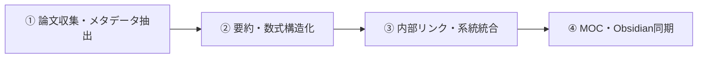

# No.121 学術論文ナレッジ同期

- **種別**: 知識管理・複合連携
- **対象スキル**: `academic-knowledge-sync`
- **指示文プロンプト原本**:
> 【知識管理 No.121】学術論文ナレッジ同期 のスキルを呼び出し、論文データの収集・要約・ナレッジグラフ連結を迅速かつ確実に完遂します。

---

## 代表的な活用・専門プロンプト 10選

### 1. 論文PDFからの要点・新規性・課題の構造化抽出
> 【知識管理 No.121】学術論文ナレッジ同期 のスキルを呼び出します。指定した論文PDFからアブストラクト、主要な貢献、提案手法の新規性、限界と今後の課題を構造化して抽出してください。

### 2. 関連論文の引用関係マップと先行研究サーベイ
> 【知識管理 No.121】学術論文ナレッジ同期 のスキルを呼び出します。対象論文の参考文献リストから主要な先行研究を特定し、研究の流れと系統を整理したサーベイノートを作成してください。

### 3. 数式・アルゴリズムのLaTeX専門解釈ノート作成
> 【知識管理 No.121】学術論文ナレッジ同期 のスキルを呼び出します。論文内に登場する主要な数式・アルゴリズムを抽出し、LaTeX表記法とステップごとの分かりやすい解説を付けたノート化を行ってください。

### 4. 論文要約のObsidian整合度向上メタデータ（YAML）付与
> 【知識管理 No.121】学術論文ナレッジ同期 のスキルを呼び出します。タイトル、著者、出版年、DOI、キーワード、主要カテゴリを自動抽出し、Obsidianのフロントマター（YAML）形式で整頓してください。

### 5. 既存ノートとの双方向リンク（2-Hop Links）自動生成
> 【知識管理 No.121】学術論文ナレッジ同期 のスキルを呼び出します。今回の論文内容と現在保管庫にある既存の研究ノート・知識を比較し、共通概念に対する適切な内部リンク（[[WikiLinks]]）を自動付与してください。

### 6. 実装コード・リポジトリ（GitHub等）との対応付け
> 【知識管理 No.121】学術論文ナレッジ同期 のスキルを呼び出します。論文に関連する公式実装コードや派生リポジトリの情報を取得・紹介し、アルゴリズムとコードの対応箇所を整理してください。

### 7. arXiv/PubMed等からの最新論文フィード自動取得・要約
> 【知識管理 No.121】学術論文ナレッジ同期 のスキルを呼び出します。指定分野の最新プレスリリース情報を定期取得し、読むべき優先度スコアを算出してデイリーノートに追記してください。

### 8. 実験結果データ・ベンチマークスコアの比較テーブル化
> 【知識管理 No.121】学術論文ナレッジ同期 のスキルを呼び出します。既存手法との性能比較データを集計し、ベースライン手法に対する優位性と測定指標を整理してください。

### 9. 論文読書メモ（Literature Note）から恒久ノート（Permanent Note）への昇華
> 【知識管理 No.121】学術論文ナレッジ同期 のスキルを呼び出します。論文から抜き出した単なる要約メモを、自身の考察やアイデアと結合した再利用性の高いエバーグリーンノートに再構築してください。

### 10. テーマ別ナレッジMOC（Maps of Content）の自動更新
> 【知識管理 No.121】学術論文ナレッジ同期 のスキルを呼び出します。新しく蓄積された論文ノートを適切なトピック別MOC（目次ノート）に登録し、ナレッジ全体の構造を最新状態に同期してください。

---

## 対象スキル体系図

