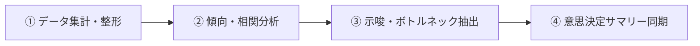

# No.016 業務・データ分析サマリー

- **種別**: 単体活用
- **対象スキル**: `business-data-analysis`
- **指示文プロンプト原本**:
> 【単体活用 No.16】業務・データ分析サマリー のスキルをピンポイントで呼び出し、データ集計・示唆抽出・意思決定サマリー作成を爆速かつ確実に完遂します。

---

## 代表的な活用・展開プロンプト 10選

### 1. 売上・KPI推移のボトルネック要因分析
> 【単体活用 No.16】業務・データ分析サマリー のスキルを呼び出します。月次売上データおよびKPI実績から目標未達要因を抽出し、改善施策案を含む分析サマリーを作成してください。

### 2. 顧客行動ログ・利用傾向のクラスター分析サマリー
> 【単体活用 No.16】業務・データ分析サマリー のスキルを呼び出します。顧客の利用頻度・利用機能ログから主要セグメントを分類し、各グループの行動特性サマリーを作成してください。

### 3. 不動産物件データ・成約要因の相関分析
> 【単体活用 No.16】業務・データ分析サマリー のスキルを呼び出します。物件価格、立地、築年数、反響数の相関を分析し、成約確度を高める価格・訴求ポイントを整理してください。

### 4. 業務プロセス工数・タスク滞留箇所の可視化
> 【単体活用 No.16】業務・データ分析サマリー のスキルを呼び出します。業務フローの工程別所要時間データからボトルネックを特定し、工数削減に向けた改善レポートを作成してください。

### 5. 在庫回転率・入出庫データの推移分析サマリー
> 【単体活用 No.16】業務・データ分析サマリー のスキルを呼び出します。入庫・出庫データをもとに在庫回転期間と滞留リスクのある品目を抽出し、適正発注の目安を提示してください。

### 6. A/Bテスト結果の有意差検定と施策採否判定
> 【単体活用 No.16】業務・データ分析サマリー のスキルを呼び出します。実施したA/BテストのCVRデータを統計的に検証し、有意差の有無と本番適用の推奨判定サマリーを作成してください。

### 7. マーケティーグ施策ROI・費用対効果の横断比較
> 【単体活用 No.16】業務・データ分析サマリー のスキルを呼び出します。媒体別の獲得単価（CPA）と顧客生涯価値（LTV）を比較し、予算配分の最適化方針を策定してください。

### 8. アンケート定性回答テキストの感情・頻出テーマ要約
> 【単体活用 No.16】業務・データ分析サマリー のスキルを呼び出します。顧客アンケートの自由記述データを自然言語処理的に分類し、主要な不満点・要望トレンドの要約を作成してください。

### 9. 異常値・外れ値検知とリスク早期警戒レポート
> 【単体活用 No.16】業務・データ分析サマリー のスキルを呼び出します。運用ログや数値データ群から統計的な外れ値を検出し、原因仮説とアラートサマリーを提示してください。

### 10. 分析結果のObsidian保管庫・MOC自動同期
> 【単体活用 No.16】業務・データ分析サマリー のスキルを呼び出します。分析結果の数表・インサイトをMarkdown形式（YAML付き）に整形し、分析MOCノートへ自動同期してください。

---

## 対象スキル体系図

