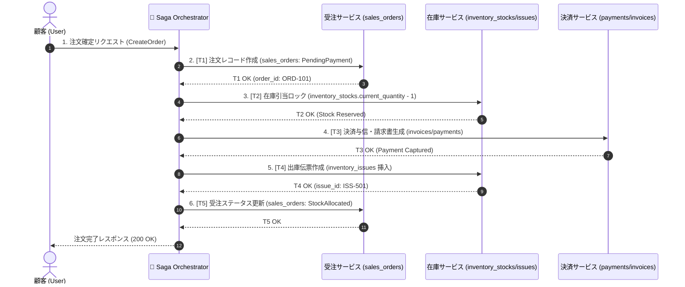
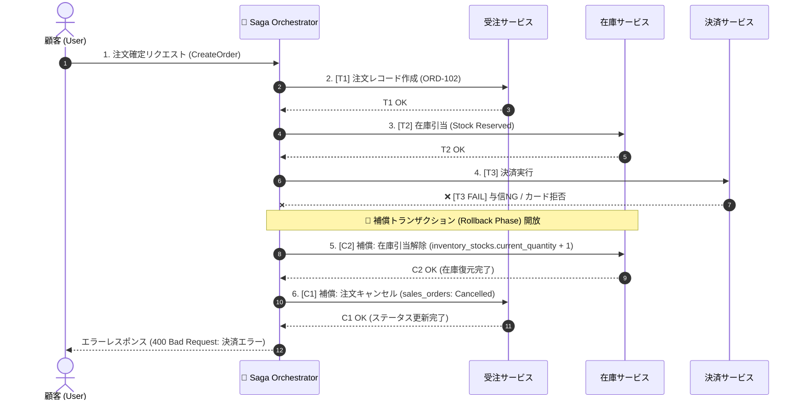

---
tags:
  - saga-pattern
  - distributed-transactions
  - compensation
  - multi-agent
  - architecture
  - obsidian
summary: 30テーブルデータモデルおよび状態遷移v2に基づく、Sagaパターン（正常系・補償トランザクション異常系）の具体的動作仕様書 (20260911版 v1)。
updated: 2026-09-11
---

# 🔄 20260911 No.162 Sagaパターン 具体的動作仕様書 (v1)

## 1. 概要と基本コンセプト

本仕様書は、分散マイクロサービス環境（またはモジュラーモノリス境界）において、2Phase Commit (2PC) を使用せずにACID類似の整合性を保証する **オーケストレーション型 Saga パターン (Orchestrated Saga Pattern)** の正常系および異常系（補償トランザクション）の具体的動作挙動を定義します。

---

## 2. 正常系フロー仕様 (Happy Path Sequence)

ユーザーが注文を完了し、仮引当・決済・出庫伝票発行・請求書生成がすべて正常に完了するシームレスな流れです。

### 2.1 正常系 Mermaid シーケンス図



### 2.2 正常系 データベース操作詳細

| ステップ | サービス | 実行アクション / SQL | 成功判定条件 |
| :--- | :--- | :--- | :--- |
| **T1** | 受注 | `INSERT INTO sales_orders` (status_id: `PENDING`) | `order_id` 生成 |
| **T2** | 在庫 | `UPDATE inventory_stocks SET current_quantity = current_quantity - N` | 更新件数 == 1 かつ `current_quantity >= 0` |
| **T3** | 決済 | `INSERT INTO invoices` ➔ `INSERT INTO payments` | 決済事業者 `status = CAPTURED` |
| **T4** | 在庫 | `INSERT INTO inventory_issues` (出庫専用伝票) | `issue_id` 生成 |
| **T5** | 受注 | `UPDATE sales_orders SET status_id = 'STOCK_ALLOCATED'` | ステータス更新成功 |

---

## 3. 異常系・補償トランザクション仕様 (Compensation Flow)

ステップ T3 (決済) が何らかの理由（与信枠不足・カード期限切れ等）で失敗した場合、逆順に補償アクション (C2 ➔ C1) を実行し、データベースを元の整合状態へ自動復元します。

### 3.1 異常系 Mermaid シーケンス図 (決済失敗時ロールバック)



### 3.2 補償アクション (Compensation Action) 定義表

| 失敗ステップ | 影響を受ける過去ステップ | 補償アクショントリガー | 具体的補償データベース処理 (SQL) |
| :--- | :--- | :--- | :--- |
| **T3 (決済失敗)** | **T2 (在庫引当済)** | **C2: 在庫引当解除** | `UPDATE inventory_stocks SET current_quantity = current_quantity + N WHERE variant_id = ?` |
| **T3 (決済失敗)** | **T1 (注文下書き済)** | **C1: 注文キャンセル** | `UPDATE sales_orders SET status_id = 'CANCELLED' WHERE order_id = ?` |
| **T4 (出庫伝票失敗)**| **T3 (決済完了済)** | **C3: 仮売上取消/返金** | `INSERT INTO refunds (payment_id, refund_amount...)` (赤黒相殺処理) |

---

## 4. Python/FastAPI Saga オーケストレーター実装仕様

```python
from dataclasses import dataclass
from typing import List, Callable

@dataclass
class SagaStep:
    name: str
    execute: Callable[[], bool]
    compensate: Callable[[], bool]

class SagaOrchestrator:
    """補償トランザクションを自動追跡・実行するSagaエンジン"""

    def __init__(self, saga_id: str):
        self.saga_id = saga_id
        self.executed_steps: List[SagaStep] = []

    def run(self, steps: List[SagaStep]) -> bool:
        for step in steps:
            print(f"[*] Executing step: {step.name}")
            try:
                success = step.execute()
                if not success:
                    print(f"[❌ FAIL] Step failed: {step.name}. Starting Compensation...")
                    self._rollback()
                    return False
                self.executed_steps.append(step)
            except Exception as e:
                print(f"[🚨 EXCEPTION] {step.name}: {e}. Starting Compensation...")
                self._rollback()
                return False
        return True

    def _rollback(self):
        """成功した過去ステップを逆順に補償実行 (C_n -> C_1)"""
        for step in reversed(self.executed_steps):
            print(f"[🔄 RECOVERING] Executing compensation for: {step.name}")
            try:
                step.compensate()
            except Exception as comp_err:
                print(f"[CRITICAL] Compensation failed for {step.name}: {comp_err}")
                # ログ・監査テーブルへ記録し、人間にエスカレーション
```
