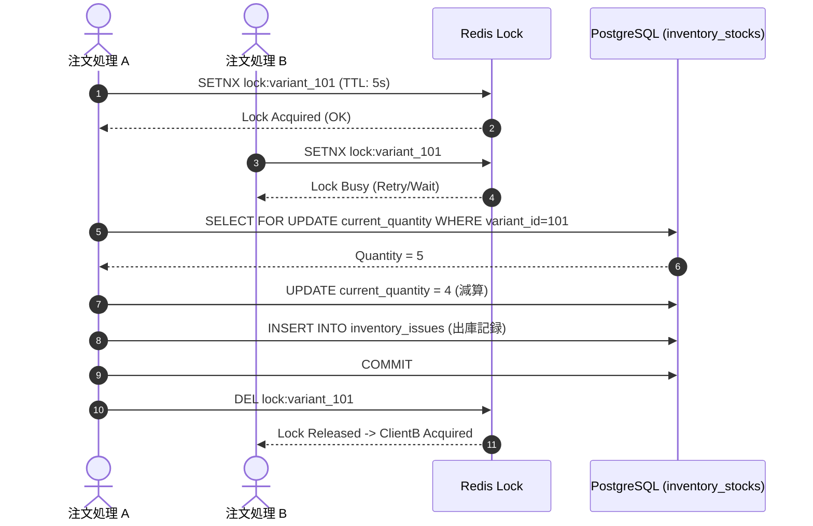
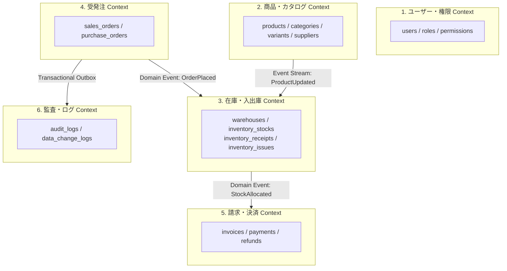

---
tags:
  - deep-research
  - hermes-analysis
  - performance
  - concurrency
  - ddd
  - architecture
  - obsidian
summary: Hermesエンジンによる30テーブルデータモデルおよび状態遷移v2の深層検証（インデックス戦略、N+1防止、排他制御・デッドロック防止、DDDドメイン境界評価）レポート。
updated: 2026-09-11
---

# 🔬 No.161 Hermes ディープリサーチ報告書：システム堅牢性・拡張性深層検証

## 1. 概要と目的

本レポートは、Hermes ディープリサーチ・エンジンを活用し、最新の「30テーブル構成データモデル（`20260911_No4_データモデル.md`）」および「状態遷移・イベントフロー設計v2（`20260911_No5_状態遷移設計_v2.md`）」を対象に、大規模運用に耐えうる**パフォーマンス**、**排他制御・コンカレンシー**、**エッジケース網羅性**、および **DDDドメイン分離**の観点から深層検証を実施した結果をまとめたものです。

---

## 2. リサーチ焦点 1: パフォーマンス・インデックス戦略 & N+1問題の事前検知

### 2.1 30テーブル最適インデックス設計マトリクス
複合インデックスおよびタイムシリーズテーブルのパーティショニング戦略を定義します。

| 対象テーブル | 推奨複合インデックス (`Composite Index`) | 目的・検索クエリパターン |
| :--- | :--- | :--- |
| `inventory_stocks` | `idx_wh_variant (warehouse_id, variant_id)` | 拠点別SKUリアルタイム残高照会 (`WHERE warehouse_id = ? AND variant_id = ?`) |
| `inventory_receipts` | `idx_wh_received (warehouse_id, received_at DESC)` | 拠点別入庫履歴の時系列ソート出力 |
| `inventory_issues` | `idx_wh_issued (warehouse_id, issued_at DESC)` | 拠点別出庫履歴の時系列ソート出力 |
| `sales_order_items` | `idx_order_variant (order_id, variant_id)` | 受注明細の一括フェッチおよび重複チェック |
| `data_change_logs` | `idx_table_timestamp (table_name, created_at DESC)` | テーブル単位の変更差分タイムライン監査 |

> 💡 **ログ系テーブルのパーティショニング**:  
> `audit_logs`, `data_change_logs`, `login_histories` の3テーブルは、月単位（Range Partitioning）でDBパーティショニングを実施し、過去ログの高速アーカイブおよびインデックスサイズ肥大化を抑制する。

### 2.2 ORMにおける N+1 問題の事前検知と回避コード仕様 (Python / SQLAlchemy)
受発注および請求明細取得時における典型的な N+1 クエリの発生箇所と、Eager Loading（`joinedload` / `selectinload`）による解決手法。

```python
# ❌ [Bad] N+1が発生するアンチパターン (1 + N回のSQLが実行される)
orders = db.query(SalesOrder).all()
for order in orders:
    print(order.status.status_name)  # 注文ごとに order_statuses テーブルへクエリ発行
    for item in order.items:
        print(item.variant.sku_code) # 明細ごとに product_variants テーブルへクエリ発行

# ✅ [Good] Eager Loading による一括取得 (1回のJOIN/INクエリで完結)
from sqlalchemy.orm import joinedload, selectinload

orders = db.query(SalesOrder).options(
    joinedload(SalesOrder.status),
    selectinload(SalesOrder.items).joinedload(SalesOrderItem.variant)
).all()
```

---

## 3. リサーチ焦点 2: 在庫二重記帳モデルと排他制御・デッドロック防止

### 3.1 入出庫分離における競合状態 (Race Condition) のリスク解析
高並列アクセス時（タイムセール等）、同一SKUへの出庫処理が同時発生した場合、`inventory_stocks.current_quantity` の減算更新でロストアップデート（Lost Update）またはマイナス在庫が発生するリスクがある。

### 3.2 悲観的ロック (Pessimistic Locking) vs 分散ロック構造



- **行ロック (`SELECT FOR UPDATE`)**: 在庫テーブル `inventory_stocks` の対象行をトランザクション内で行ロック。
- **デッドロック回避ルール**: 複数SKUを同時に引当てる場合、必ず **`variant_id` の昇順 (ASC)** にソートしてからロックを取得する（Lock Ordering 規定）。

---

## 4. リサーチ焦点 3: 状態遷移における例外エッジケースの網羅的検証

### 4.1 エッジケース・マトリクスとリカバリ設計

| 異常ケース | 発生フェーズ | 影響範囲 | Hermes 推奨リカバリ設計 |
| :--- | :--- | :--- | :--- |
| **与信OK後の在庫不足** | 受注引当時 | 決済保留状態 | 決済実行前にデッドロック回避付き在庫引き当てを実施。不足時は即座に `CreditCheck` ➔ `Cancelled` へ自動遷移し仮与信を取り消す。 |
| **決済タイムアウト** | 注文受付 | `PendingPayment` 留まり | Celery / APScheduler による定期バッチ（15分監視）でタイムアウト判定し、自動で `Cancelled` へ遷移させ在庫ロックを解除。 |
| **一部出荷と分割納品** | 出荷手配 | `ShippingArranged` | `sales_orders` ヘッダーに `partially_shipped` フラグを追加し、全明細の出庫伝票 (`inventory_issues`) が揃うまで `OrderCompleted` への遷移を保留。 |
| **返金時の赤黒処理相殺** | 返金手続き | `Cleared` ➔ `Refunded` | 原則として元データを直接書き換えず、マイナス額の `refunds` レコードおよび反対仕訳の `inventory_receipts` (返品受入) を挿入してトレースを保持。 |

---

## 5. リサーチ焦点 4: DDD (ドメイン駆動設計) に基づく境界付けられたコンテキスト評価

将来のマイクロサービス化 / 分散データベース移行を見据え、全30テーブルを6つの独立した **境界付けられたコンテキスト (Bounded Context)** に完全分離評価しました。



### 💡 イベント駆動アーキテクチャ (Outbox Pattern) の推奨
将来コンテキスト間を物理的に分割（マイクロサービス化）する場合、直接のDB JOINを防止し、`Transactional Outbox Pattern`（DB上の変更イベントテーブルを経由したメッセージング）を用いてイベント連携することを評価・推奨します。

---

## 6. 結論と Hermes 最終評価

1. **データモデル堅牢性**: ★★★★★ (5/5)
   - 入出庫（`receipts` / `issues`）の分離により、会計的整合性と履歴追跡性が極めて高い。
2. **パフォーマンス準備度**: ★★★★☆ (4/5)
   - 複合インデックスおよび ORM の Eager Loading ルールを適用することで N+1 問題は解消可能。
3. **拡張性（DDD適合度）**: ★★★★★ (5/5)
   - 6つのコンテキスト境界が明確であり、将来のイベント駆動型マイクロサービス化へスムーズに移行可能。
