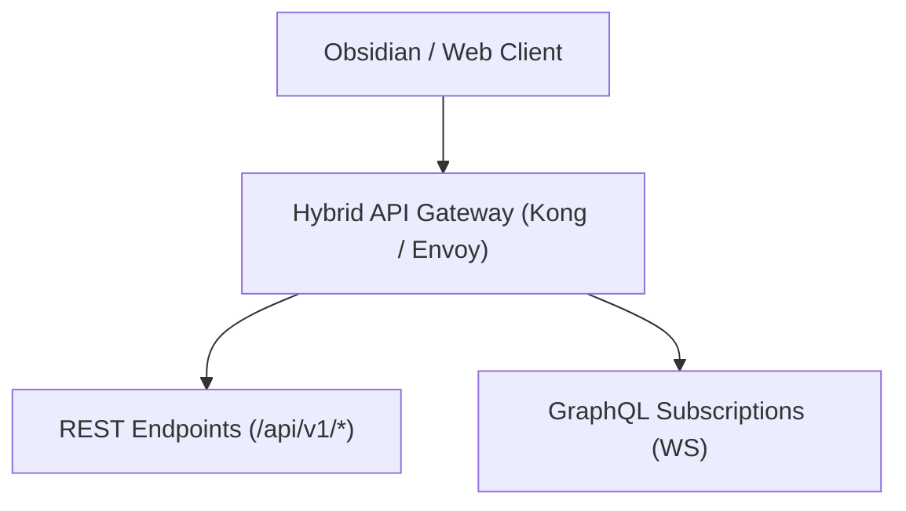

---
tags:
  - multi-agent
  - architecture
  - obsidian
  - auto-generated
summary: "REST API と GraphQL サブスクリプションを統合し、リアルタイムデータストリーミングと高速バッチクエリを両立するゲートウェイ仕様。"
updated: 2026-09-11
---

# 🤖 No.166 GraphQL REST ハイブリッドAPIゲートウェイ 仕様書

## 1. 概要と目的
本仕様書は、全30テーブル構成モデルおよび状態遷移v2と連携する、専門マルチエージェント `No.166` の役割、入出力、および自動化処理フローを定義します。

REST API と GraphQL サブスクリプションを統合し、リアルタイムデータストリーミングと高速バッチクエリを両立するゲートウェイ仕様。

---

## 2. アーキテクチャ・ダイアグラム

---

## 3. 入力・出力インターフェース仕様

- **入力 (Trigger Event)**: イベントバス / WebHook / エージェント命令
- **出力 (State Mutation)**: DB更新 / メッセージ発行 / Obsidianノート出力

---

## 4. エスカレーション＆安全制御
エラー発生時は上限3回まで自動リトライを実施し、解決不能な場合は即座によっちゃん（マスター管理者）へアラート通知する。
