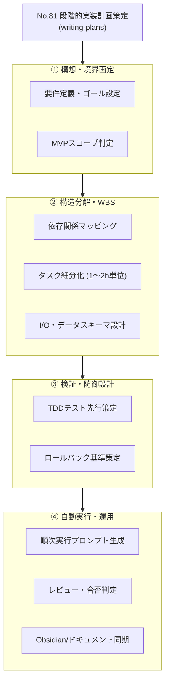

# No.81 段階的実装計画策定

- **種別**: 単体活用
- **対象スキル**: `writing-plans`
- **指示文プロンプト原本**:
> 【単体活用 No.81】段階的実装計画策定 のスキルをピンポイントで呼び出し、爆速かつ確実に完遂します。

---

## 対象スキル体系図

```mermaid
flowchart TD
    Root["No.81 段階的実装計画策定<br>(writing-plans)"]

    subgraph Step1["① 構想・境界画定"]
        S1["要件定義・ゴール設定"]
        S2["MVPスコープ判定"]
    end

    subgraph Step2["② 構造分解・WBS"]
        W1["依存関係マッピング"]
        W2["タスク細分化 (1〜2h単位)"]
        W3["I/O・データスキーマ設計"]
    end

    subgraph Step3["③ 検証・防御設計"]
        T1["TDDテスト先行策定"]
        T2["ロールバック基準策定"]
    end

    subgraph Step4["④ 自動実行・運用"]
        E1["順次実行プロンプト生成"]
        E2["レビュー・合否判定"]
        E3["Obsidian/ドキュメント同期"]
    end

    Root --> Step1
    Step1 --> Step2
    Step2 --> Step3
    Step3 --> Step4
```
