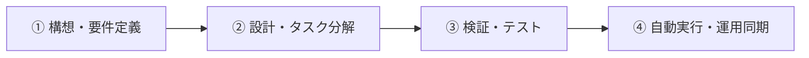

# No.107 発想技法AIナビゲーター

- **種別**: 複合連携
- **対象スキル**: `multi-agent-workflow`
- **指示文プロンプト原本**:
> 【複合連携 No.107】発想技法AIナビゲーター の連携スキルを呼び出し、複数エージェントを自動連動させて完遂します。

---

## 代表的な活用・展開プロンプト 10選

### 1. 発想技法AIナビゲーター の要件定義とMVPスコープ境界画定
> 【複合連携 No.107】発想技法AIナビゲーター の連携スキルを呼び出し、複数エージェントを自動連動させて完遂します。 発想技法AIナビゲーター の要件定義とMVPスコープ境界画定を速やかに実行してください。

### 2. 発想技法AIナビゲーター に適したモジュール構造・ファイル分割設計
> 【複合連携 No.107】発想技法AIナビゲーター の連携スキルを呼び出し、複数エージェントを自動連動させて完遂します。 発想技法AIナビゲーター に適したモジュール構造・ファイル分割設計を速やかに実行してください。

### 3. 発想技法AIナビゲーター 実行時の例外監視と自動リカバリ手順策定
> 【複合連携 No.107】発想技法AIナビゲーター の連携スキルを呼び出し、複数エージェントを自動連動させて完遂します。 発想技法AIナビゲーター 実行時の例外監視と自動リカバリ手順策定を速やかに実行してください。

### 4. 発想技法AIナビゲーター のデータスキーマおよびI/Oパイプライン最適化
> 【複合連携 No.107】発想技法AIナビゲーター の連携スキルを呼び出し、複数エージェントを自動連動させて完遂します。 発想技法AIナビゲーター のデータスキーマおよびI/Oパイプライン最適化を速やかに実行してください。

### 5. 発想技法AIナビゲーター に伴う依存ライブラリの整合性チェックとバージョン固定
> 【複合連携 No.107】発想技法AIナビゲーター の連携スキルを呼び出し、複数エージェントを自動連動させて完遂します。 発想技法AIナビゲーター に伴う依存ライブラリの整合性チェックとバージョン固定を速やかに実行してください。

### 6. 発想技法AIナビゲーター に連動したGitブランチ運用とプルリクエスト作成
> 【複合連携 No.107】発想技法AIナビゲーター の連携スキルを呼び出し、複数エージェントを自動連動させて完遂します。 発想技法AIナビゲーター に連動したGitブランチ運用とプルリクエスト作成を速やかに実行してください。

### 7. 発想技法AIナビゲーター の品質担保に向けた自動テストケース先行配置
> 【複合連携 No.107】発想技法AIナビゲーター の連携スキルを呼び出し、複数エージェントを自動連動させて完遂します。 発想技法AIナビゲーター の品質担保に向けた自動テストケース先行配置を速やかに実行してください。

### 8. 発想技法AIナビゲーター と外部サービス（API/Webhook）の疎通・結合検証
> 【複合連携 No.107】発想技法AIナビゲーター の連携スキルを呼び出し、複数エージェントを自動連動させて完遂します。 発想技法AIナビゲーター と外部サービス（API/Webhook）の疎通・結合検証を速やかに実行してください。

### 9. 発想技法AIナビゲーター 実行タスクのバッチ自動化およびログ監視体制構築
> 【複合連携 No.107】発想技法AIナビゲーター の連携スキルを呼び出し、複数エージェントを自動連動させて完遂します。 発想技法AIナビゲーター 実行タスクのバッチ自動化およびログ監視体制構築を速やかに実行してください。

### 10. 発想技法AIナビゲーター の実行結果とドキュメントをObsidian保管庫へ自動同期
> 【複合連携 No.107】発想技法AIナビゲーター の連携スキルを呼び出し、複数エージェントを自動連動させて完遂します。 発想技法AIナビゲーター の実行結果とドキュメントをObsidian保管庫へ自動同期を速やかに実行してください。

---

## 対象スキル体系図

