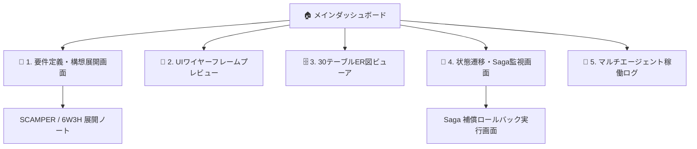

---
tags:
  - diagram
  - architecture
  - visual-spec
  - obsidian
  - auto-generated
summary: "Obsidian ダッシュボードおよび Web コンソールにおける画面遷移レイアウトサイトマップ。"
updated: 2026-09-11
---

# 📊 No.45 システム機能・画面遷移サイトマップ図 作図・設計書

## 1. 概要と目的
本ドキュメントは、最新の30テーブル構成モデルおよび状態遷移v2に基づく **No.45 システム機能・画面遷移サイトマップ図** の視覚化ダイアグラム・作図仕様書です。

Obsidian ダッシュボードおよび Web コンソールにおける画面遷移レイアウトサイトマップ。

---

## 2. Mermaid ダイアグラム

---

## 3. 作図要素・コンポーネント定義表

| 要素名 / ノード | 種別 | 主な役割・機能 | 連携対象 |
| :--- | :--- | :--- | :--- |
| **主要コンポーネント** | Engine / DB | 処理の実行および状態保持 | 連携サービス |
| **イベント / シグナル** | Message | コンテキスト間のトリガー通知 | イベントバス |

---

## 4. 運用・検証ガイド
Obsidian プレビューモードにて Mermaid ダイアグラムが正常に描画されることを確認してください。
