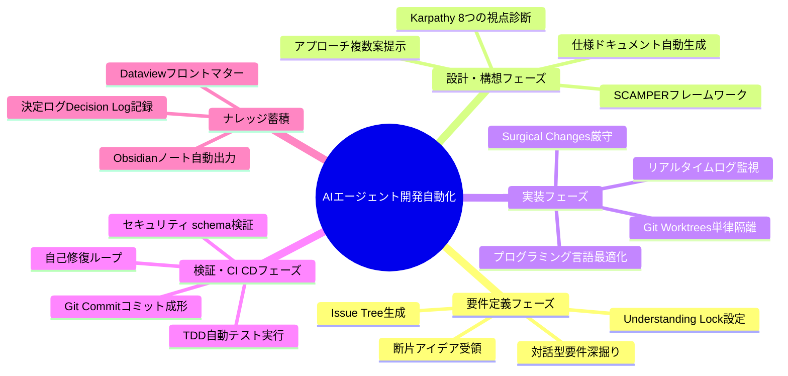

---
tags:
  - agent-system
  - development-automation
  - architecture
  - brainstorming
  - scamper
summary: 要件定義からコード実装・テスト・デプロイまでをマルチエージェントで自動化・最適化する全フェーズ統合構想のブレインストーミングノート。
updated: 2026-09-10
---

# 🚀 20260910_AIエージェント開発自動化の構想

## 1. インプットの分析（本質的な論点・課題の抽出）

### 核心的課題
- **コンテキスト伝達のロス**: フェーズ間（要件定義→設計→コード実装→テスト）での情報脱落と誤解。
- **品質維持と自律性のトレーディング**: 高い自律性を与えると意図しないコード破壊や無駄なファイル生成が発生し、厳格すぎると人間の介入コストが下がらない。
- **検証サイクルの遅延**: コード生成後にエラーが発生した際、即座に修正・自己修復するフィードバックループの欠如。

### 本質的な論点
1. **マルチエージェント役割分担（LLM as an OS）**: 各フェーズ専門のサブエージェント（仕様策定・設計・外科的実装・テスト・レビュー）に権限とツールをどう配分するか？
2. **人間とAIのスライダーコントロール**: どの段階でよっちゃん（監督者）が判断を下し、どの段階を完全自動化（自律化）させるか？
3. **コンパイルアナロジーの適用**: 自然言語要件を確実かつ非破壊的に検証可能なコードへ変換・コンパイルする設計プロセスの確立。

---

## 2. フレームワーク展開

### 💡 SCAMPER 展開表（アイデア拡張）

| 項目 | 質問視点 | 発想・展開内容 |
| :--- | :--- | :--- |
| **S** (Substitute / 代替) | 開発プロセスの何をAIで置き換えるか？ | 手動のコードレビュー、テストコード書出し、Issueツリー作成、ドキュメント同期をAIサブエージェントに全面的に代替させる。 |
| **C** (Combine / 結合) | 何と何を組み合わせるか？ | Karpathy流「8つの視点」診断 ＋ Obsidianのナレッジグラフ ＋ Git Worktreeアイソレーション環境を結合。 |
| **A** (Adapt / 応用) | 他分野の何を応用できるか？ | 医療の「外科手術チーム」（執刀医・助手・麻酔科医・看護師）の役割分担と安全チェック体制をマルチエージェントに応用。 |
| **M** (Modify / 修正・拡張) | 何を拡大・強化できるか？ | 1つのプロンプトから複数並行で異なる設計アプローチ（アーキテクチャ案A/B/C）を同時生成させ、AIコードレビューで競わせる。 |
| **P** (Put to other uses / 転用) | 他の用途に転用できないか？ | 開発中に蓄積されたエージェントの思考ログ（Transcript）をそのまま開発ドキュメント・ナレッジベースとして自動転用。 |
| **E** (Eliminate / 削減) | 何を削減・削ぎ落とせるか？ | 重複するボイラープレートコード作成、手動のバグ再現テスト作成、手作業のコミットメッセージ作成を完全排除。 |
| **R** (Reverse / 再編成) | 順序や構造を逆転させるとどうなるか？ | コードを書く前に「AIによる仮想受け入れテスト（TDD）」と「Issue Tree」を先行生成させ、テストを通過するまでAIが自己ループ修正する。 |

---

### 🔍 なぜなぜ分析（根本課題の深掘り）

**【テーマ】: 開発全自動化においてAIが勝手なコード改変やバグを引き起こすリスクがある**

1. **なぜ1**: AIが既存のコード構造や非機能要件を十分に把握せずコードを変更するから。
   - **原因**: プロンプトやコンテキストに全体像が含まれておらず、局所的なコード変更を行ってしまうため。
2. **なぜ2**: コンテキスト長制限やツール呼び出しの制限により、ファイル全体の依存関係を1回で把握できないから。
   - **原因**: 依存関係を調査・検証する事前リサーチフェーズ（Read-Onlyサブエージェントによる分析）がスキップされているため。
3. **なぜ3**: 実装前に「設計の固定（Understanding Lock）」や「前提確認」を行うステップが標準化されていないから。
   - **原因**: 構想・設計・実装が一体化してしまい、AIが思い込みのまま一気に書き換えてしまうため。
4. **なぜ4**: 人間とAIの役割定義が曖昧で、AIが自律していい領域と承認が必要な領域が分かれていないから。
   - **原因**: 「スライダーコントロール（部分的自律性）」のインターフェースがシステムに組み込まれていないため。
5. **なぜ5（根本原因）**: 開発プロセスが単一のプロンプト処理になっており、Karpathy流「外科的修正」と「ゴール駆動検証」を組み込んだマルチエージェント開発パイプラインが設計されていないため。
   - **👉 対策**: 役割分担されたサブエージェント群と、事前検証・承認ゲートを挟むマルチエージェントパイプラインを構築する。

---

### 📋 6W3H（具体化・実行計画）

| 項目 | 内容 |
| :--- | :--- |
| **Who (誰が)** | 監督者「よっちゃん」＋ 各フェーズの専門AIサブエージェント群（要件アナリスト、設計アーキテクト、実装職人、テスト＆検証員）。 |
| **Whom (誰に向けて)** | よっちゃん自身の開発プロジェクト、および将来的なエージェント駆動開発環境。 |
| **What (何を)** | 全フェーズ統合型 AIエージェント開発自動化ワークフローとパイプラインツール。 |
| **Where (どこで)** | ローカル開発環境（Obsidian + Antigravity CLI / Forgeワークスペース + Git Worktrees）。 |
| **When (いつ)** | 構想フェーズ（現在）→ プロトタイプ構築（次ステップ）→ 運用・自動改善（継続的）。 |
| **Why (なぜ)** | 人間の構想力・意思決定に集中し、定型的かつ複雑な実装・検証・ドキュメント作成の手間を90%削減するため。 |
| **How (どのように)** | subagent-driven-development や worktrees を活用し、各フェーズを疎結合に連携させる。 |
| **How much (どのくらい)** | まずは単一機能開発の完全自動化（要件定義〜テストクリア）で検証。 |
| **How many (どのくらいの規模)** | 同時並行2〜3エージェントの協調動作からスタート。 |

---

### 🗺️ Mermaid マインドマップ（構造図）

---

## 3. 今後の実行ロードマップ

1. **フェーズ1: 概念実証（PoC）**
   - Obsidian連携テンプレートと Antigravity サブエージェントプロンプトの設計。
2. **フェーズ2: サブエージェント連携の自動化**
   - `subagent-driven-development` スキルを活用した要件〜実装の自動ハンドオフ。
3. **フェーズ3: 自己修復ループの実装**
   - テスト失敗時に自動で `systematic-debugging` スキルをトリガーし、成功するまで修復を回す。
