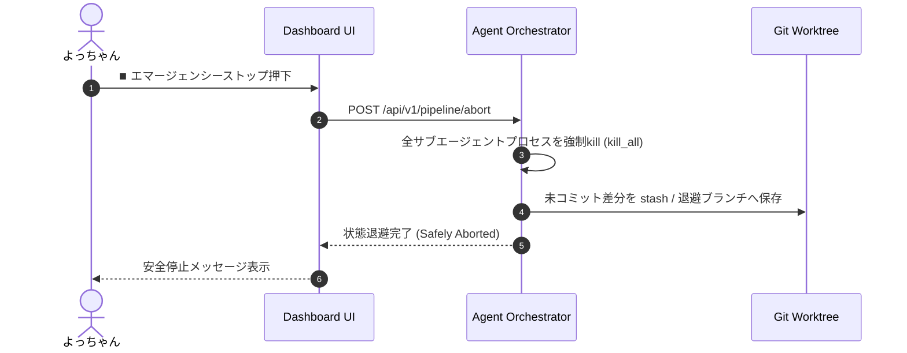

---
tags:
  - error-handling
  - exception-design
  - fault-tolerance
  - agent-system
  - obsidian
summary: エラーマトリクス、PreToolUse フックエラー等のリカバリ戦略、および安全退避メカニズムの設計書。
updated: 2026-09-11
---

# ⚠️ No.11 エラーハンドリング・例外処理設計書

## 1. 概要

本ドキュメントは、システム実行中に発生し得る各種例外（ツール実行エラー、プラグインフック障害、Gitコンフリクト、APIタイムアウト、トークン上限等）の分類と、それぞれの**フォールバック・リカバリ自動化手順**を定義します。

---

## 2. 例外分類マトリクスとリカバリ戦略

| エラーコード | 例外名称・現象 | 発生原因 | 自動リカバリ / 対処手順 |
| :--- | :--- | :--- | :--- |
| **ERR-101** | `PreToolUseHookError` | `hooks.json` パス記述ミスやNode.jsモジュール欠如 | フックを一時的バイパスとし、システムログに警告を記録して本処理のツール実行を継続。 |
| **ERR-102** | `SurgicalViolationError` | AIが範囲外の行を勝手に改変 | 変更をロールバックし、`target_lines` のみの修正を強制する厳格プロンプトで1回再試行。 |
| **ERR-103** | `TestFailureMaxRetry` | TDD修正が3回連続で失敗 | 自動ループを即座に停止し、エラーログと修正提案を添えて **よっちゃんへエスカレーション**。 |
| **ERR-104** | `GitWorktreeConflict` | Worktree作成時のブランチ重複 | ブランチ名にタイムスタンプ（`feature/ui_20260911_1530`）を自動付与して再作成。 |
| **ERR-105** | `TokenLimitExceeded` | トークン数超過 | 会話履歴（Transcript）を要約し、不要なコンテキストを削ぎ落としてセッションをリフレッシュ。 |

---

## 3. 緊急停止 (Emergency Stop) と退避メカニズム

---

## 4. ログ出力・追跡可能性 (Observability)

- 全エラー発生時は `C:\Users\PC_User\.gemini\antigravity-cli\brain\<session-id>\.system_generated\logs\transcript.jsonl` へ構造化JSONとしてログ保存。
- 重大例外発生時は、Obsidian側ノートへ `> [!CAUTION]` 警告ブロックを自動挿入。
