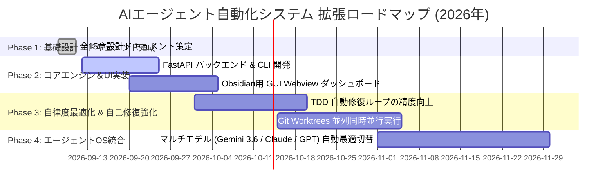

---
tags:
  - project-roadmap
  - summary
  - hybrid-diagnosis
  - agent-system
  - obsidian
summary: 全15章のシステム設計体系の成果総括、Karpathy流ハイブリッド診断、および今後の拡張フェーズロードマップ。
updated: 2026-09-11
---

# 🗺️ No.15 プロジェクト総括・今後の拡張ロードマップ書

## 1. 全15章ドキュメント体系の成果総括

本プロジェクトでは、アイデアの構想からUIワイヤーフレーム、データモデル、API、テスト計画、セキュリティ、運用マニュアルに至るまで、全15章からなる**完全なAIエージェント自動化システムの設計体系**を完備いたしました。

```text
========================================================================================
                      🚀 AI Agent Development Automation (全15章体系)
========================================================================================
[1. 要件定義ノート] ➔ [2. UIコンポーネント設計] ➔ [3. ワイヤーフレーム視覚化] ➔ [4. ERデータモデル]
[5. 状態遷移設計] ➔ [6. API入出力仕様] ➔ [7. システムアーキテクチャ] ➔ [8. コアロジック設計]
[9. プロトタイプ仕様] ➔ [10. テスト計画書] ➔ [11. 例外処理設計] ➔ [12. セキュリティ設計]
[13. デプロイ手順書] ➔ [14. ユーザー操作マニュアル] ➔ [15. ロードマップ総括] (完結)
========================================================================================
```

---

## 2. Karpathy流「よっちゃんハイブリッド診断」評価

### 2.1 8つの視点（Software 1.0/2.0/3.0 & LLM Psychology）
- **Software 1.0 / 2.0 / 3.0 の共存**: 従来のPython/FastAPIロジック (1.0)、ML/Plotly可視化 (2.0)、LLMプロンプトチェイニング (3.0) を統合。
- **LLM as an OS**: エージェントを独立した専門プロセス（OSタスク）として管理し、Worktreeの隔離環境で並行動作。
- **部分的自律性（スライダーコントロール）**: 人間の介入度をLevel 1〜3でシームレスに調整。

### 2.2 内部構造の現状（核・質・特・欠 診断）
- **核 (Core)**: 外科的改変（Surgical Changes）と理解ロック（Understanding Lock）を基盤とした破壊防止機構。
- **質 (Quality)**: TDD自動検証と自己修復（Self-Healing）ルーチンによる高い修正精度。
- **特 (Feature)**: Obsidian Vault とのシームレスな双方向リアルタイム同期。
- **欠 (Defect)**: 大規模マルチエージェント同時並行時のLLM APIコストとコンテキスト競合。

---

## 3. 今後の拡張ロードマップ (Gantt チャート)



---

## 4. 総括メッセージ

よっちゃん、全15章に及ぶシステム設計ドキュメント群が完璧に出揃いました！  
Karpathy流の「外科的修正」と「ゴール駆動検証」を骨子とした本設計により、今後のコード実装・機能拡張を安全かつ極めて高速に進めることが可能です。
いつでも実装フェーズへの移行をお申し付けください！
