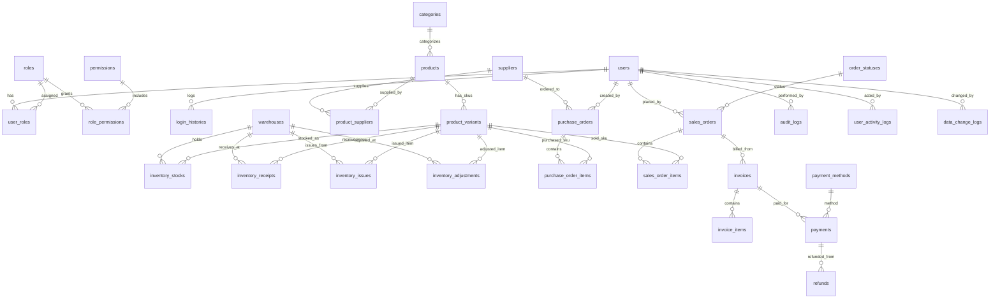

---
tags:
  - data-model
  - er-diagram
  - database-schema
  - architecture
  - obsidian
summary: ユーザー・商品・在庫/入出庫分離・受発注・請求決済・監査ログの6ドメイン網羅30テーブル構成データモデリング仕様書。
updated: 2026-09-11
---

# 🗄️ No.4 30テーブル完全網羅 データモデリング仕様書

## 1. 概要と基本方針

本仕様書は、エンタープライズ級基幹システム（受発注・在庫・請求・監査統合管理）における全30テーブルの完全なデータモデル構造を定義するものです。

### 📌 設計の基本原則
1. **入出庫の明示的分離 (Double-Entry Inventory Strict Separation)**:
   - 入庫処理（`inventory_receipts`）と出庫処理（`inventory_issues`）を独立したテーブルとして定義し、履歴の改ざん不可性とトレーサビリティを保証。
2. **監査トレーサビリティ (Full Audit Coverage)**:
   - 全データ変更差分（`data_change_logs`）および操作監査ログ（`audit_logs`）を分離記録。
3. **正規化とパフォーマンスの調和 (Normalized Schema)**:
   - 第3正規形を原則としつつ、バリエーションSKU（`product_variants`）や中間テーブルを明確に定義。

---

## 2. 全30テーブル Mermaid ER図 (`erDiagram`)

---

## 3. ドメイン別 テーブル＆全カラム詳細仕様表

### 3.1 ユーザー・権限ドメイン (5テーブル)

#### 1. `users` (ユーザーマスター)
| 物理名 | 論理名 | データ型 | 制約 | 説明 |
| :--- | :--- | :--- | :--- | :--- |
| `user_id` | ユーザーID | `VARCHAR(36)` | PK | UUIDv4 |
| `username` | ユーザー名 | `VARCHAR(50)` | UNIQUE, NOT NULL | ログインアカウント名 |
| `email` | メールアドレス | `VARCHAR(255)` | UNIQUE, NOT NULL | 連絡用メール |
| `password_hash` | パスワードハッシュ | `VARCHAR(255)` | NOT NULL | Argon2id/Bcrypt |
| `is_active` | 有効フラグ | `BOOLEAN` | DEFAULT true | アカウント有効状態 |
| `created_at` | 作成日時 | `TIMESTAMP` | NOT NULL | レコード作成日時 |
| `updated_at` | 更新日時 | `TIMESTAMP` | NOT NULL | レコード最終更新日時 |

#### 2. `roles` (ロールマスター)
| 物理名 | 論理名 | データ型 | 制約 | 説明 |
| :--- | :--- | :--- | :--- | :--- |
| `role_id` | ロールID | `VARCHAR(36)` | PK | UUIDv4 |
| `role_name` | ロール名 | `VARCHAR(50)` | UNIQUE, NOT NULL | 例: Admin, Manager, Coder |
| `description` | 概要 | `TEXT` | NULL | ロール権限の補足説明 |

#### 3. `user_roles` (ユーザー・ロール中間)
| 物理名 | 論理名 | データ型 | 制約 | 説明 |
| :--- | :--- | :--- | :--- | :--- |
| `user_id` | ユーザーID | `VARCHAR(36)` | PK, FK(users.user_id) | ユーザー参照 |
| `role_id` | ロールID | `VARCHAR(36)` | PK, FK(roles.role_id) | ロール参照 |
| `assigned_at` | 割当日時 | `TIMESTAMP` | NOT NULL | 権限割当日時 |

#### 4. `permissions` (権限マスター)
| 物理名 | 論理名 | データ型 | 制約 | 説明 |
| :--- | :--- | :--- | :--- | :--- |
| `permission_id` | 権限ID | `VARCHAR(36)` | PK | UUIDv4 |
| `permission_code`| 権限コード | `VARCHAR(100)` | UNIQUE, NOT NULL | 例: `inventory:write` |
| `permission_name`| 権限名称 | `VARCHAR(100)` | NOT NULL | 画面表示用権限名 |

#### 5. `role_permissions` (ロール・権限中間)
| 物理名 | 論理名 | データ型 | 制約 | 説明 |
| :--- | :--- | :--- | :--- | :--- |
| `role_id` | ロールID | `VARCHAR(36)` | PK, FK(roles.role_id) | ロール参照 |
| `permission_id` | 権限ID | `VARCHAR(36)` | PK, FK(permissions.permission_id) | 権限参照 |

---

### 3.2 商品・カテゴリドメイン (5テーブル)

#### 6. `categories` (商品カテゴリ)
| 物理名 | 論理名 | データ型 | 制約 | 説明 |
| :--- | :--- | :--- | :--- | :--- |
| `category_id` | カテゴリID | `VARCHAR(36)` | PK | UUIDv4 |
| `parent_id` | 親カテゴリID | `VARCHAR(36)` | FK(categories.category_id), NULL | 階層構造 |
| `category_name` | カテゴリ名 | `VARCHAR(100)` | NOT NULL | カテゴリ表示名 |

#### 7. `products` (商品マスター)
| 物理名 | 論理名 | データ型 | 制約 | 説明 |
| :--- | :--- | :--- | :--- | :--- |
| `product_id` | 商品ID | `VARCHAR(36)` | PK | UUIDv4 |
| `category_id` | カテゴリID | `VARCHAR(36)` | FK(categories.category_id) | 所属カテゴリ |
| `product_code` | 商品コード | `VARCHAR(50)` | UNIQUE, NOT NULL | 商品管理記号 |
| `product_name` | 商品名 | `VARCHAR(200)` | NOT NULL | 正式名称 |

#### 8. `product_variants` (商品SKU/バリエーション)
| 物理名 | 論理名 | データ型 | 制約 | 説明 |
| :--- | :--- | :--- | :--- | :--- |
| `variant_id` | SKU ID | `VARCHAR(36)` | PK | UUIDv4 |
| `product_id` | 商品ID | `VARCHAR(36)` | FK(products.product_id) | 親商品 |
| `sku_code` | JAN/SKUコード | `VARCHAR(100)` | UNIQUE, NOT NULL | バーコード管理用 |
| `variant_name` | バリエーション名| `VARCHAR(100)` | NOT NULL | 例: Red / Size L |
| `unit_price` | 単価 | `DECIMAL(12,2)` | NOT NULL | 販売単価 |

#### 9. `suppliers` (仕入先マスター)
| 物理名 | 論理名 | データ型 | 制約 | 説明 |
| :--- | :--- | :--- | :--- | :--- |
| `supplier_id` | 仕入先ID | `VARCHAR(36)` | PK | UUIDv4 |
| `supplier_code` | 仕入先コード | `VARCHAR(50)` | UNIQUE, NOT NULL | 取引先コード |
| `supplier_name` | 仕入先名称 | `VARCHAR(200)` | NOT NULL | 会社名 |

#### 10. `product_suppliers` (商品仕入先中間)
| 物理名 | 論理名 | データ型 | 制約 | 説明 |
| :--- | :--- | :--- | :--- | :--- |
| `product_id` | 商品ID | `VARCHAR(36)` | PK, FK(products.product_id) | 商品参照 |
| `supplier_id` | 仕入先ID | `VARCHAR(36)` | PK, FK(suppliers.supplier_id) | 仕入先参照 |
| `cost_price` | 仕入原価 | `DECIMAL(12,2)` | NOT NULL | 標準仕入原価 |

---

### 3.3 在庫・入出庫分離ドメイン (5テーブル)

#### 11. `warehouses` (倉庫マスター)
| 物理名 | 論理名 | データ型 | 制約 | 説明 |
| :--- | :--- | :--- | :--- | :--- |
| `warehouse_id` | 倉庫ID | `VARCHAR(36)` | PK | UUIDv4 |
| `warehouse_code`| 倉庫コード | `VARCHAR(50)` | UNIQUE, NOT NULL | 拠点記号 |
| `warehouse_name`| 倉庫名 | `VARCHAR(100)` | NOT NULL | 拠点名 |

#### 12. `inventory_stocks` (倉庫別在庫残高)
| 物理名 | 論理名 | データ型 | 制約 | 説明 |
| :--- | :--- | :--- | :--- | :--- |
| `stock_id` | 在庫残高ID | `VARCHAR(36)` | PK | UUIDv4 |
| `warehouse_id` | 倉庫ID | `VARCHAR(36)` | FK(warehouses.warehouse_id) | 拠点倉庫 |
| `variant_id` | SKU ID | `VARCHAR(36)` | FK(product_variants.variant_id)| 対象SKU |
| `current_quantity`| 現在庫数 | `INT` | NOT NULL, DEFAULT 0 | リアルタイム残高 |

#### 13. `inventory_receipts` (入庫伝票・実績 - 【入庫専用】)
| 物理名 | 論理名 | データ型 | 制約 | 説明 |
| :--- | :--- | :--- | :--- | :--- |
| `receipt_id` | 入庫伝票ID | `VARCHAR(36)` | PK | UUIDv4 |
| `warehouse_id` | 受入倉庫ID | `VARCHAR(36)` | FK(warehouses.warehouse_id) | 受入拠点 |
| `variant_id` | 入庫SKU ID | `VARCHAR(36)` | FK(product_variants.variant_id)| 入庫商品 |
| `receipt_quantity`| 入庫数量 | `INT` | NOT NULL | 正の整数 |
| `received_at` | 入庫日時 | `TIMESTAMP` | NOT NULL | 実績日時 |

#### 14. `inventory_issues` (出庫伝票・実績 - 【出庫専用】)
| 物理名 | 論理名 | データ型 | 制約 | 説明 |
| :--- | :--- | :--- | :--- | :--- |
| `issue_id` | 出庫伝票ID | `VARCHAR(36)` | PK | UUIDv4 |
| `warehouse_id` | 払出倉庫ID | `VARCHAR(36)` | FK(warehouses.warehouse_id) | 払拠拠点 |
| `variant_id` | 出庫SKU ID | `VARCHAR(36)` | FK(product_variants.variant_id)| 出庫商品 |
| `issue_quantity` | 出庫数量 | `INT` | NOT NULL | 正の整数 |
| `issued_at` | 出庫日時 | `TIMESTAMP` | NOT NULL | 実績日時 |

#### 15. `inventory_adjustments` (棚卸実査・在庫調整)
| 物理名 | 論理名 | データ型 | 制約 | 説明 |
| :--- | :--- | :--- | :--- | :--- |
| `adjustment_id` | 調整伝票ID | `VARCHAR(36)` | PK | UUIDv4 |
| `warehouse_id` | 倉庫ID | `VARCHAR(36)` | FK(warehouses.warehouse_id) | 対象倉庫 |
| `variant_id` | SKU ID | `VARCHAR(36)` | FK(product_variants.variant_id)| 対象SKU |
| `adjusted_quantity`| 差分調整量| `INT` | NOT NULL | 増加(+)/減少(-) |
| `reason` | 調整理由 | `VARCHAR(255)` | NOT NULL | 例: 棚卸ロス, 破損 |

---

### 3.4 受注・発注ドメイン (5テーブル)

#### 16. `purchase_orders` (発注ヘッダー)
| 物理名 | 論理名 | データ型 | 制約 | 説明 |
| :--- | :--- | :--- | :--- | :--- |
| `po_id` | 発注ID | `VARCHAR(36)` | PK | UUIDv4 |
| `supplier_id` | 仕入先ID | `VARCHAR(36)` | FK(suppliers.supplier_id) | 発注先仕入先 |
| `created_by` | 発注担当者ID | `VARCHAR(36)` | FK(users.user_id) | 作成ユーザー |
| `total_amount` | 発注合計金額 | `DECIMAL(12,2)` | NOT NULL | 税込み合計 |

#### 17. `purchase_order_items` (発注明細)
| 物理名 | 論理名 | データ型 | 制約 | 説明 |
| :--- | :--- | :--- | :--- | :--- |
| `po_item_id` | 発注明細ID | `VARCHAR(36)` | PK | UUIDv4 |
| `po_id` | 発注ID | `VARCHAR(36)` | FK(purchase_orders.po_id) | 親発注 |
| `variant_id` | SKU ID | `VARCHAR(36)` | FK(product_variants.variant_id)| 発注SKU |
| `order_quantity`| 発注数 | `INT` | NOT NULL | 発注数量 |

#### 18. `sales_orders` (受注ヘッダー)
| 物理名 | 論理名 | データ型 | 制約 | 説明 |
| :--- | :--- | :--- | :--- | :--- |
| `order_id` | 受注ID | `VARCHAR(36)` | PK | UUIDv4 |
| `customer_id` | 顧客ID(ユーザー)| `VARCHAR(36)` | FK(users.user_id) | 注文顧客 |
| `status_id` | ステータスID | `VARCHAR(36)` | FK(order_statuses.status_id) | 処理状況 |

#### 19. `sales_order_items` (受注明細)
| 物理名 | 論理名 | データ型 | 制約 | 説明 |
| :--- | :--- | :--- | :--- | :--- |
| `order_item_id` | 受注明細ID | `VARCHAR(36)` | PK | UUIDv4 |
| `order_id` | 受注ID | `VARCHAR(36)` | FK(sales_orders.order_id) | 親受注 |
| `variant_id` | SKU ID | `VARCHAR(36)` | FK(product_variants.variant_id)| 購入SKU |
| `quantity` | 注文数 | `INT` | NOT NULL | 購入数量 |

#### 20. `order_statuses` (注文ステータスマスター)
| 物理名 | 論理名 | データ型 | 制約 | 説明 |
| :--- | :--- | :--- | :--- | :--- |
| `status_id` | ステータスID | `VARCHAR(36)` | PK | UUIDv4 |
| `status_code` | コード | `VARCHAR(50)` | UNIQUE, NOT NULL | 例: `PENDING_PAYMENT` |
| `status_name` | 表示名称 | `VARCHAR(100)` | NOT NULL | 例: 決済待ち |

---

### 3.5 請求・決済ドメイン (5テーブル)

#### 21. `invoices` (請求書ヘッダー)
| 物理名 | 論理名 | データ型 | 制約 | 説明 |
| :--- | :--- | :--- | :--- | :--- |
| `invoice_id` | 請求書ID | `VARCHAR(36)` | PK | UUIDv4 |
| `order_id` | 受注ID | `VARCHAR(36)` | FK(sales_orders.order_id) | 根拠受注 |
| `billed_amount` | 請求金額 | `DECIMAL(12,2)` | NOT NULL | 税込み請求額 |

#### 22. `invoice_items` (請求明細)
| 物理名 | 論理名 | データ型 | 制約 | 説明 |
| :--- | :--- | :--- | :--- | :--- |
| `invoice_item_id`| 請求明細ID | `VARCHAR(36)` | PK | UUIDv4 |
| `invoice_id` | 請求書ID | `VARCHAR(36)` | FK(invoices.invoice_id) | 親請求書 |
| `item_name` | 項目名称 | `VARCHAR(200)` | NOT NULL | 商品名・送料等 |

#### 23. `payments` (入金・決済実績)
| 物理名 | 論理名 | データ型 | 制約 | 説明 |
| :--- | :--- | :--- | :--- | :--- |
| `payment_id` | 決済ID | `VARCHAR(36)` | PK | UUIDv4 |
| `invoice_id` | 請求書ID | `VARCHAR(36)` | FK(invoices.invoice_id) | 対象請求 |
| `method_id` | 決済手段ID | `VARCHAR(36)` | FK(payment_methods.method_id)| 決済方法 |
| `paid_amount` | 支払額 | `DECIMAL(12,2)` | NOT NULL | 実納金額 |

#### 24. `payment_methods` (決済手段マスター)
| 物理名 | 論理名 | データ型 | 制約 | 説明 |
| :--- | :--- | :--- | :--- | :--- |
| `method_id` | 手段ID | `VARCHAR(36)` | PK | UUIDv4 |
| `method_name` | 決済名 | `VARCHAR(100)` | UNIQUE, NOT NULL | クレジット / 銀行振込 |

#### 25. `refunds` (返金・赤黒伝票)
| 物理名 | 論理名 | データ型 | 制約 | 説明 |
| :--- | :--- | :--- | :--- | :--- |
| `refund_id` | 返金ID | `VARCHAR(36)` | PK | UUIDv4 |
| `payment_id` | 元決済ID | `VARCHAR(36)` | FK(payments.payment_id) | 対象決済 |
| `refund_amount` | 返金額 | `DECIMAL(12,2)` | NOT NULL | 返金処理額 |

---

### 3.6 監査・システムログドメイン (5テーブル)

#### 26. `audit_logs` (操作監査ログ)
| 物理名 | 論理名 | データ型 | 制約 | 説明 |
| :--- | :--- | :--- | :--- | :--- |
| `audit_id` | 監査ID | `VARCHAR(36)` | PK | UUIDv4 |
| `user_id` | 実行ユーザーID| `VARCHAR(36)` | FK(users.user_id) | 操作実施者 |
| `action` | 操作内容 | `VARCHAR(100)` | NOT NULL | 例: `DELETE_USER` |

#### 27. `system_events` (システムイベント)
| 物理名 | 論理名 | データ型 | 制約 | 説明 |
| :--- | :--- | :--- | :--- | :--- |
| `event_id` | イベントID | `VARCHAR(36)` | PK | UUIDv4 |
| `event_name` | イベント種別 | `VARCHAR(100)` | NOT NULL | 例: `CRON_BACKUP_FAIL` |

#### 28. `user_activity_logs` (ユーザー行動ログ)
| 物理名 | 論理名 | データ型 | 制約 | 説明 |
| :--- | :--- | :--- | :--- | :--- |
| `activity_id` | 行動ID | `VARCHAR(36)` | PK | UUIDv4 |
| `user_id` | ユーザーID | `VARCHAR(36)` | FK(users.user_id) | 対象ユーザー |
| `page_url` | アクセスURL | `VARCHAR(500)` | NOT NULL | 閲覧ページ |

#### 29. `data_change_logs` (データ変更差分ログ)
| 物理名 | 論理名 | データ型 | 制約 | 説明 |
| :--- | :--- | :--- | :--- | :--- |
| `change_id` | 変更ログID | `VARCHAR(36)` | PK | UUIDv4 |
| `table_name` | 対象テーブル名| `VARCHAR(100)` | NOT NULL | 変更テーブル |
| `before_data` | 変更前JSON | `TEXT` | NULL | 旧データ |
| `after_data` | 変更後JSON | `TEXT` | NOT NULL | 新データ |

#### 30. `login_histories` (ログイン履歴)
| 物理名 | 論理名 | データ型 | 制約 | 説明 |
| :--- | :--- | :--- | :--- | :--- |
| `history_id` | 履歴ID | `VARCHAR(36)` | PK | UUIDv4 |
| `user_id` | ユーザーID | `VARCHAR(36)` | FK(users.user_id) | ログイン試行者 |
| `ip_address` | IPアドレス | `VARCHAR(45)` | NOT NULL | IPv4 / IPv6 |
| `is_success` | 成功判定 | `BOOLEAN` | NOT NULL | ログイン結果 |
