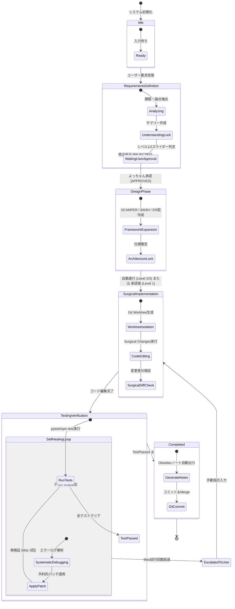

---
tags:
  - state-transition
  - event-flow
  - architecture
  - agent-system
  - obsidian
summary: AIエージェントおよび開発パイプラインの状態遷移・イベント制御フローを定義した設計書。
updated: 2026-09-11
---

# 🔄 No.5 状態遷移・イベントフロー設計書

## 1. 概要

本ドキュメントは、システム全体のパイプライン状態遷移、AIサブエージェントのライフサイクル状態、および自己修復（TDDエラーフィードバック）のイベントフローを定義します。

---

## 2. Mermaid パイプライン状態遷移図

---

## 3. 自律度レベル（Level 1〜3）ごとのイベント制御分岐

| 自律度レベル | 承認ゲート発生ポイント | イベント制御挙動 |
| :--- | :--- | :--- |
| **Level 1 (手動承認モード)** | - 全ツール呼び出し時 - 全フェーズ切替時 | エージェントはツール呼び出し前・後で完全に一時停止し、よっちゃんの個別のWeb/CLI承認イベントを待つ。 |
| **Level 2 (半自律モード - デフォルト)** | - `UnderstandingLock` 完了時 - `TestingVerification` 完了時 | フェーズ内の単一ツール実行は自動連続処理し、主要成果物の完成時のみ承認ダイアログをトリガー。 |
| **Level 3 (完全自律モード)** | - `EscalatedToUser` (自己修復失敗時) のみ | 全フェーズを自動走破。自己修復が3回失敗した場合のみ、非常停止しよっちゃんへ通知。 |

---

## 4. 例外・自己修復フロー仕様

1. **Self-Healing Trigger**: テストコマンドの Exit Code ≠ 0 を検知。
2. **Log Extraction**: エラーのスタックトレースを自動抽出し、`systematic-debugging` コンテキストをロード。
3. **Patch Execution**: 該当の最小ブロックのみを `replace_file_content` で修復。
