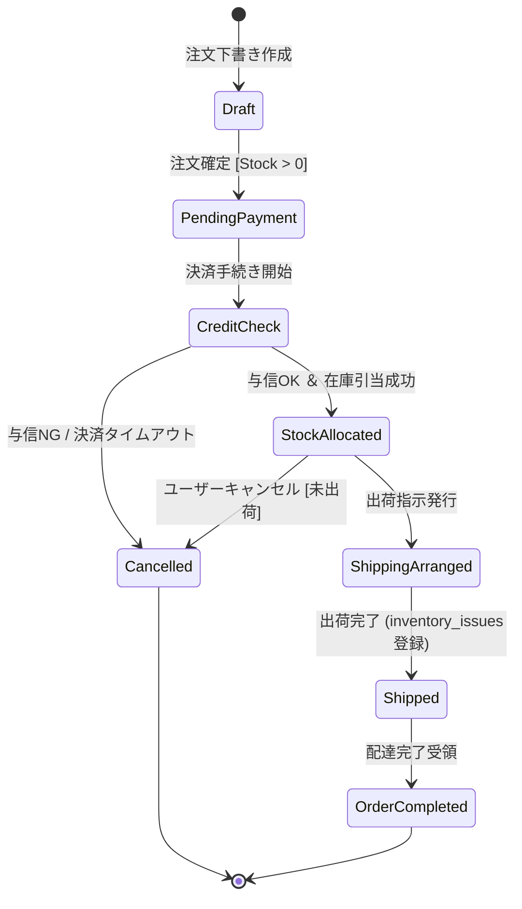
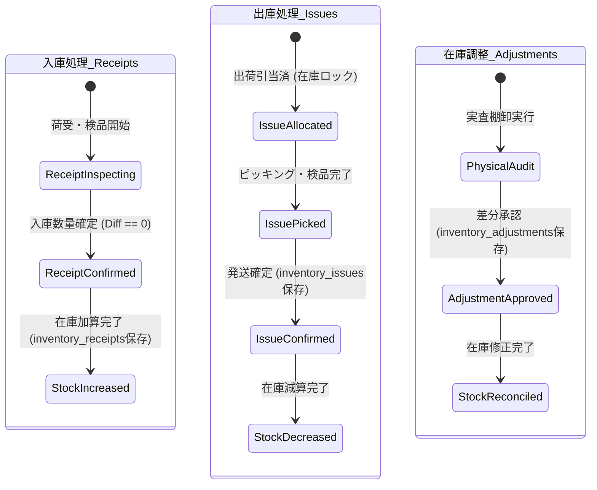
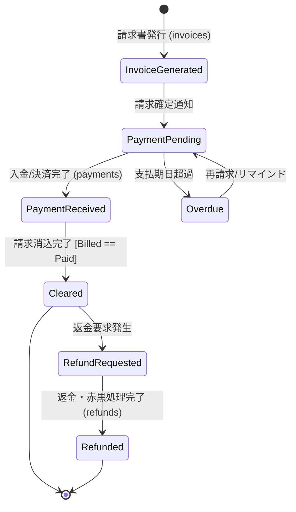
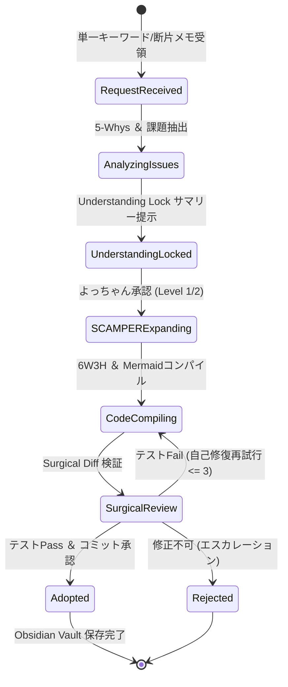

---
tags:
  - state-transition
  - event-flow
  - database-schema
  - architecture
  - obsidian
summary: 最新30テーブル構成データモデルに対応した主要4系統（受注・入出庫・請求決済・AI発想）の状態遷移およびイベントフロー設計書(v2)。
updated: 2026-09-11
---

# 🔄 No.5 状態遷移・イベントフロー設計書 (v2: 30テーブル完全統合版)

## 1. 概要と基本理念

本設計書は、最新の30テーブル構成データモデル（`20260911_No4_データモデル.md`）に基づき、システム内で発生する主要4系統のステータス遷移およびイベントトリガー、Guard条件（前提条件）、およびデータベース更新アクションを定義するものです。

---

## 2. システム別 状態遷移図 & トリガー・Guard条件仕様

### 2.1 受注ライフサイクル (Sales Order Lifecycle)

受注の発生から出荷完了、またはキャンセルに至る状態遷移を制御します。

#### 🗺️ Mermaid 状態遷移図

#### 📋 イベント＆Guard条件・更新テーブル定義
| 遷移元 ➔ 遷移先 | トリガーイベント | Guard条件 (前提条件) | 更新対象テーブル |
| :--- | :--- | :--- | :--- |
| `Draft` ➔ `PendingPayment` | ユーザーが「注文確定」ボタンを押下 | `sales_order_items.quantity` > 0 | `sales_orders`, `order_statuses` |
| `PendingPayment` ➔ `StockAllocated` | 決済与信成功 ＆ 在庫引当実行 | `inventory_stocks.current_quantity` >= `order_quantity` | `sales_orders`, `inventory_stocks` (引当) |
| `StockAllocated` ➔ `Shipped` | 倉庫作業員が出庫確定ボタンを押下 | 出庫伝票 `inventory_issues` 作成完了 | `sales_orders`, `inventory_issues`, `inventory_stocks` |
| `Any` ➔ `Cancelled` | キャンセル要求発生 | 出荷状態が `Shipped` 未満であること | `sales_orders`, `inventory_stocks` (引当解除) |

---

### 2.2 入出庫・在庫ライフサイクル (Inventory Receipt & Issue Lifecycle)

【入出庫明示的分離仕様】に基づき、入庫（`inventory_receipts`）と出庫（`inventory_issues`）を独立したイベント履歴として管理し、在庫残高（`inventory_stocks`）を二重記帳的に更新します。

#### 🗺️ Mermaid 状態遷移図

#### 📋 イベント＆Guard条件・更新テーブル定義
| 分類 | トリガーイベント | Guard条件 (前提条件) | 更新対象テーブル |
| :--- | :--- | :--- | :--- |
| **入庫確定** | 発注残に対する受入検品完了 | `purchase_orders` の発注残数量 >= 受入数量 | `inventory_receipts` (新規挿入) `inventory_stocks` (`+`加算) |
| **出庫確定** | ピッキング後の出荷検品完了 | `inventory_stocks.current_quantity` >= 出庫数量 | `inventory_issues` (新規挿入) `inventory_stocks` (`-`減算) |
| **在庫調整** | 実査棚卸の差分判定 | 管理者ユーザー権限 `inventory:adjust` | `inventory_adjustments` (新規挿入) `inventory_stocks` (差分反映) |

---

### 2.3 請求・入金ライフサイクル (Billing & Payment Lifecycle)

受注確定から請求書発行、決済承認、消込および返金（赤黒処理）の推移を管理します。

#### 🗺️ Mermaid 状態遷移図

#### 📋 イベント＆Guard条件・更新テーブル定義
| 遷移元 ➔ 遷移先 | トリガーイベント | Guard条件 (前提条件) | 更新対象テーブル |
| :--- | :--- | :--- | :--- |
| `Draft` ➔ `InvoiceGenerated` | 出荷完了または受注確定 | `sales_orders.status` == `StockAllocated` / `Shipped` | `invoices`, `invoice_items` |
| `PaymentPending` ➔ `PaymentReceived` | 決済プロバイダ / 銀行振込通知 | 振込金額 `paid_amount` > 0 | `payments`, `payment_methods` |
| `PaymentReceived` ➔ `Cleared` | 自動消込ロジックの実行 | `invoices.billed_amount` == `SUM(payments.paid_amount)` | `invoices` (ステータス更新) |
| `Cleared` ➔ `Refunded` | 返品・返金要求の承認 | `refund_amount` <= `payments.paid_amount` | `refunds`, `audit_logs` |

---

### 2.4 AI発想・メタデータライフサイクル (AI Brainstorming Lifecycle)

AIエージェントによるアイデア展開・要件定義・Surgical Changes の状態推移と承認制御を管理します。

#### 🗺️ Mermaid 状態遷移図

#### 📋 イベント＆Guard条件・更新テーブル定義
| 遷移元 ➔ 遷移先 | トリガーイベント | Guard条件 (前提条件) | 更新対象テーブル / ログ |
| :--- | :--- | :--- | :--- |
| `RequestReceived` ➔ `UnderstandingLocked` | 分析プロンプトの完了 | 課題の抽出および論点が定義されていること | `user_activity_logs` |
| `UnderstandingLocked` ➔ `SCAMPERExpanding` | よっちゃん承認ボタン押下 | 自律度スライダー (Level 1~3) の判定クリア | `audit_logs` |
| `CodeCompiling` ➔ `SurgicalReview` | スクリプト出力完了 | `validate_surgical_diff()` チェック通過 | `data_change_logs` |
| `SurgicalReview` ➔ `Adopted` | 最終テストPass ＆ コミット | 変更が範囲内であり意図しない破壊がないこと | `Obsidian Vault MD File` |

---

## 3. 共通例外処理とトランザクション整合性

1. **入出庫の不可逆性 (Immutability of Inventory Logs)**:
   - `inventory_receipts` および `inventory_issues` の過去レコードは直接 `UPDATE` / `DELETE` することを禁止し、訂正時は `inventory_adjustments` または対消し伝票を発行する。
2. **ACID トランザクション制御**:
   - `inventory_receipts` 挿入と `inventory_stocks` の加算更新は同一データベーストランザクション内で行い、片方のみの成功を防止する。
