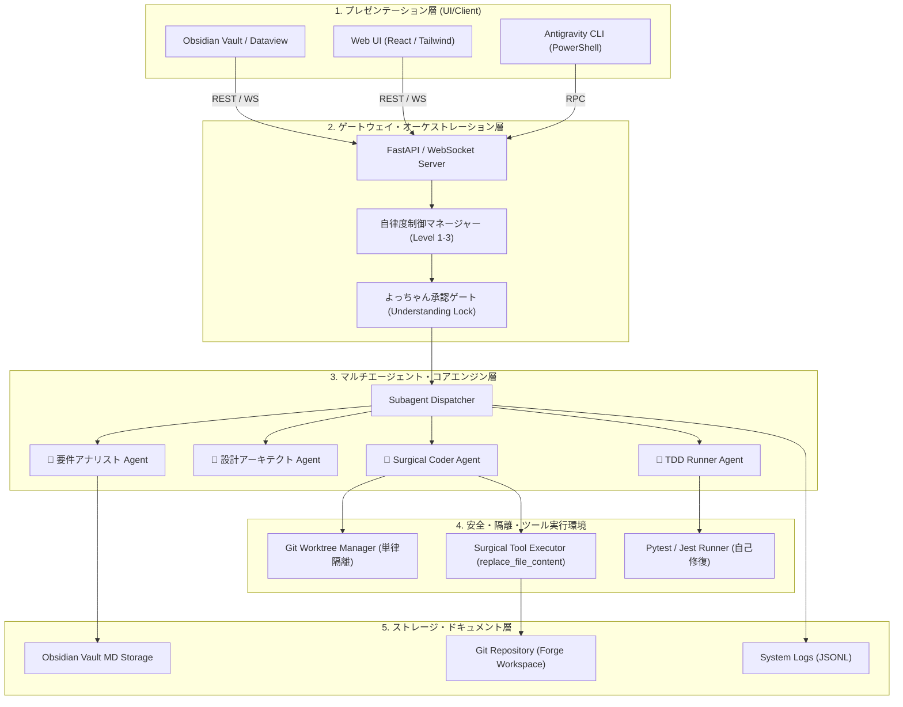

---
tags:
  - system-architecture
  - directory-structure
  - clean-architecture
  - agent-system
  - obsidian
summary: システムレイヤリング構成、ディレクトリツリー、非機能要件、セキュリティ仕様を定義したシステムアーキテクチャ設計書。
updated: 2026-09-11
---

# 🏛️ No.7 ディレクトリ・システムアーキテクチャ設計書

## 1. 概要

本ドキュメントは、AIエージェント開発自動化システムの全体コンポーネント構造、レイヤリング構成、標準ディレクトリツリー、および非機能要件（セキュリティ・隔離環境・トークン管理）を定義します。

---

## 2. Mermaid システムコンポーネント構成図



---

## 3. ディレクトリ構造仕様 (モジュラー・クリーンアーキテクチャ)

```text
forge-agent-automation/
├── .gemini/                       # Antigravity 設定＆カスタムスキル
│   ├── config/                    # プラグイン & フック定義
│   └── brain/                     # 会話ログ & Transcript (JSONL)
├── .agents/                       # プロジェクト共有エージェントスキル
│   └── skills/                    # 固有ワークフロースキル catalog
├── src/                           # コアソースコード
│   ├── domain/                    # ドメインモデル & 状態エンティティ
│   │   ├── entities/              # Project, AgentTask, SurgicalDiff
│   │   └── services/              # 自律度制御, 理解ロックロジック
│   ├── usecases/                  # 開発パイプラインユースケース
│   │   ├── run_brainstorming.py   # SCAMPER/6W3H 構想展開
│   │   └── run_surgical_coding.py # 外科的実装 & 自己修復ループ
│   ├── interfaces/                # 外部連携インターフェース
│   │   ├── api/                   # FastAPI ルート & WebSocket
│   │   └── cli/                   # CLI インタラクティブ・コマンド
│   └── infrastructure/            # インフラ実装
│       ├── git/                   # Worktree 管理・安全判定
│       └── obsidian/              # Markdown 自動生成 & タグ付与
├── tests/                         # TDD テストスイート
│   ├── unit/                      # ユニットテスト
│   └── integration/               # エージェント連携結合テスト
└── docs/                          # ドキュメント & Obsidian同期先
```

---

## 4. 非機能要件・安全機構仕様

1. **Surgical Constraint (外科的変更制限)**:
   - ファイルの全書き換え（Overwrite）は原則禁止とし、必ず `replace_file_content` による局所置換を実施。
2. **Worktree Isolation (Git作業木の分離)**:
   - エージェントの試行コードはメインブランチを直接汚さず、孤立した `Git Worktree` 上で開発・テストを実行。
3. **Emergency Stop (緊急停止ボタン)**:
   - 全サブエージェントプロセスをワンタップで強制終了（`kill_all`）する安全機構を常時UI上に展開。
