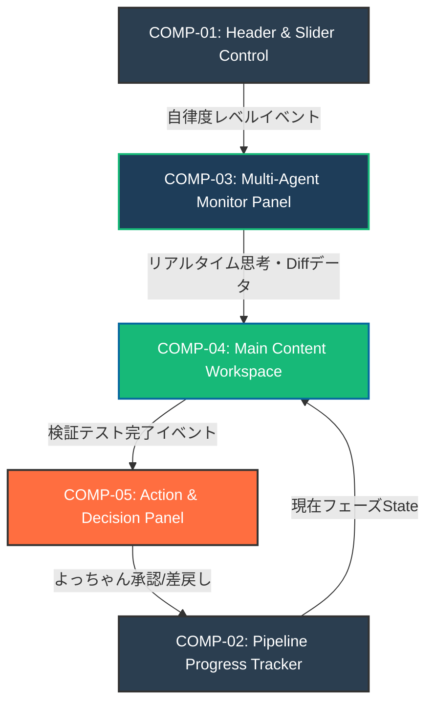
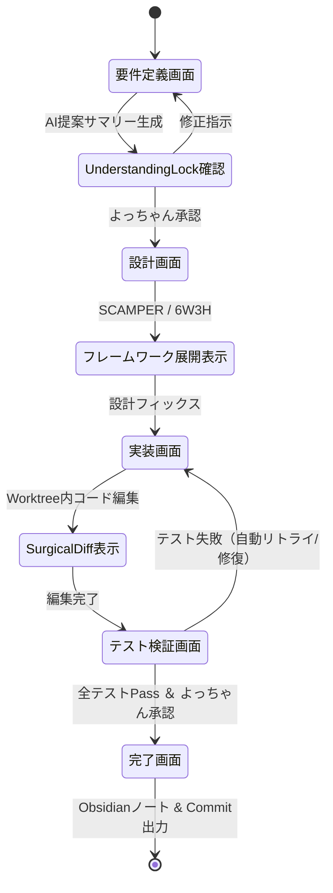

---
tags:
  - ui-design
  - wireframe
  - component-architecture
  - agent-system
  - obsidian
summary: AIエージェント開発自動化システムにおける画面コンポーネント構成・レイアウト（ワイヤーフレーム）およびMermaid構成図の設計書。
updated: 2026-09-11
---

# 🎨 20260911_UIコンポーネント設計書

## 1. 概要とデザインコンセプト

本設計書は、参照ノート（`20260910_メタアイデア要件定義.md` および `20260910_AIエージェント開発自動化の構想.md`）に基づき、要件定義から実装・検証・デプロイまでを可視化・操作するための**UIコンポーネント構成とワイヤーフレームレイアウト**を定義するものです。

### 🎨 コア・デザインコンセプト
- **スライダーコントロールの直観化**: AIの自律度（Man in the loop / Semi-Autonomous / Full-Autonomous）をワンタッチで切り替え。
- **マルチエージェント状態のリアルタイム監視**: どの専門エージェント（仕様・設計・実装・テスト）が今何を実行中か一目で把握。
- **Goal-Driven検証ビジュアル**: テスト成功率・Surgical Diff（外科的変更差分）をグラフィカルに提示。

---

## 2. 画面レイアウト構成要素一覧

ダッシュボード画面は以下の5つの主要コンポーネントエリアで構成されます。

| コンポーネントID | コンポーネント名 | 主な機能と要素 |
| :--- | :--- | :--- |
| **COMP-01** | **Top Header & Control Bar** | - プロジェクト切替ドロップダウン<br>- **AI自律度調整スライダー** (Level 1: 承認必須 〜 Level 3: フル自律)<br>- エマージェンシーストップ（緊急停止）ボタン |
| **COMP-02** | **Pipeline Progress Tracker** | - 開発フェーズ（要件定義 ➔ 設計 ➔ 外科的実装 ➔ TDD検証 ➔ デプロイ）のステッパー表示<br>- 現在進行中フェーズのハイライトと所要時間計測 |
| **COMP-03** | **Multi-Agent Monitor Panel** | - 稼働中サブエージェントカード（要件アナリスト, 設計アーキテクト, 実装職人, 検証員）<br>- エージェントごとの思考状態（Thinking / Tool Calling / Waiting）およびライブログ表示 |
| **COMP-04** | **Main Content Workspace Area** | - **Tab 1: 要件・理解サマリー (Understanding Lock)**<br>- **Tab 2: 外科的コードDiffビューア (Surgical Diff)**<br>- **Tab 3: TDD・テスト実行インタラクティブ結果**<br>- **Tab 4: 成果物プレビュー (Mermaid図 / Markdown)** |
| **COMP-05** | **Action & Decision Panel** | - よっちゃん承認ダイアログ（「承認して次フェーズへ」「修正指示を入力」）<br>- ワンクリックGitHubコミット / Obsidianノート出力ボタン |

---

## 3. 画面構造レイアウト（アスキーワイヤーフレーム）

```text
+-----------------------------------------------------------------------------------+
| [COMP-01] 🚀 AI Agent Dev Studio | Project: Forge-App  | Autonomy Slider: [==o==] |
+-----------------------------------------------------------------------------------+
| [COMP-02] [1.要件定義 ✅] -> [2.設計 ✅] -> [3.実装 🔄] -> [4.検証 ⏳] -> [5.完了 ⏳]   |
+------------------------------------+----------------------------------------------+
| [COMP-03] エージェント監視パネル   | [COMP-04] メインワークスペース               |
| +--------------------------------+ | +------------------------------------------+ |
| | 🤖 実装エージェント (Running)  | | | [Tab: Surgical Diff] [Tab: Test Log]   | |
| |  - Tool: replace_file_content  | | |                                        | |
| |  - Worktree: feature/ui-design | | |  - src/components/Dashboard.tsx        | |
| +--------------------------------+ | |  +  <Slider value={autonomyLevel} />   | |
| | 🧪 テストエージェント (Idle)   | | |  -  <Slider value={legacyLevel} />     | |
| |  - Waiting for build           | | |                                        | |
| +--------------------------------+ | +------------------------------------------+ |
|                                    | [COMP-05] アクション & 意思決定            |
|                                    | [  承認して検証フェーズに進む  ]  [ 修正指示 ] |
+------------------------------------+----------------------------------------------+
```

---

## 4. Mermaid による画面遷移・コンポーネント構造図

### 🗺️ コンポーネント依存関係＆データフロー図



---

### 🔄 画面遷移・処理フロー図



---

## 5. 今後の実装アプローチ

1. **Obsidian Webview / HTML カード化**:
   - 本ワイヤーフレームを基に、Obsidian用インタラクティブダッシュボード（HTML + Mermaid）として埋め込み可能なノートを作成。
2. **Antigravity ステート連携**:
   - エージェントのステータスログ（Transcript）を可視化するデータバインディングの構築。
