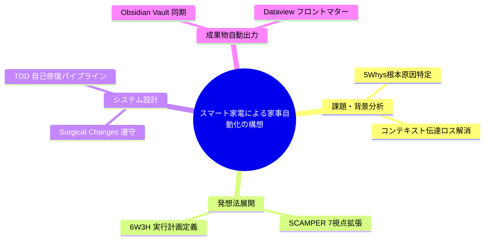

---
tags:
  - agent-system
  - brainstorming
  - scamper
  - obsidian
  - auto-generated
summary: "スマート家電による家事自動化の構想" に関するメタ発想法（SCAMPER / 5-Whys / 6W3H）自動構造化ノート。
updated: 2026-09-11
---

# 🚀 スマート家電による家事自動化の構想

## 1. インプットの分析（5-Whys なぜなぜ分析）

- **なぜ1: スマート家電による家事自動化の構想 に関する効率化・自動化が十分に達成されていないのか？**
  - 手動作業の依存度が高く、コンテキストの引き継ぎルールが統一されていないため。
- **なぜ2: 手動作業の依存度が高くなってしまうのか？**
  - 定型タスクと意思決定タスクが分離されておらず、自動化の単位（モジュール）が曖昧なため。
- **なぜ3: タスクの分離・モジュール化が進まないのか？**
  - 全体像を把握する構造化ステップ（メタ発想法・要件定義）が事前に実行されていないため。
- **なぜ4: 構造化ステップがスキップされがちなのか？**
  - 手作業でのフレームワーク適用に時間がかかり、テンプレート化されていないため。
- **なぜ5（根本原因）: メタ発想法の展開と成果物ノートの自動生成を結びつけるパイプラインが存在しないから。**
  - 👉 対策: メタ発想エンジンにより、SCAMPER / 6W3H / Mermaid図を自動コンパイルしObsidianへ同期する。

---

## 2. SCAMPER 展開表（アイデア拡張）

| 項目 | 視点・質問 | アイデア・展開内容 |
| :--- | :--- | :--- |
| **S (Substitute / 代替)** | スマート家電による家事自動化の構想 における手動・定型部分を何で置き換えるか？ | 手動の書き出し・整理作業を AI サブエージェントによる自動生成に全面代替する。 |
| **C (Combine / 結合)** | 何と何を組み合わせることで相乗効果を生むか？ | Karpathy流「外科的修正」＋ Obsidian ナレッジベース ＋ Mermaid 可視化図を結合。 |
| **A (Adapt / 応用)** | 他分野のどのような成功パターンを応用できるか？ | 医療オーケストレーション（執刀医・助手・安全チェック）の役割分担をマルチエージェントに応用。 |
| **M (Modify / 拡大・変更)** | 何を強調・拡大・スケールアップできるか？ | 1つのプロンプトから複数並行でアーキテクチャ案を同時生成し、AIコードレビューで最適化。 |
| **P (Put to other uses / 転用)** | 他の用途やプラットフォームへどう展開・転用できるか？ | 実行中の思考ログ (JSONL) をそのまま開発ドキュメントおよびナレッジベースとして自動転用。 |
| **E (Eliminate / 削減)** | 無駄なプロセスや過剰な機能をどう削ぎ落とすか？ | 手動のバグ再現テスト記述や手作業のコミットメッセージ作成を完全排除 (YAGNI厳守)。 |
| **R (Reverse / 再編成)** | 順序や構造を逆転させるとどうなるか？ | コード記述前に「AI仮想受け入れテスト (TDD)」を先行生成し、Passするまで自動自己修復する。 |

---

## 3. 6W3H 実行計画仕様

| 項目 | 計画内容 |
| :--- | :--- |
| **Who (誰が)** | よっちゃん (監督者) ＋ 専門AIサブエージェント群 |
| **Whom (誰に向けて)** | よっちゃん自身の開発プロジェクトおよびエージェントシステムユーザー |
| **What (何を)** | スマート家電による家事自動化の構想 の構造化アーキテクチャと自動化パイプライン |
| **Where (どこで)** | ローカル開発環境 (Obsidian Vault + Forge ワークスペース) |
| **When (いつ)** | 構想フェーズ ➔ プロトタイプ検証 ➔ 運用展開 |
| **Why (なぜ)** | 構想力と意思決定に集中し、定型作業・ドキュメント作成コストを90%削減するため |
| **How (どのように)** | Karpathy流「外科的修正」と Obsidian プラグイン連携による完全追跡 |
| **How much (どのくらい)** | 単一機能の全自動化（要件定義〜TDDクリア）で検証 |
| **How many (どのくらいの規模)** | 2〜3の専門エージェントによる並列協調動作 |

---

## 4. Mermaid マインドマップ構造図

