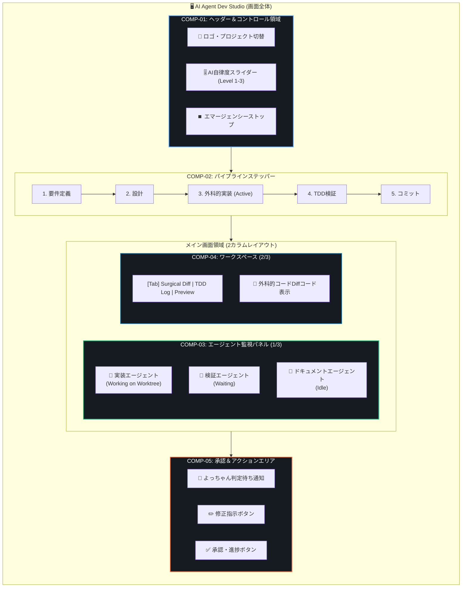

---
tags:
  - ui-design
  - wireframe
  - visual-layout
  - agent-system
  - obsidian
summary: UIコンポーネント設計書を元にした、Obsidianプレビュー対応HTML/MarkdownモックアップおよびMermaidレイアウト図。
updated: 2026-09-11
---

# 🖥️ 20260911_ワイヤーフレーム視覚化設計書

## 1. 概要

本ドキュメントは、設計ノート（`20260911_UIコンポーネント設計.md`）で定義された5つのコアコンポーネント（COMP-01〜COMP-05）を、Obsidian上で視覚的にプレビュー・体験できる**インタラクティブHTML/Markdownワイヤーフレーム**および**Mermaidレイアウト配置図**として構造化したものです。

---

## 2. 視覚化ワイヤーフレーム（Obsidian プレビュー用 HTML モックアップ）

> [!TIP]
> 以下のコンポーネントブロックは、Obsidianのプレビューモード（読了モード）でリアルタイムにGUIダッシュボードとしてレンダリングされます。

  <!-- COMP-01: Header & Control Bar -->
  

    

      🚀 AI Agent Dev Studio Workspace: Forge-App
    

    

      🤖 AI自律度スライダー:
      

        Level 2: 半自律 (要点承認) 🎚️
      

      <button style="background: #da3633; color: white; border: none; padding: 6px 12px; border-radius: 6px; cursor: pointer; font-size: 0.85em; font-weight: bold;">
        ⏹️ エマージェンシーストップ
      </button>
    

  

  <!-- COMP-02: Pipeline Progress Tracker -->
  

    
✅ 1. 要件定義 (Understanding Lock)

    
✅ 2. 構想設計 (SCAMPER)

    
🔄 3. 外科的コード実装 (Running...)

    
⏳ 4. TDD自動検証

    
⏳ 5. 完了 & コミット

  

  <!-- Main Body Grid: COMP-03 (Left) & COMP-04 (Right) -->
  

    <!-- COMP-03: Multi-Agent Monitor Panel -->
    

      

        🤖 専門エージェント稼働状況
      

      <!-- Agent Card 1 -->
      

        
👨‍💻 実装エージェント (Karpathy Bot)

        
Status: Active | Worktree: feature/ui

        
> Executing replace_file_content...

      

      <!-- Agent Card 2 -->
      

        
🧪 検証エージェント (TDD Runner)

        
Status: Waiting | Target: pytest

        
> Waiting for implementation code...

      

      <!-- Agent Card 3 -->
      

        
📝 ドキュメントエージェント

        
Status: Idle

      

    

    <!-- COMP-04: Main Content Workspace Area -->
    

      <!-- Tab Header -->
      

        

          🔍 Surgical Diff (変更差分)
        

        

          🧪 TDD テストログ
        

        

          📄 Mermaid構成図
        

      

      <!-- Code Diff Area -->
      

        
--- src/components/AutonomyControl.tsx

        
+++ src/components/AutonomyControl.tsx

        
@@ -12,4 +12,6 @@

        
- const autonomy = 'manual';

        
+ const autonomy = 'semi-autonomous';

        
+ applySurgicalConstraint(autonomy);

      

    

  

  <!-- COMP-05: Action & Decision Panel -->
  

    

      💬 よっちゃんの判定待ち: 変更内容（Surgical Diff）を確認し、次フェーズへ進めてよいですか？
    

    

      <button style="background: #21262d; color: #c9d1d9; border: 1px solid #30363d; padding: 8px 14px; border-radius: 6px; cursor: pointer; font-size: 0.85em;">
        ✏️ 修正指示を入力
      </button>
      <button style="background: #238636; color: white; border: none; padding: 8px 16px; border-radius: 6px; cursor: pointer; font-size: 0.85em; font-weight: bold;">
        ✅ 承認してTDD検証に進む
      </button>
    

  

---

## 3. Mermaid レイアウト配置図

---

## 4. UI状態バリエーション（自律度スライダーレベル別）

1. **Level 1 (Man in the loop / 厳格承認モード)**:
   - すべてのツール呼び出し（ファイル編集・コマンド実行）の直前に **COMP-05 承認パネル** が出現し、よっちゃんの個別の確認を求める。
2. **Level 2 (Semi-Autonomous / 要点承認モード - 推奨デフォルト)**:
   - 各フェーズ（要件・設計・実装・テスト）の切り替わり時のみ **COMP-05** でよっちゃんの承認を求める。
3. **Level 3 (Full Autonomous / 完全自律モード)**:
   - 全自動でTDDループ・自己修復を回し、最終コミット時のみよっちゃんへ報告する。
