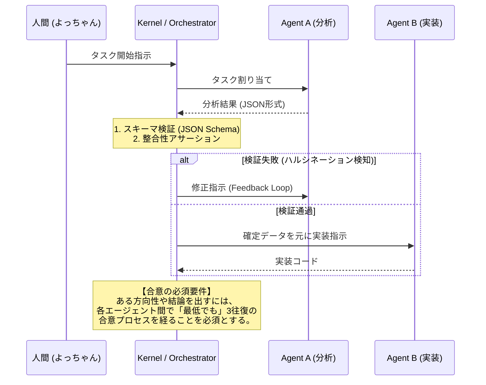
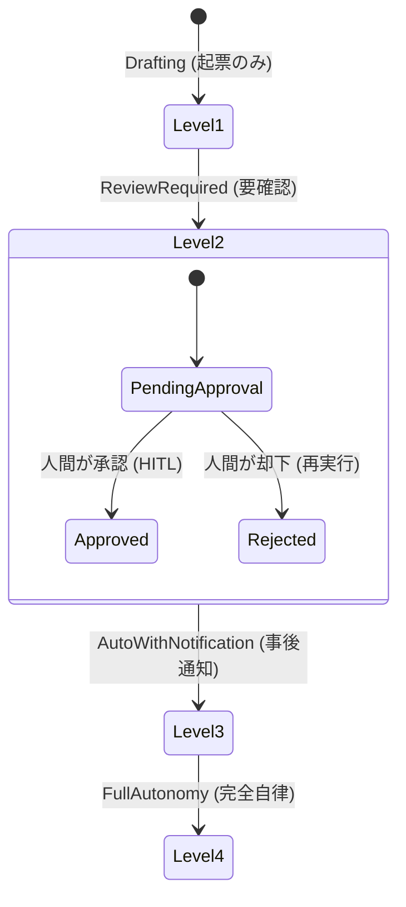

# 次世代マルチエージェント自動化プラットフォーム構築 提案書

本提案書は、複数のAIエージェントによる業務自動化機能において、発生しうる論理的破綻リスクおよび将来的な拡張性課題を徹底的に分析し、それらを克服するための堅牢なシステムアーキテクチャを提案するものです。

---

## 1. マルチエージェント自動化における「4大破綻リスク」

エージェント間で自律的な協調を行う際、対策なしでは以下の論理的・システム的破綻が発生します。

1.  **無限対話ループ（Infinite Feedback Loop）**
    *   *現象*: エージェントAの出力がエージェントBの入力になり、その応答が再びエージェントAを起動する、という対話のデッドロック・永久ループ。
    *   *リスク*: トークン・APIコストの爆発、サーバーリソースの枯渇。
2.  **ハルシネーションの連鎖（Hallucination Cascade）**
    *   *現象*: 前段のエージェントが生成した誤った事実やバグを含むコードを、後段のエージェントが「正しい前提」として処理を重ねてしまう現象。
    *   *リスク*: 最終成果物の品質破綻、およびエラー発生時の根本原因（Root Cause）特定の困難化。
3.  **状態不整合（State Inconsistency）**
    *   *現象*: 複数のエージェントが非同期かつ並行にファイルやデータベースを書き換えることで発生する競合状態。
    *   *リスク*: データの破損、排他制御の崩壊。
4.  **ブラックボックス化と人間不在の暴走（Loss of Human Control）**
    *   *現象*: エージェント間の意思決定プロセスが複雑化し、人間が「現在システムが何をしており、なぜその決定をしたか」を追えなくなる。
    *   *リスク*: 決済やコードリリース等の高リスク処理における、業務上の説明責任（Accountability）の喪失。

---

## 2. 解決策：「エージェント・カーネル（LLM as an OS）」アーキテクチャ

これらの破綻リスクを完全に排除するため、エージェントを個別に動かすのではなく、オペレーティングシステム（OS）のように一元管理する **「エージェント・カーネル」** を導入します。

```mermaid
graph TD
    subgraph Agent Kernel (OS)
        M[Message Bus / IPC]
        R[Resource Manager / Cost Guardian]
        S[Sandbox / Execution Runtime]
        SM[State Machine / Orchestrator]
    end

    A1[Agent: Planner] --> M
    A2[Agent: Developer] --> M
    A3[Agent: Reviewer] --> M

    M --> SM
    SM --> R
    SM --> S
    S --> Files["Workspace (Locked)"]
```

### カーネルの4大コンポーネント

*   **メッセージバス (標準化IPC)**: エージェント間の通信は直接行うのではなく、必ず共通のJSONスキーマに基づくメッセージバスを介して非同期に行います。メッセージには `Trace ID` と `TTL (Time-To-Live: 最大転送回数)` が付与され、無限ループを自動で検知・強制遮断します。
*   **リソースマネージャー (Cost Guardian)**: タスクあたりの最大トークン消費量およびAPIコスト上限を厳格に管理します。閾値を超えた場合は、プロセスの強制停止または人間への承認を求めます。
*   **サンドボックス (Execution Runtime)**: エージェントが実行するコマンドやファイルの読み書きは、制限された安全な実行環境（サンドボックス）内でのみ許可されます。
*   **ステートマネージャー (Orchestrator)**: 状態の更新は直接行わず、「イベントログ」を発行してOrchestratorが一元的にシーケンシャル処理（イベントソーシング）します。これにより状態の不整合を防ぎます。

---

## 3. エージェント協調のシーケンス（ハルシネーション伝播の防止）

各エージェントの出力が次のエージェントに渡る前に、**「バリデーション・ファクトチェックゲート」**を強制挿入し、誤情報の伝播を防ぎます。



---

## 4. 人間介入（HITL: Human-in-the-Loop）と自律性スライダー

システムの安全性を確保するため、業務上のリスクやタスクの難易度に応じてエージェントの自律権限（レベル）を動的に切り替えます。



### 自律性レベルの定義
1.  **Level 1: Drafting (下書きモード)**
    *   エージェントは成果物を作成するのみ。システム変更や外部送信は一切行わず、人間がコピペして実行する。
2.  **Level 2: Review Required (承認必須モード) -- 推奨デフォルト**
    *   書き込みやデプロイ、外部通信を行う直前でプロセスを一時停止し、人間（SlackやCLI）に承認をリクエストする（HITL）。
3.  **Level 3: Auto with Notification (事後通知モード)**
    *   すべて自動実行するが、実行直後に「何を実行したか」の完全な証跡（Trace Log）を人間に通知する。
4.  **Level 4: Full Autonomy (完全自動モード)**
    *   人間の介入なしにバックグラウンドで自律動作・自己修正を行う。

> [!IMPORTANT]
> 「決済処理の実行」「本番環境へのコードデプロイ」「顧客への直接メール送信」などの**破壊的・高リスクアクション**については、ポリシーとして **Level 2 (Review Required)** を強制適用し、人間（よっちゃん）の物理的な「GO」サインがない限り実行できないハードウェア境界を設定します。

---

## 5. 実装ロードマップ

マルチエージェント自動化の導入は、段階的なリスク最小化アプローチを採用します。

*   **フェーズ1：プロトタイプ（自律性 L1〜L2）**
    *   本リポジトリの [agy.toml](file:///C:/Users/PC_User/AI_toml/agy.toml) の定義に従い、インメモリで動作する 3〜4 体のエージェントのオーケストレーションスクリプトを作成。
    *   出力結果のスキーマバリデーション（Pydantic等）の導入。
*   **フェーズ2：エージェント・カーネルの共通化（自律性 L2〜L3）**
    *   無限ループを防ぐ TTL およびトークンカウンタの共通化。
    *   Slack/コマンドラインを介した HITL（人間承認ゲート）の統合。
*   **フェーズ3：プロダクション化（自律性 L3〜L4）**
    *   実行環境のサンドボックス化（Docker / gVisor 等による分離）。
    *   エージェント間の対話をセマンティックに監視する「心理デバッグ（LLM Psychology）」監視ダッシュボードの実装。
