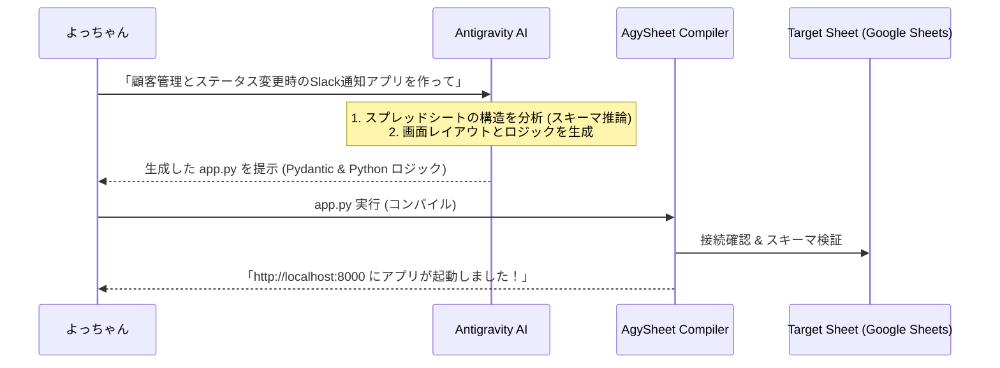

# AIネイティブ・宣言的ローコードフレームワーク「AgySheet」設計提案書

本提案書は、Google AppSheet の「データモデルからアプリとUIを自動生成・実行する」というローコード思想を、Antigravity上でコードベース（Python + Pydantic + FastAPI）としてエレガントに再定義し、高い生産性と無限の拡張性を両立させるフレームワーク **`AgySheet`** のアーキテクチャ設計を提案するものです。

---

## 1. AppSheet の課題と `AgySheet` の解決アプローチ

| 評価軸 | Google AppSheet (ノーコード) | AgySheet (コードベース/AIネイティブ) |
| :--- | :--- | :--- |
| **開発スピード** | 非常に高速（GUIで定義） | 非常に高速（AIによる自然言語生成 ＋ Pydanticモデル記述） |
| **ビジネスロジック** | 独自のExcel風数式（複雑な処理は困難） | **制限なし（純粋なPythonコード）** |
| **拡張性 (エスケープハッチ)** | ほぼ不可能（プラットフォームにロックイン） | **完全自由（一般的なPythonライブラリ、FastAPIミドルウェアを統合可能）** |
| **バージョン管理** | 困難（Web上の独自リビジョン管理） | **容易（Gitでコードとして完全管理）** |
| **UIの自由度** | テンプレートのみ（デザイン変更不可） | **高い（Tailwind/Vanilla CSSベースのWebコンポーネントを動的出力）** |

---

## 2. システムアーキテクチャ

`AgySheet` は、静的なモデル定義からAPIと美麗なWeb UIを自動生成する「コンパイル＆ランタイム」構造を採用します。

```mermaid
graph TD
    subgraph AgySheet Framework
        C[DataConnector API]
        R[Declarative Router / FastAPI]
        RE[UI Rendering Engine / Web Components]
    end

    subgraph User Code (payment.py etc.)
        M["Model Definition (Pydantic)"]
        L["Python Callbacks (Logic)"]
    end

    subgraph Data Sources
        G["Google Sheets / BigQuery / SQLite"]
    end

    M --> C
    M --> R
    M --> RE
    L --> R
    C --> G

    RE --> UI["Beautiful Web Dashboard (Tailwind CSS)"]
```

### アーキテクチャの主要コンポーネント
1.  **データコネクタ層 (DataConnector)**
    *   Google Sheets、BigQuery、ローカルSQLiteなどのデータソースへの接続とOAuth認証をカプセル化し、CRUD操作を抽象化。
2.  **宣言的ルーター (declarative-router)**
    *   定義されたモデルスキーマから、FastAPIベースのRESTful API（GET, POST, PUT, DELETE）および OpenAPI ドキュメントを自動生成。
3.  **UIレンダリングエンジン (Rendering Engine)**
    *   スキーマ情報を解釈し、データ入力フォーム、一覧テーブル、詳細カード、グラフ描画などの Tailwind/Vanilla CSS ベースのUIを自動的にHTML/JSとして出力。

---

## 3. AgySheet によるアプリケーション定義コード例

開発者は、1つのPythonファイルに「データ構造」と「ビジネスロジック」を記述するだけで、画面とAPIが同時に立ち上がります。

```python
# app.py
import agysheet as agy
from agysheet.connectors import GoogleSheetsConnector

# 1. スプレッドシートとの連携モデルを宣言的に定義
class Customer(agy.Model):
    __connector__ = GoogleSheetsConnector(
        spreadsheet_id="1xX...your-sheets-id...",
        sheet_name="Customers"
    )

    # フィールドの定義（バリデーションやUIのラベルも同時に宣言）
    id: str = agy.Field(primary_key=True, title="顧客ID")
    name: str = agy.Field(title="名前", required=True)
    email: str = agy.Field(title="メールアドレス", validation="email")
    status: str = agy.Field(title="ステータス", default="Active", choices=["Active", "Inactive"])
    notes: str = agy.Field(title="備考", widget="textarea")

# 2. ビジネスロジックの注入 (AppSheetでは困難だった複雑なロジックをPythonで実装)
@Customer.on_change("status")
def handle_status_change(customer: Customer, old_value: str, new_value: str):
    """ステータスが変更された時のフック処理"""
    if new_value == "Inactive":
        # Slack通知、API送信、別DB連携など、何でもコードで記述可能
        send_slack_notification(f"警告: 顧客 {customer.name} のステータスが Inactive になりました。")

# 3. アプリケーションの起動
app = agy.AgySheet(models=[Customer])

if __name__ == "__main__":
    # 開発サーバーの立ち上げ。自動的にWeb UIとAPIサーバーがポート8000で起動
    app.run(port=8000)
```

---

## 4. AI (Antigravity/Gemini) との協調パイプライン

アプリの構築は、Antigravity上のAIアシスタントに要件を伝えるだけで、上記の定義ファイルが自動生成されます。



---

## 5. 将来困る点と、設計上の予防措置（耐障害性と移行パス）

### 1. 非決定的なAI動作によるUI破壊の防止（静的コンパイル）
*   *問題*: ランタイム時にAIがUIを都度生成すると、プロンプトのブレやモデル更新により、画面崩れやバグが突発的に発生する。
*   *予防策*: 開発段階でAIがUI設計（TOMLレイアウト定義）とコードをファイルに静的に書き出し、実行時はAIを介さず決定論的にプログラムを動かします。

### 2. 「ローコードの限界」到達時の脱出経路（エスケープハッチ）
*   *問題*: アプリが大規模になり、AgySheetの自動UI機能だけでは画面要件を満たせなくなる。
*   *予防策*: AgySheetが生成するAPIは標準のFastAPIであるため、画面だけを React や Vite などで独自実装し、バックグラウンドのAPIはそのまま再利用する、という「完全な手書きコードへのスムーズな移行パス」を設計段階から保証します。
